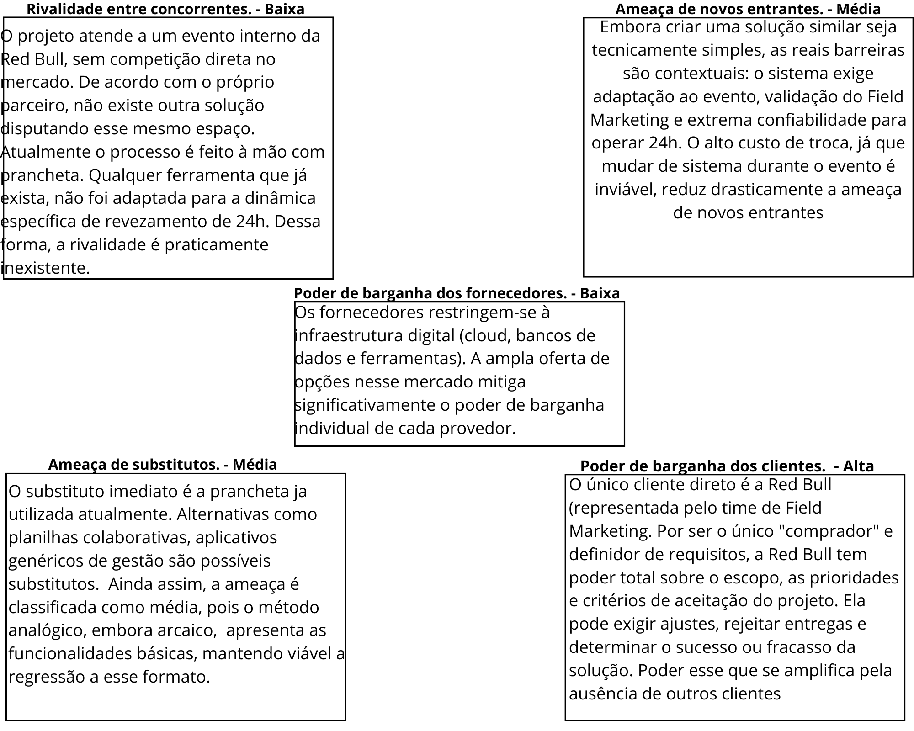

# WAD - Web Application Document - Módulo 2 - Inteli

**_Os trechos em itálico servem apenas como guia para o preenchimento da seção. Por esse motivo, não devem fazer parte da documentação final_**

## Nome do Grupo

#### Nomes dos integrantes do grupo

## Sumário

[1. Introdução](#c1)

[2. Visão Geral da Aplicação Web](#c2)

[3. Projeto Técnico da Aplicação Web](#c3)

[4. Desenvolvimento da Aplicação Web](#c4)

[5. Testes da Aplicação Web](#c5)

[6. Estudo de Mercado e Plano de Marketing](#c6)

[7. Conclusões e trabalhos futuros](#c7)

[8. Referências](c#8)

[Anexos](#c9)

 

# 1. Introdução (sprints 1 a 5)

A proposta do projeto surge a partir de um desafio operacional real no evento da Red Bull 24 Horas, uma competição de corrida em esteira onde duas equipes com 16 participantes cada se revezam durante as 24 horas de prova. A equipe que completar mais quilômetros na esteira após a apuração dos resultados vence; porém, o controle é feito manualmente, por meio de anotações em uma prancheta pelo time operacional do Field Marketing, no qual se registra qual é o atleta que entrará para correr, e, de 5 em 5 minutos, realiza-se o backup. Ao término da corrida do atleta, é marcada a quilometragem e tirada uma foto para arquivo.

Diante deste cenário e considerando as limitações humanas e das esteiras utilizadas (Technogym), como a conectividade com outros aparelhos além da pulseira, que é algo inviável, propõe-se o desenvolvimento de uma plataforma digital que irá mostrar os dados da corrida, com o backup de 5 em 5 minutos, nome dos atletas, qual horário cada um entrou e uma tabela separada para cada equipe. Será um sistema de banco de dados simples, com um recurso que facilite também o registro das fotos da esteira com a quilometragem, para que não fique algo totalmente manual, garantindo uma maior confiabilidade das informações e diminuindo problemas por erros humanos.

Além disso, o sistema irá calcular automaticamente a quilometragem, cada vez que será computada pelo pessoal do Field Marketing, e também irá contar com um display simultâneo restrito para o pessoal da Red Bull, para que haja um controle das equipes, permitindo um melhor acompanhamento durante a competição.

# 2. Visão Geral da Aplicação Web (sprint 1)

## 2.1. Escopo do Projeto (sprints 1 e 4)

### 2.1.1. Modelo de 5 Forças de Porter (sprint 1)

As 5 Forças de Porter é um modelo estratégico desenvolvido pelo professor Michael Porter (Harvard, 1979) para analisar o nível de competitividade de um setor e apoiar a tomada de decisões estratégicas.
O modelo mapeia cinco forças externas que determinam a intensidade da concorrência e, consequentemente, a atratividade e rentabilidade de um mercado conforme apresentado na Figura 2.1.1.
 

  Figura 2.1.1 -  5 Forças de Porter 
  Fonte: Material produzido pelos autores (2026).

    

Portanto, com base na análise das cinco forças aplicada ao projeto, conclui-se que o ambiente competitivo se mostra favorável. A rivalidade praticamente inexistente e o baixo poder dos fornecedores criam condições propícias para a operação. Os pontos de atenção concentram-se no poder de barganha elevado da Red Bull, que é o único cliente e definidor de todos os critérios de aceitação, e na ameaça média de substitutos, dado que a prancheta ainda cumpre funções básicas e uma regressão a esse formato permanece viável.

O equilíbrio geral das forças indica que o maior risco estratégico não é externo, mas relacional: manter o alinhamento contínuo com o cliente é condição essencial para o sucesso do projeto.
### 2.1.2. Análise SWOT da Instituição Parceira (sprint 1)

A Red Bull é uma marca conhecida no mundo inteiro e que investe muito em esporte, então fazer uma SWOT antes de começar o projeto ajudou a gente a entender melhor com quem está trabalhando e o que precisa ser pensado na hora de desenvolver a solução. A Figura 2.1.2 mostra a matriz que montamos.

*Figura 2.1.2 — Análise SWOT da Red Bull*

Fonte: elaborado pelos autores (2026).

O ponto mais forte da Red Bull para o projeto é a estrutura interna de Field Marketing, que já tem experiência em rodar eventos próprios de grande porte como o 24 Horas. A maior fraqueza é como o controle de quilometragem é feito hoje, no papel, somado às limitações das esteiras que não conversam com sistemas externos. Do lado de fora, a corrida vem crescendo no Brasil e o público jovem engajado em eventos urbanos pesa a favor, mas o cenário também tem ameaças relevantes para uma prova de 24 horas: Outros eventos esportivos disputando atenção, imprevistos operacionais durante a competição e riscos de saúde dos atletas em uma prova de longa duração.

### 2.1.3. Solução (sprints 1 a 5)

*Explique detalhadamente os seguintes aspectos (até 60 palavras por item):*
1. Problema a ser resolvido
2. Dados disponíveis (mencionar fonte e conteúdo; se não houver, indicar “não se aplica”)
3. Solução proposta
4. Forma de utilização da solução
5. Benefícios esperados
6. Critério de sucesso e como será avaliado

### 2.1.4. Value Proposition Canvas (sprint 1): 
*Sem limite de palavras – usar template do curso*

*Elaborar o Value Proposition Canvas com base na proposta de solução definida.*

### 2.1.5. Matriz de Riscos do Projeto (sprint 1)

A matriz de riscos é uma ferramenta qualitativa e analítica que permite aos gestores mensurar, avaliar e ordenar eventos de incerteza que possam comprometer os objetivos estratégicos e operacionais. Estruturada em uma escala de 5x5, ela cruza os eixos de probabilidade, definida como a possibilidade de ocorrência, e impacto, que representa a severidade da consequência, para determinar a magnitude do risco. Essa metodologia possibilita a classificação dos eventos em níveis como pequeno, moderado, alto e crítico, orientando a adoção de respostas adequadas para evitar, reduzir, compartilhar ou aceitar o risco. Conforme o Ministério do Planejamento, Desenvolvimento e Gestão (2017), tal abordagem foi aplicada em nosso projeto para identificar situações adversas e subsidiar a implementação de controles que mitiguem a probabilidade de falhas no andamento do trabalho.

  Figura 2.1.5.1 Matriz de risco 
   
  Material produzido pelos autores, 2026

####  Ameaças

| ID | Risco | Descrição Detalhada | Impacto | Probabilidade | Plano de Ação e Resposta (Mitigação) | Responsável |
| :--- | :--- | :--- | :--- | :--- | :--- | :--- |
| **R01** | Instabilidade de Conexão no Local do Evento | Queda ou ocilação do Wi-Fi durante o evento, impedindo o registro em tempo real dos checkpoints. | Alto | Baixa | Alinhar antecipadamente com a organizadora a infraestrutura de Wi-Fi (Starlink ou equivalente) e implementar cache local no app pra manter o registro mesmo com queda momentânea. | Red Bull |
| **R02** | Indisponibilidade do Banco de Dados | O serviço de banco (Supabase) ficar fora do ar durante o evento, impedindo o registro de checkpoints. | Crítico | Baixa | Validação prévia do ambiente em simulação e backup local mínimo no app pra continuar os registros caso o banco caia. | Cauan |
| **R03** | Inconsistência nos Checkpoints (KM Regressivo) | Operador digitar km menor que o checkpoint anterior por engano, comprometendo o cálculo do total acumulado. | Médio | Média | Validação no sistema que bloqueia o salvamento se o km for menor que o último registrado no mesmo turno. | Fernando |
| **R04** | Falha no Registro de Transição | Falha ao registar o momento exato da troca de atletas, corrompendo métricas individuais de pace. | Alto | Média | Interface de confirmação rápida para o "juiz de prova" e logs de segurança com timestamp de alta precisão. | André |
| **R05** | Não Conformidade visual (Brandbook) | Rejeição da interface pelo Compliance da Red Bull por descumprimento das diretrizes de marca. | Médio | Baixa | Validação contínua com a equipa de marca da Red Bull durante as sprints de design. | Augusto |
| **R06** | Latência na Atualização do Placar | Atraso perceptível entre o registro do checkpoint e a atualização do placar exibido em tela, prejudicando a experiência durante o evento. | Médio | Alta | Otimização do envio de dados e atualização eficiente do placar conforme a stack a ser definida no planejamento técnico. | Red Bull |
| **R07** | Erro Operacional (Digitação Incorreta) | Operador ou juiz digitar quilometragem errada na transição, corrompendo os resultados. | Alto | Alta | Bloqueios lógicos (ex: impedir saltos de KM impossíveis) e dupla validação visual na UI. | Fernando / André |
| **R08** | Fadiga Operacional (Madrugada) | Queda de atenção e erros da equipa de apoio devido à exaustão física durante provas longas. | Médio | Alta | Escala de revezamento, pausas obrigatórias e área de descanso com alimentação e energéticos. | Produção / Red Bull |
| **R09** | Falha Mecânica da Esteira | Travamento ou reinicialização da esteira no meio da corrida de um atleta. | Crítico | Média | **Contingência:** Sistema assume último checkpoint + pace médio do atleta. Troca para esteira reserva. | André |
| **R10** | Descarregamento de iPads/Tablets | Dispositivos dos juízes ou de exibição ficarem sem bateria durante o evento. | Alto | Alta | iPads obrigatoriamente ligados à corrente, powerbanks de reserva e alertas de bateria a 20%. | Infraestrutura |

#### Oportunidades

| ID | Risco (Oportunidade) | Descrição Detalhada | Impacto | Probabilidade | Plano de Ação (Potencialização) | Responsável |
| :--- | :--- | :--- | :--- | :--- | :--- | :--- |
| **R11** | Reuso do Sistema em Outros Eventos | A solução pode ser reaproveitada em outros eventos esportivos da Red Bull (corridas, ciclismo, etc.), aumentando o impacto do projeto pra marca. | Alto | Média | Documentar o sistema de forma genérica e modular, permitindo adaptação para diferentes formatos de competição. | Daniel |
| **R12** | Análise Pós-Evento dos Dados | Os dados consolidados ao longo das 24h podem virar insumo pra planejamento de futuras edições do evento (descansos, ritmo, gestão de esteira). | Médio | Alta | Estruturar o relatório pós-evento com gráficos de evolução por hora e por esteira, facilitando a análise pelo time da Red Bull. | Augusto |
| **R13** | Engajamento por Gamificação | Inserir leaderboards e elementos visuais de competitividade no modo TV pra aumentar o engajamento da plateia presente no evento. | Médio | Média | Aplicar diretrizes simples de design no painel de placar pra deixar a disputa mais visualmente envolvente. | Cauan |
| **R14** | Case Interno Red Bull | A solução pode ser apresentada como case dentro da Red Bull pra outras áreas que organizam eventos similares, gerando reconhecimento ao time de Field Marketing. | Médio | Média | Documentar o processo e os resultados de forma apresentável pra divulgação interna após o evento. | André |
| **R15** | Geração de Conteúdo Pós-Evento | Os dados e o histórico podem ser usados pelo time de marketing pra gerar conteúdo orgânico de redes sociais sobre a competição (totais finais, momentos de virada, recordes). | Médio | Alta | Garantir que a exportação CSV traga todos os dados necessários pra o time de marketing montar o conteúdo manualmente. | Luckas |

## 2.2. Personas (sprint 1)

**Perfil dos Usuários:**

- Usuários principais: time operacional do evento (Field Marketing);

- Usuários secundários: organização para validação dos dados;

**Perfil:**

- Perfil sem especialização em sistemas digitais;

- Atuam em ambiente dinâmico, com pressão e constantes mudanças de contexto;

- Precisam de rapidez (eficácia) e praticidade (eficiência) para as suas funções;

- Possuem baixa tolerância a sistemas complexos ou lentos;

- Focam na execução do evento, mas não na tecnologia;

**Dores dos Usuários:**

- Potencial para erros no registro manual (anotações incorretas ou imprecisas);

- Falta de confiabilidade e consistência das informações ao longo das 24 horas;

- Impossibilidade de monitorar em tempo real o total de quilômetros por equipe;

- Operação altamente demandante (registro contínuo + dinâmica intensa do evento);

- Dependência de checkpoints manuais como o “backup” a cada 30 minutos;

- Ausência de métodos de rastreabilidade dos registros (apenas uma pessoa com uma prancheta registra);

- Restrições tecnológicas (tecnologias sem integração direta com as esteiras e inviabilidade de uso de pulseiras);

- Perda de dados de até 30 minutos caso a esteira pare de funcionar;

**Necessidades dos Usuários:**

- Substituir a prancheta por um processo digital simples e ágil;

- Possuir um sistema de backups constantes e realizados automaticamente;

- Permitir registro rápido de início, checkpoints e fim da corrida;

- Calcular automaticamente o total de quilômetros por equipe;

- Possibilitar acompanhamento conveniente do placar e evolução da competição;

- Disponibilizar informações em tempo real (ou quase) durante o evento;

-  Garantir robustez e minimizar erros operacionais;

- Suportar operação contínua durante 24 horas;

- Ser utilizável em dispositivos móveis no ambiente do evento;

## 2.3. User Stories (sprints 1 a 5)

*Posicione aqui a lista de User Stories levantadas para o projeto. Siga o template de User Stories e utilize a mesma referência USXX no roadmap de seu quadro Kanban. Indique todas as User Stories mapeadas, mesmo aquelas que não forem implementadas ao longo do projeto. Não se esqueça de explicar o INVEST das 5 User Stories prioritárias*

*ATUALIZE ESTA SEÇÃO SEMPRE QUE ALGUMA DEMANDA MUDAR EM SEU PROJETO*

*Template de User Story*
Identificação | USXX (troque XX por numeração ordenada das User Stories)
--- | ---
Persona | nome da Persona
User Story | "como (papel/perfil), posso (ação/meta), para (benefício/razão)"
Critério de aceite 1 | CR1: descrever cenário + testes de aceite
Critério de aceite 2 | CR2: descrever cenário + testes de aceite
Critério de aceite ... | CR...
Critérios INVEST | *(Por que é Independente? Por que é Negociável? Por que é Valorosa? Por que é Estimável? Por que é Pequena? Por que é Testável?)*

# 3. Projeto da Aplicação Web (sprints 1 a 5)

## 3.1. Requisitos do Sistema (sprints 1 a 5)

*Esta seção formaliza o que o sistema deve fazer, sob quais regras e com quais qualidades. Atualize a cada sprint conforme os requisitos evoluem.*

### 3.1.1. Requisitos Funcionais (sprint 1, refinar até sprint 5)

*Liste os RF numerados de forma objetiva e verificável. Cada RF deve poder ser convertido em caso de teste.*

| ID    | Descrição | Prioridade | Status       |
|-------|-----------|------------|--------------|
| RF001 | ...       | Alta       | Implementado |
| RF002 | ...       | Média      | Planejado    |

### 3.1.2. Regras de Negócio (sprint 1, refinar até sprint 5)

*Numere e redija as RN de forma implementável e testável. Toda RN deve ter pelo menos um teste automatizado associado a partir da sprint 3.*

| ID   | Descrição | RF associado |
|------|-----------|--------------|
| RN01 | ...       | RF001        |
| RN02 | ...       | RF001        |

### 3.1.3. Requisitos Não Funcionais — 8 Eixos ISO/IEC 25010 (sprints 1 a 5)

*Preencha os 8 eixos. Cada eixo deve ter ao menos um RNF verificável (com métrica, limite ou critério concreto) ou justificativa explícita de ausência. Evolua do conceitual (sprint 1) ao técnico mensurável (sprint 5).*

| Eixo                     | Requisito | Métrica / Critério | Como atendido |
|--------------------------|-----------|--------------------|---------------|
| USAB — Usabilidade       | ...       | ...                | ...           |
| CONF — Confiabilidade    | ...       | ...                | ...           |
| DES — Desempenho         | ...       | p95 < X ms         | ...           |
| SUP — Suportabilidade    | ...       | ...                | ...           |
| SEG — Segurança          | ...       | ...                | ...           |
| CAP — Capacidade         | ...       | ...                | ...           |
| REST — Restrições Design | ...       | ...                | ...           |
| ORG — Organizacionais    | ...       | ...                | ...           |

### 3.1.4. Matriz RF → RN → Endpoint (sprints 3 a 5)

*Matriz de cobertura mostrando quais RN e endpoints implementam cada RF.*

| RF    | RN associadas | Endpoint    | Método |
|-------|---------------|-------------|--------|
| RF001 | RN01, RN02    | `/usuarios` | POST   |

## 3.2. Arquitetura (sprints 1 a 5)

### 3.2.1. Diagrama de Arquitetura (sprints 3 e 4)

*Posicione aqui o diagrama de arquitetura da solução, indicando as camadas principais (Controller, Service, Repository, Model) e suas responsabilidades. Atualize sempre que necessário.*

### 3.2.2. Diagrama de Casos de Uso (sprint 1)

*Apresente o diagrama de casos de uso com atores (boneco), casos (elipse) e as relações `<<include>>` / `<<extend>>` com semântica correta. Consulte a notação de referência em `in02/suporte/use-case_3.0_v1.0.pdf`.*

### 3.2.3. Diagrama de Classes do Domínio (sprint 2)

*Diagrama UML de classes com entidades, atributos, relacionamentos e responsabilidades. Diferencie **associação**, **agregação** (losango vazio), **composição** (losango cheio) e **herança** (triângulo vazio). Multiplicidade explícita em toda associação.*

### 3.2.4. Diagrama de Sequência UML (sprint 3)

*Ao menos um fluxo prioritário, mostrando a interação entre as camadas Controller → Service → Repository → Banco. Linhas de vida verticais, ativação correta, mensagens síncronas e assíncronas diferenciadas, retornos tracejados.*

### 3.2.5. Diagrama de Atividades ou Estados (sprint 3)

*Ao menos um fluxo relevante em UML ou BPMN. Use a notação da ferramenta escolhida de forma consistente (sem misturar convenções).*

### 3.2.6. Diagrama de Implantação (sprints 4 e 5)

*Diagrama UML de deployment mostrando nós físicos, artefatos e canais de comunicação. Representa a visão Engineering + Technology do RM-ODP.*

### 3.2.7. Padrões de Projeto Aplicados (sprints 3 a 5)

*Documente os design patterns utilizados (Repository, Strategy, Factory, DTO etc.) e quais princípios SOLID se aplicam. Justifique a adoção de cada padrão com base em uma necessidade real do projeto.*

## 3.3. Wireframes (sprint 2)

*Posicione aqui as imagens do wireframe construído para sua solução e, opcionalmente, o link para acesso (mantenha o link sempre público para visualização)*

## 3.4. Guia de estilos (sprint 3)

*Descreva aqui orientações gerais para o leitor sobre como utilizar os componentes do guia de estilos de sua solução*

### 3.4.1 Cores

*Apresente aqui a paleta de cores, com seus códigos de aplicação e suas respectivas funções*

### 3.4.2 Tipografia

*Apresente aqui a tipografia da solução, com famílias de fontes e suas respectivas funções*

### 3.4.3 Iconografia e imagens 

*(esta subseção é opcional, caso não existam ícones e imagens, apague esta subseção)*

*posicione aqui imagens e textos contendo exemplos padronizados de ícones e imagens, com seus respectivos atributos de aplicação, utilizadas na solução*

## 3.5 Protótipo de alta fidelidade (sprint 3)

*posicione aqui algumas imagens demonstrativas de seu protótipo de alta fidelidade e o link para acesso ao protótipo completo (mantenha o link sempre público para visualização)*

## 3.6. Modelagem do banco de dados (sprints 2 e 4)

### 3.6.1. Modelo Entidade-Relacionamento (ER) (sprint 2)

*Apresente o modelo ER conceitual com entidades, atributos e relacionamentos. Use notação consistente (Chen ou Crow's Foot — não misture).*

### 3.6.2. Diagrama Entidade-Relacionamento (DER) (sprint 2)

*Posicione aqui o DER com cardinalidades explícitas em ambos os lados de cada relação e identificação de PK/FK. O DER deve ser coerente com o diagrama de classes (3.2.3).*

### 3.6.3. Modelo Relacional e Modelo Físico (sprints 2 e 4)

*Posicione aqui os diagramas de modelos relacionais do banco de dados, apresentando todos os esquemas de tabelas e suas relações. Inclua as migrations DDL numeradas e reproduzíveis (`CREATE TABLE`, `CREATE INDEX`, constraints `NOT NULL`, `UNIQUE`, `FOREIGN KEY`, `CHECK`). Utilize texto para complementar suas explicações quando necessário.*

### 3.6.4. Consultas SQL e lógica proposicional (sprint 2)

*posicione aqui uma lista de consultas SQL compostas, realizadas pelo back-end da aplicação web, com sua respectiva lógica proposicional, descrita conforme template abaixo. Lembre-se que para usar LaTeX em markdown, basta você colocar as expressões entre $ ou $$*

*Template de SQL + lógica proposicional*
#1 | ---
--- | ---
**Expressão SQL** | SELECT * FROM suppliers WHERE (state = 'California' AND supplier_id <> 900) OR (supplier_id = 100); 
**Proposições lógicas** | $A$: O estado é 'California' (state = 'California')   $B$: O ID do fornecedor não é 900 (supplier_id ≠ 900)   $C$: O ID do fornecedor é 100 (supplier_id = 100)
**Expressão lógica proposicional** | $(A \land B) \lor C$
**Tabela Verdade** | <table> <thead> <tr> <th>$A$</th> <th>$B$</th> <th>$C$</th> <th>$(A \land B)$</th> <th>$(A \land B) \lor C$</th> </tr> </thead> <tbody> <tr> <td>F</td> <td>F</td> <td>F</td> <td>F</td> <td>F</td> </tr> <tr> <td>F</td> <td>F</td> <td>V</td> <td>F</td> <td>V</td> </tr> <tr> <td>F</td> <td>V</td> <td>F</td> <td>F</td> <td>F</td> </tr> <tr> <td>F</td> <td>V</td> <td>V</td> <td>F</td> <td>V</td> </tr> <tr> <td>V</td> <td>F</td> <td>F</td> <td>F</td> <td>F</td> </tr> <tr> <td>V</td> <td>F</td> <td>V</td> <td>F</td> <td>V</td> </tr> <tr> <td>V</td> <td>V</td> <td>F</td> <td>V</td> <td>V</td> </tr> <tr> <td>V</td> <td>V</td> <td>V</td> <td>V</td> <td>V</td> </tr> </tbody> </table>

*Dica: edite a tabela verdade fora do markdown, para ter melhor controle*

## 3.7. WebAPI e endpoints (sprints 3 e 4)

*Utilize um link para outra página de documentação contendo a descrição completa de cada endpoint. Ou descreva aqui cada endpoint criado para seu sistema.* 

*Cada endpoint deve conter endereço, método (GET, POST, PUT, PATCH, DELETE), header, body, formatos de response e os status codes possíveis (200, 201, 204, 400, 401, 403, 404, 409, 422, 500).*

## 3.8. Autenticação, Autorização e Resiliência (sprint 5)

### 3.8.1. Autenticação

*Descreva o fluxo de autenticação implementado: persistência de senha com hash bcrypt/argon2 (parâmetros de custo explícitos e justificados), validação de credenciais e criação de sessão. Senhas em texto plano no banco não são aceitas.*

### 3.8.2. Controle de sessão

*Descreva o controle de sessão baseado em `session id` persistido em tabela própria, com expiração. Se optar por JWT, justifique a escolha explicando os trade-offs (stateless, não revogável, payload exposto).*

### 3.8.3. Autorização

*Descreva as regras de autorização por rota e por operação, baseadas no perfil do usuário autenticado. A verificação deve ocorrer no backend — o frontend nunca é fonte de verdade para autorização.*

### 3.8.4. Estratégias de Resiliência

*Descreva as estratégias aplicadas no tratamento de falhas de rede: timeout, retry com backoff exponencial, circuit breaker e idempotência em operações críticas (`PUT`, `DELETE`, operações de pagamento etc.).*

## 3.9. Matriz de Rastreabilidade (RTM) (sprints 3 a 5)

*A RTM consolida a rastreabilidade completa do sistema. Um elo quebrado invalida toda a cadeia — mantenha-a atualizada a cada sprint. A partir da sprint 3 não deve haver lacunas nos fluxos centrais.*

| Persona | RF    | RN   | Endpoint    | Tela     | Teste | Evidência        |
|---------|-------|------|-------------|----------|-------|------------------|
| ...     | RF001 | RN01 | `/usuarios` | Cadastro | CT02  | print, log, relatório de cobertura |

# 4. Desenvolvimento da Aplicação Web

## 4.1. Primeira versão da aplicação web (sprint 3)

*Descreva e ilustre aqui o desenvolvimento da primeira versão do sistema web. Utilize prints de tela para ilustrar. Indique obrigatoriamente: (a) o que foi implementado, (b) o que não foi concluído, (c) dificuldades técnicas enfrentadas e próximos passos.*

## 4.2. Segunda versão da aplicação web (sprint 4)

*Descreva e ilustre aqui o desenvolvimento da segunda versão do sistema web, com foco no que foi consolidado entre a primeira versão funcional e o sistema operacional integrado. Utilize prints de tela para ilustrar. Indique obrigatoriamente: (a) o que foi implementado, (b) o que não foi concluído, (c) dificuldades técnicas enfrentadas e próximos passos.*

## 4.3. Versão final da aplicação web (sprint 5)

*Descreva e ilustre aqui o desenvolvimento da versão final do sistema web, com foco em refatorações, correções finais e na camada de autenticação/autorização entregue. Utilize prints de tela para ilustrar. Indique obrigatoriamente: (a) o que foi refinado ou adicionado desde a sprint 4, (b) pendências remanescentes, (c) dificuldades técnicas enfrentadas.*

# 5. Testes

## 5.1. Relatório de testes de integração de endpoints automatizados (sprint 4)

*Liste e descreva os testes automatizados dos endpoints criados e planejados para sua solução, implementados com **Jest**. Cubra as duas abordagens:*

- ***White-box*** *— testes unitários de Service que exercitam ramos internos, exceções e regras de negócio (conhecimento da implementação).*
- ***Black-box*** *— testes de integração dos endpoints via Jest + Supertest, verificando apenas o contrato HTTP (status, body, efeito observável), sem depender da implementação interna.*

*Posicione aqui também o relatório de cobertura de testes Jest se houver (através de link ou transcrito para estrutura markdown).*

## 5.2. Testes de usabilidade (sprint 5)

### 5.2.1. Relatório de testes de guerrilha

*Posicione aqui as tabelas com enunciados de tarefas, etapas e resultados de testes de usabilidade. Ou utilize um link para seu relatório de testes (mantenha o link sempre público para visualização).*

### 5.2.2. Relatório de testes SUS (System Usability Scale)

*Posicione aqui o relatório dos testes SUS realizados.*

# 6. Estudo de Mercado e Plano de Marketing (sprint 4)

## 6.1 Resumo Executivo

*Preencher com até 300 palavras, sem necessidade de fonte*

*Apresente de forma clara e objetiva os principais destaques do projeto: oportunidades de mercado, diferenciais competitivos da aplicação web e os objetivos estratégicos pretendidos.*

## 6.2 Análise de Mercado

*a) Visão Geral do Setor (até 250 palavras)*
*Contextualize o setor no qual a aplicação está inserida, considerando aspectos econômicos, tecnológicos e regulatórios. Utilize fontes confiáveis.*

*b) Tamanho e Crescimento do Mercado (até 250 palavras)*
*Apresente dados quantitativos sobre o tamanho atual e projeções de crescimento do mercado. Utilize fontes confiáveis.*

*c) Tendências de Mercado (até 300 palavras)*
*Identifique e analise tendências relevantes (tecnológicas, comportamentais e mercadológicas) que influenciam o setor. Utilize fontes confiáveis.*

## 6.3 Análise da Concorrência

*a) Principais Concorrentes (até 250 palavras)*
*Liste os concorrentes diretos e indiretos, destacando suas principais características e posicionamento no mercado.*

*b) Vantagens Competitivas da Aplicação Web (até 250 palavras)*
*Descreva os diferenciais da sua aplicação em relação aos concorrentes, sem necessidade de citação de fontes.*

## 6.4 Público-Alvo

*a) Segmentação de Mercado (até 250 palavras)*
Descreva os principais segmentos de mercado a serem atendidos pela aplicação. Utilize bases de dados e fontes confiáveis.*

*b) Perfil do Público-Alvo (até 250 palavras)*
*Caracterize o público-alvo com dados demográficos, psicográficos e comportamentais, incluindo necessidades específicas. Utilize fontes obrigatórias.*

## 6.5 Posicionamento

*a) Proposta de Valor Única (até 250 palavras)*
*Defina de maneira clara o que torna a sua aplicação única e valiosa para o mercado.*

*b) Estratégia de Diferenciação (até 250 palavras)*
*Explique como sua aplicação se destacará da concorrência, evidenciando a lógica por trás do posicionamento.*

## 6.6 Estratégia de Marketing 

*a) Produto/Serviço (até 200 palavras)*
*Descreva as funcionalidades, benefícios e diferenciais da aplicação*

*b) Preço (até 200 palavras)*
*Explique o modelo de precificação adotado e justifique com base nas análises anteriores.*

*c) Praça (Distribuição) (até 200 palavras)*
*Apresente os canais digitais utilizados para distribuir e entregar a aplicação ao público.*

*d) Promoção (até 200 palavras)*
*Descreva as estratégias digitais planejadas, como SEO, redes sociais, marketing de conteúdo e campanhas pagas.*

# 7. Conclusões e trabalhos futuros (sprint 5)

*Escreva de que formas a solução da aplicação web atingiu os objetivos descritos na seção 2 deste documento. Indique pontos fortes e pontos a melhorar de maneira geral.*

*Relacione os pontos de melhorias evidenciados nos testes com planos de ações para serem implementadas. O grupo não precisa implementá-las, pode deixar registrado aqui o plano para ações futuras*

*Relacione também quaisquer outras ideias que o grupo tenha para melhorias futuras*

# 8. Referências (sprints 1 a 5)

_Incluir as principais referências de seu projeto, para que seu parceiro possa consultar caso ele se interessar em aprofundar. Um exemplo de referência de livro e de site:_ 

LUCK, Heloisa. Liderança em gestão escolar. 4. ed. Petrópolis: Vozes, 2010.  
SOBRENOME, Nome. Título do livro: subtítulo do livro. Edição. Cidade de publicação: Nome da editora, Ano de publicação.  

INTELI. Adalove. Disponível em: https://adalove.inteli.edu.br/feed. Acesso em: 1 out. 2023  
SOBRENOME, Nome. Título do site. Disponível em: link do site. Acesso em: Dia Mês Ano

# Anexos

*Inclua aqui quaisquer complementos para seu projeto, como diagramas, imagens, tabelas etc. Organize em sub-tópicos utilizando headings menores (use ## ou ### para isso)*
