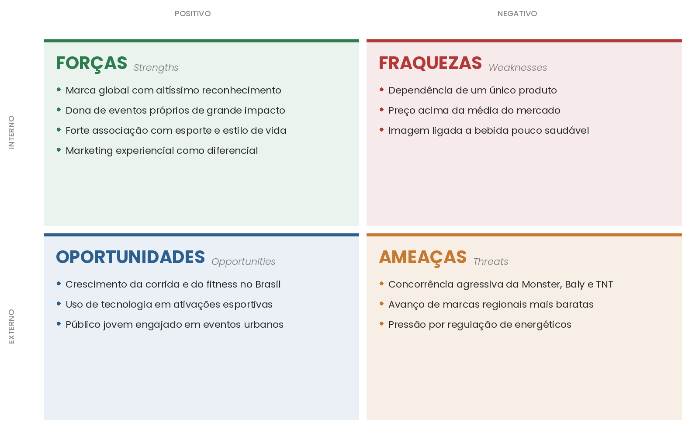

# WAD - Web Application Document - Módulo 2 - Inteli

## Grupo 03

#### André Lopes de Melo, Augusto de Castro Cadena, Cândido Luiz Vieira Quinderé Cidrão, Cauan da Rocha Martins, Daniel Hamoui, Fernando Takeshi Ohara, Luckas Milfont 

## Sumário

[1. Introdução](#c1)

[2. Visão Geral da Aplicação Web](#c2)

[3. Projeto Técnico da Aplicação Web](#c3)

[4. Desenvolvimento da Aplicação Web](#c4)

[5. Testes da Aplicação Web](#c5)

[6. Estudo de Mercado e Plano de Marketing](#c6)

[7. Conclusões e trabalhos futuros](#c7)

[8. Referências](c#8)

[Anexos](#c9)

 

# 1. Introdução (sprints 1 a 5)

A proposta do projeto surge a partir de um desafio operacional real no evento da Red Bull 24 Horas, uma competição de corrida em esteira onde duas equipes com 16 participantes cada se revezam durante as 24 horas de prova. A equipe que completar mais quilômetros na esteira após a apuração dos resultados vence; porém, o controle é feito manualmente, por meio de anotações em uma prancheta pelo time operacional do Field Marketing, no qual se registra qual é o atleta que entrará para correr, e, de 5 em 5 minutos, realiza-se o backup. Ao término da corrida do atleta, é marcada a quilometragem e tirada uma foto para arquivo.

Diante deste cenário e considerando as limitações humanas e das esteiras utilizadas (Technogym), como a conectividade com outros aparelhos além da pulseira, que é algo inviável, propõe-se o desenvolvimento de uma plataforma digital que irá mostrar os dados da corrida, com o backup de 5 em 5 minutos, nome dos atletas, qual horário cada um entrou e uma tabela separada para cada equipe. Será um sistema de banco de dados simples, com um recurso que facilite também o registro das fotos da esteira com a quilometragem, para que não fique algo totalmente manual, garantindo uma maior confiabilidade das informações e diminuindo problemas por erros humanos.

Além disso, o sistema irá calcular automaticamente a quilometragem, cada vez que será computada pelo pessoal do Field Marketing, e também irá contar com um display simultâneo restrito para o pessoal da Red Bull, para que haja um controle das equipes, permitindo um melhor acompanhamento durante a competição.

# 2. Visão Geral da Aplicação Web (sprint 1)

## 2.1. Escopo do Projeto (sprints 1 e 4)

### 2.1.1. Modelo de 5 Forças de Porter (sprint 1)

As 5 Forças de Porter é um modelo estratégico desenvolvido pelo professor Michael Porter (Harvard, 1979) para analisar o nível de competitividade de um setor e apoiar a tomada de decisões estratégicas.
O modelo mapeia cinco forças externas que determinam a intensidade da concorrência e, consequentemente, a atratividade e rentabilidade de um mercado conforme apresentado na Figura 2.1.1.
 

  Figura 2.1.1 -  5 Forças de Porter 
  Fonte: Material produzido pelos autores (2026).

    

#### 1. Rivalidade entre concorrentes
A rivalidade é classificada como baixa. O projeto é direcionado a um evento interno exclusivo da Red Bull, o que elimina a competição direta de mercado por outros possíveis rivais. Atualmente, o maior "concorrente" é o processo manual feito com pranchetas. Embora existam ferramentas de gestão no mercado, nenhuma é adaptada para a dinâmica específica de um revezamento de 24 horas, classificando, assim, a rivalidade como praticamente inexistente no nosso nicho de atuação.

#### 2. Ameaça de novos entrantes
A ameaça de novos entrantes é média. Do ponto de vista técnico, o desenvolvimento de uma solução similar é simples; contudo, as barreiras de entrada são principalmente contextuais e operacionais. O sistema exige uma validação rigorosa do time de Field Marketing e uma garantia inegociável de confiabilidade para operar sem interrupções por 24 horas. Além disso, o custo de troca durante a execução do evento é extremamente inviável, o que protege a solução uma vez que ela é implementada.

#### 3. Poder de barganha dos fornecedores
O poder de barganha é baixo. A dependência de fornecedores se restringe à infraestrutura digital básica, como serviços de nuvem (cloud), bancos de dados e ferramentas de desenvolvimento. Como o mercado de tecnologia oferece uma ampla gama de provedores e opções intercambiáveis, o poder individual de cada fornecedor é mitigado, permitindo que o projeto mantenha autonomia sobre seus custos e escolhas técnicas.

#### 4. Ameaça de produtos substitutos
A ameaça é média. Os substitutos imediatos não são outras plataformas digitais, mas sim o método analógico (prancheta e papel), planilhas colaborativas ou aplicativos genéricos de produtividade. Embora sejam soluções arcaicas e menos eficientes para a análise de dados em tempo real, elas cumprem as funcionalidades básicas de registro. A viabilidade de uma regressão a esses formatos obriga o projeto a manter um alto nível de entrega de valor para justificar a digitalização.

#### 5. Poder de barganha dos clientes
O poder de barganha é alto. O projeto possui um cenário de monopsônio, onde há apenas um cliente direto: a Red Bull (representada pelo time de Field Marketing). Como único "comprador" e definidor de requisitos, o cliente tem total controle sobre o escopo, as prioridades e os critérios de aceitação. A ausência de outros clientes no horizonte do projeto aumenta a autoridade da Red Bull para exigir ajustes e determinar o sucesso ou fracasso da solução.

### Conclusão
Com base na análise das cinco forças aplicada ao projeto, conclui-se que o ambiente competitivo se mostra favorável à implementação e consolidação da ferramenta. A rivalidade praticamente inexistente, somada ao baixo poder de barganha dos fornecedores, cria um "oceano azul" operacional, onde a pressão externa de mercado é minimizada pela especificidade do nicho e pela abundância de recursos tecnológicos.

Entretanto, o equilíbrio estratégico do projeto é sensível a dois vetores internos de atenção. O primeiro é o poder de barganha elevado da Red Bull, que, por ser o cliente único e soberano, transforma a relação comercial em uma dependência direta de alinhamento de expectativas. O segundo é a ameaça média de substitutos, uma vez que a simplicidade do método analógico (prancheta) atua como uma zona de conforto para o usuário; qualquer falha técnica ou complexidade excessiva no sistema pode motivar uma regressão ao formato manual, que permanece viável e funcional para as necessidades básicas do evento.

Portanto, o equilíbrio geral das forças indica que o maior risco estratégico não é de natureza externa ou competitiva, mas sim relacional e operacional. O sucesso do projeto não depende de vencer concorrentes, mas de garantir um alinhamento contínuo e rigoroso com os critérios de aceitação do cliente, assegurando que a superioridade da ferramenta digital em relação aos métodos substitutos seja evidente, estável e indispensável durante as 24 horas de operação.

### 2.1.2. Análise SWOT da Instituição Parceira (sprint 1)

A Red Bull é uma marca conhecida no mundo inteiro e que investe muito em esporte, então fazer uma SWOT antes de começar o projeto ajudou a gente a entender melhor com quem está trabalhando e o que precisa ser pensado na hora de desenvolver a solução. A Figura 2.1.2 mostra a matriz que montamos.

*Figura 1 — Análise SWOT da Red Bull*

Fonte: elaborado pelos autores (2026).

O ponto mais forte da Red Bull para o projeto é a estrutura interna de Field Marketing, que já tem experiência em rodar eventos próprios de grande porte como o 24 Horas. A maior fraqueza é como o controle de quilometragem é feito hoje, no papel, somado às limitações das esteiras que não conversam com sistemas externos. Do lado de fora, a corrida vem crescendo no Brasil e o público jovem engajado em eventos urbanos pesa a favor, mas o cenário também tem ameaças relevantes para uma prova de 24 horas: Outros eventos esportivos disputando atenção, imprevistos operacionais durante a competição e riscos de saúde dos atletas em uma prova de longa duração.

### 2.1.3. Solução (sprints 1 a 5)

*Explique detalhadamente os seguintes aspectos (até 60 palavras por item):*
1. Problema a ser resolvido
2. Dados disponíveis (mencionar fonte e conteúdo; se não houver, indicar “não se aplica”)
3. Solução proposta
4. Forma de utilização da solução
5. Benefícios esperados
6. Critério de sucesso e como será avaliado

### 2.1.4. Value Proposition Canvas (sprint 1): 

Esta seção detalha o alinhamento estratégico entre as necessidades operacionais de campo do parceiro Red Bull e as funcionalidades específicas da solução proposta, garantindo consistência entre as dores identificadas no monitoramento de atletas e o valor gerado para o ecossistema de Field Marketing. O Canva da proposta de valor é estruturado a partir de uma análise rigorosa do Perfil do Cliente, criando um Mapa de Valor que responde diretamente a cada desafio logístico e técnico do evento de 24 horas. [1]

  <b>Figura 1 – CANVA DA PROPOSTA DE VALOR</b> 
   
  Fonte: Elaborado pelos autores (2026)

**Análise do Mapa do Perfil do Cliente**

**Tarefas do Cliente (Customer Jobs)**
O perfil de usuário da Operação Red Bull busca, essencialmente, realizar o registro contínuo e confiável de dados de performance, como quilometragem, velocidade e pace, durante o revezamento ininterrupto de 16 atletas por equipe (totalizando 32 participantes). Para os gestores do ecossistema, a prioridade absoluta é a consolidação e validação do total de quilômetros por equipe para a apuração de um resultado oficial e inquestionável. Portanto, o foco central do operador não é apenas inserir números, mas garantir que a transição entre atletas e o monitoramento dos checkpoints ocorram sem lacunas informacionais, exigindo que a tecnologia atue como um suporte eficiente para a gestão da prova.

**Dores do Cliente (Pains)**
Os operadores enfrentam barreiras críticas, como o cansaço extremo e a sobrecarga cognitiva resultantes de 24 horas de monitoramento, o que frequentemente gera erros de anotação e ilegibilidade no método manual. Essa vulnerabilidade é agravada pela ineficiência de tecnologias genéricas, como as pulseiras Technogym, que se mostram inviáveis na dinâmica veloz do evento. Dito isso, a dor do usuário é operacional e acumulativa, o risco de perda de dados históricos ou a inconsistência de registros manuais gera uma insegurança profunda quanto à integridade do resultado final, tornando o processo de apuração um fardo propenso a contestações.

**Ganhos do Cliente (Gains)**
As expectativas de ganho concentram-se na obtenção de um resultado final preciso, transparente e imune a erros humanos, resultando em uma cerimônia de premiação justa e baseada em dados reais. O usuário busca a agilidade de chegar ao fim das 24 horas de prova com todos os dados já digitalizados e prontos para análise, eliminando o retrabalho pós evento. Então, o ganho máximo desejado é a confiança operacional, onde a padronização e o registro rápido transformam-se no principal motor de sucesso da entrega técnica para o parceiro.

**Análise do Mapa de Valor**

**Produtos e Serviços (Products and Services)**

A entrega central consiste em uma aplicação web mobile estruturada para operar em tablets, oferecendo módulos de registro de checkpoints e gestão de perfis de atletas integrados a um motor de cálculo em tempo real. A solução transforma o registro de quilometragem em métricas de performance imediatas e automatiza a geração do relatório oficial. Portanto, este eixo supre diretamente as Tarefas do Cliente (Customer Jobs), pois substitui o processo burocrático e analógico da prancheta por uma interface fluida, garantindo que o software seja o meio técnico necessário para que a Red Bull oficialize a performance dos corredores com precisão digital.

**Aliviadores de Dores (Pain Relievers)**

O sistema neutraliza o risco de erro humano através da padronização digital de inputs e do bloqueio de dados inconsistentes, impedindo que a fadiga do operador resulte em registros inválidos. A persistência de dados em tempo real assegura que nenhuma informação seja perdida, mesmo em casos de falhas no hardware externo. Dito isso, este eixo é o reflexo direto das Dores do Cliente (Pains), pois mitiga a insegurança gerada pelo cansaço extremo e pela vulnerabilidade do método manual, eliminando o risco de contestações e garantindo a integridade total do histórico da prova.

**Criadores de Ganhos (Gain Creators)**

Através de uma usabilidade de baixo esforço e do cálculo automático de performance, o sistema permite que registros complexos sejam realizados de forma ágil e precisa. A rastreabilidade individual por atleta assegura que cada metro percorrido seja devidamente computado e auditável no placar geral. Então, este eixo conecta-se aos Ganhos do Cliente (Gains) ao converter a tecnologia em um motor de credibilidade e transparência, assegurando que o esforço dos atletas seja premiado com um resultado final inquestionável e gerado em tempo real, sem a necessidade de retrabalho pós-evento.

### 2.1.5. Matriz de Riscos do Projeto (sprint 1)

A matriz de riscos é uma ferramenta qualitativa e analítica que permite aos gestores mensurar, avaliar e ordenar eventos de incerteza que possam comprometer os objetivos estratégicos e operacionais. Estruturada em uma escala de 5x5, ela cruza os eixos de probabilidade, definida como a possibilidade de ocorrência, e impacto, que representa a severidade da consequência, para determinar a magnitude do risco. Essa metodologia possibilita a classificação dos eventos em níveis como pequeno, moderado, alto e crítico, orientando a adoção de respostas adequadas para evitar, reduzir, compartilhar ou aceitar o risco. Conforme o Ministério do Planejamento, Desenvolvimento e Gestão (2017), tal abordagem foi aplicada em nosso projeto para identificar situações adversas e subsidiar a implementação de controles que mitiguem a probabilidade de falhas no andamento do trabalho.

  Figura 2.1.5.1 - Matriz de risco 
   
  Material produzido pelos autores, 2026

####  Ameaças

| ID | Risco | Descrição Detalhada | Impacto | Probabilidade | Plano de Ação e Resposta (Mitigação) | Responsável |
| :--- | :--- | :--- | :--- | :--- | :--- | :--- |
| **R01** | Instabilidade de Conexão no Local do Evento | Queda ou oscilação do Wi-Fi durante o evento, impedindo o registro em tempo real dos checkpoints. | Alto | Baixa | Alinhar antecipadamente com a organizadora a infraestrutura de Wi-Fi (Starlink ou equivalente) e implementar cache local no app pra manter o registro mesmo com queda momentânea. | Red Bull |
| **R02** | Indisponibilidade do Banco de Dados | O serviço de banco (Supabase) ficar fora do ar durante o evento, impedindo o registro de checkpoints. | Crítico | Baixa | Validação prévia do ambiente em simulação e backup local mínimo no app pra continuar os registros caso o banco caia. | Cauan |
| **R03** | Inconsistência nos Checkpoints (KM Regressivo) | Operador digitar km menor que o checkpoint anterior por engano, comprometendo o cálculo do total acumulado. | Médio | Média | Validação no sistema que bloqueia o salvamento se o km for menor que o último registrado no mesmo turno. | Fernando |
| **R04** | Falha no Registro de Transição | Falha ao registar o momento exato da troca de atletas, corrompendo métricas individuais de pace. | Alto | Média | Interface de confirmação rápida para o "operadores de prova" e logs de segurança com timestamp de alta precisão. | André |
| **R05** | Não Conformidade visual (Brandbook) | Rejeição da interface pelo Compliance da Red Bull por descumprimento das diretrizes de marca. | Médio | Baixa | Validação contínua com a equipe de marca da Red Bull durante as sprints de design. | Augusto |
| **R06** | Latência na Atualização do Placar | Atraso perceptível entre o registro do checkpoint e a atualização do placar exibido em tela, prejudicando a experiência durante o evento. | Médio | Alta | Otimização do envio de dados e atualização eficiente do placar conforme a stack a ser definida no planejamento técnico. | Red Bull |
| **R07** | Erro Operacional (Digitação Incorreta) | Operador digitar quilometragem errada na transição, corrompendo os resultados. | Alto | Alta | Bloqueios lógicos (ex: impedir saltos de KM impossíveis) e dupla validação visual na UI. | Fernando / André |
| **R08** | Fadiga Operacional (Madrugada) | Queda de atenção e erros da equipe de apoio devido à exaustão física durante provas longas. | Médio | Alta | Escala de revezamento, pausas obrigatórias e área de descanso com alimentação e energéticos. | Produção / Red Bull |
| **R09** | Falha Mecânica da Esteira | Travamento ou reinicialização da esteira no meio da corrida de um atleta. | Crítico | Média | **Contingência:** Sistema assume último checkpoint + pace médio do atleta. Troca para esteira reserva. | André |
| **R10** | Descarregamento de iPads/Tablets | Dispositivos dos juízes ou de exibição ficarem sem bateria durante o evento. | Alto | Alta | iPads obrigatoriamente ligados à corrente, powerbanks de reserva e alertas de bateria a 20%. | Infraestrutura |

#### Oportunidades

| ID | Risco (Oportunidade) | Descrição Detalhada | Impacto | Probabilidade | Plano de Ação (Potencialização) | Responsável |
| :--- | :--- | :--- | :--- | :--- | :--- | :--- |
| **R11** | Reuso do Sistema em Outros Eventos | A solução pode ser reaproveitada em outros eventos esportivos da Red Bull (corridas, ciclismo, etc.), aumentando o impacto do projeto pra marca. | Alto | Média | Documentar o sistema de forma genérica e modular, permitindo adaptação para diferentes formatos de competição. | Daniel |
| **R12** | Análise Pós-Evento dos Dados | Os dados consolidados ao longo das 24h podem virar insumo pra planejamento de futuras edições do evento (descansos, ritmo, gestão de esteira). | Médio | Alta | Estruturar o relatório pós-evento com gráficos de evolução por hora e por esteira, facilitando a análise pelo time da Red Bull. | Augusto |
| **R13** | Engajamento por Gamificação | Inserir leaderboards e elementos visuais de competitividade no modo TV pra aumentar o engajamento da plateia presente no evento. | Médio | Média | Aplicar diretrizes simples de design no painel de placar pra deixar a disputa mais visualmente envolvente. | Cauan |
| **R14** | Case Interno Red Bull | A solução pode ser apresentada como case dentro da Red Bull pra outras áreas que organizam eventos similares, gerando reconhecimento ao time de Field Marketing. | Médio | Média | Documentar o processo e os resultados de forma apresentável pra divulgação interna após o evento. | André |
| **R15** | Geração de Conteúdo Pós-Evento | Os dados e o histórico podem ser usados pelo time de marketing pra gerar conteúdo orgânico de redes sociais sobre a competição (totais finais, momentos de virada, recordes). | Médio | Alta | Garantir que a exportação CSV traga todos os dados necessários pra o time de marketing montar o conteúdo manualmente. | Luckas |

## 2.2. Personas (sprint 1)

As personas auxiliam no projeto ao humanizar dados técnicos, permitindo que a equipe tome decisões baseadas em necessidades reais de uso, como a rapidez exigida pelo time operacional. Elas alinham as expectativas dos stakeholders e priorizam funcionalidades que resolvem dores críticas, garantindo a eficácia do produto final (COOPER, 2004; NIELSEN, 2012).

  Figura 2.2.1 Primeira persona 
   
  Material produzido pelos autores, 2026

  Figura 2.2.1 Segunda persona 
   
  Material produzido pelos autores, 2026

## 2.3. User Stories (sprints 1 a 5)

### US01
| Campo | Descrição |
| :--- | :--- |
| **Identificação** | US01 |
| **Persona** | Ricardo Oliveira : Promotor de Field Marketing |
| **User Story** | Como promotor de Field Marketing, posso selecionar a equipe e a esteira antes de qualquer registro, para garantir que os dados sejam atribuídos corretamente desde o início do turno |
| **Critério de aceite 1** | CR1 : O sistema exibe as equipes (A e B) e as duas esteiras por equipe para seleção obrigatória na tela inicial. Dado que Ricardo acessa o sistema, quando a tela carrega, então ele vê as opções de seleção antes de qualquer ação |
| **Critério de aceite 2** | CR2 : A seleção persiste durante toda a sessão de operação. Dado que Ricardo selecionou uma esteira, quando registra checkpoints subsequentes, então a seleção permanece ativa sem necessidade de reconfiguração |
| **Critério de aceite 3** | CR3 : Bloqueio de ação sem seleção. Dado que o operador tenta registrar algo sem definir a esteira, quando confirma, então o sistema impede o salvamento e solicita a seleção |
| **CRITERIOS INVEST** | |

### US02
| Campo | Descrição |
| :--- | :--- |
| **Identificação** | US02 |
| **Persona** | Ricardo Oliveira : Promotor de Field Marketing |
| **User Story** | Como promotor de Field Marketing, posso registrar o início de um turno com timestamp automático, para marcar com precisão quando o corredor começou sem depender de anotação manual |
| **Critério de aceite 1** | CR1 : Geração automática de tempo. Dado que Ricardo clica em iniciar turno, quando confirma, então o sistema registra a data e hora exatas sem entrada manual |
| **Critério de aceite 2** | CR2 : Agilidade operacional. Dado que o início é registrado, quando salvo, então o sistema exige apenas o vínculo com a esteira, sem necessidade de identificar o atleta nominalmente no momento da largada |
| **CRITERIOS INVEST** | |

### US03
| Campo | Descrição |
| :--- | :--- |
| **Identificação** | US03 |
| **Persona** | Ricardo Oliveira : Promotor de Field Marketing |
| **User Story** | Como promotor de Field Marketing, posso registrar o fim de um turno com timestamp automático e o valor de km da esteira, para documentar com precisão o encerramento de cada corrida |
| **Critério de aceite 1** | CR1 : Registro de encerramento. Dado que Ricardo clica em finalizar turno, quando confirma, então o sistema grava o timestamp final e exige obrigatoriamente o valor total de KM da esteira |
| **Critério de aceite 2** | CR2 : Confirmação de segurança. Dado que a ação de encerrar é acionada, quando o sistema processa, então ele exibe um alerta de confirmação para evitar encerramentos acidentais por erro de toque |
| **CRITERIOS INVEST** | |

### US04
| Campo | Descrição |
| :--- | :--- |
| **Identificação** | US04 |
| **Persona** | Ricardo Oliveira : Promotor de Field Marketing |
| **User Story** | Como promotor de Field Marketing, posso registrar checkpoints a cada 5 minutos com o valor de km, para criar um histórico de backup caso a esteira apresente problema |
| **Critério de aceite 1** | CR1 : Registro de checkpoint. Dado que Ricardo insere o KM atual, quando confirma, então o sistema gera o timestamp automático e vincula ao histórico da equipe |
| **Critério de aceite 2** | CR2 : Alerta de tempo. Dado que 5 minutos se passaram desde o último registro, quando o tempo expira, então o sistema exibe um alerta visual na tela para lembrar o operador de realizar o novo checkpoint |
| **Critério de aceite 3** | CR3 : Validação de KM. Dado que o operador insere um KM menor que o último registrado, quando tenta salvar, então o sistema bloqueia e emite alerta de inconsistência |
| **CRITERIOS INVEST** | |

### US06
| Campo | Descrição |
| :--- | :--- |
| **Identificação** | US06 |
| **Persona** | Camila Souza : Coordenadora de Operações de Campo |
| **User Story** | Como coordenadora de operações de campo, posso visualizar o total de km por equipe e o total geral em tempo real, para acompanhar o andamento da competição |
| **Critério de aceite 1** | CR1 : Painel de consolidação. Dado que Camila acessa a tela de gestão, quando a página carrega, então os totais acumulados de KM por equipe e o total geral do evento são exibidos de forma clara |
| **Critério de aceite 2** | CR2 : Atualização dinâmica. Dado que novos dados são inseridos pelos promotores, quando salvos, então o painel de Camila reflete os novos totais automaticamente sem necessidade de recarregar a página |
| **CRITERIOS INVEST** | |

### US08
| Campo | Descrição |
| :--- | :--- |
| **Identificação** | US08 |
| **Persona** | Camila Souza : Coordenadora de Operações de Campo |
| **User Story** | Como coordenadora de operações de campo, posso acessar o histórico cronológico de todos os registros, para auditar qualquer ponto da competição |
| **Critério de aceite 1** | CR1 : Listagem cronológica. Dado que Camila acessa o histórico, quando a tela abre, então todos os eventos são listados do mais recente para o mais antigo com seus respectivos timestamps |
| **Critério de aceite 2** | CR2 : Filtragem por esteira. Dado que Camila seleciona um filtro, quando aplicado, então o sistema exibe apenas os registros específicos da equipe ou esteira selecionada |
| **CRITERIOS INVEST** | |

### US05
| Campo | Descrição |
| :--- | :--- |
| **Identificação** | US05 |
| **Persona** | Ricardo Oliveira : Promotor de Field Marketing |
| **User Story** | Como promotor de Field Marketing, posso editar qualquer registro e adicionar observações livres, para corrigir inconsistências sem perder o histórico original |
| **Critério de aceite 1** | CR1 : Edição com rastro de auditoria. Dado que um registro é alterado, quando salvo, então o sistema mantém o dado original armazenado e indica visualmente que o item foi editado |
| **Critério de aceite 2** | CR2 : Campo de observações. Dado que Ricardo acessa o modo de edição, quando abre o formulário, então um campo de texto livre está disponível para justificativas operacionais |
| **CRITERIOS INVEST** | |

### US07
| Campo | Descrição |
| :--- | :--- |
| **Identificação** | US07 |
| **Persona** | Camila Souza : Coordenadora de Operações de Campo |
| **User Story** | Como coordenadora de operações de campo, posso visualizar métricas derivadas como projeção de km e pace médio, para tomar decisões táticas com base em dados concretos |
| **Critério de aceite 1** | CR1 : Cálculo de métricas. Dado que o sistema possui dados de tempo e distância, quando o painel é consultado, então são exibidos o pace médio, velocidade média e a projeção final de KM para as 24 horas |
| **Critério de aceite 2** | CR2 : Projeção por equipe. Dado que o ritmo de corrida muda, quando o cálculo é processado, então a projeção de KM ao fim do evento é recalculada individualmente para a Equipe A e Equipe B |
| **CRITERIOS INVEST** | |

### US09
| Campo | Descrição |
| :--- | :--- |
| **Identificação** | US09 |
| **Persona** | Camila Souza : Coordenadora de Operações de Campo |
| **User Story** | Como coordenadora de operações de campo, posso visualizar o placar em tela cheia, para que o público e a organização acompanhem o resultado em tempo real |
| **Critério de aceite 1** | CR1 : Layout de exibição. Dado que o modo placar é acionado, quando a tela abre, então os dados de KM e tempo decorrido aparecem em formato ampliado e legível à distância |
| **Critério de aceite 2** | CR2 : Independência de sessão. Dado que o placar está aberto em uma TV, quando os operadores usam o sistema nos dispositivos móveis, então o placar permanece estável e se atualiza automaticamente |
| **CRITERIOS INVEST** | |

### US10
| Campo | Descrição |
| :--- | :--- |
| **Identificação** | US10 |
| **Persona** | Camila Souza : Coordenadora de Operações de Campo |
| **User Story** | Como coordenadora de operações de campo, posso gerar um relatório pós evento com o histórico completo, para ter documentação oficial do resultado |
| **Critério de aceite 1** | CR1 : Exportação de dados. Dado que a competição encerra, quando Camila clica em gerar relatório, então o sistema baixa um arquivo em formato padronizado contendo todos os registros e métricas finais |
| **Critério de aceite 2** | CR2 : Identificação automática. Dado que o relatório é gerado, quando o download conclui, então o arquivo possui um nome padronizado incluindo a data do evento para facilitar a organização |
| **CRITERIOS INVEST** | |

# 3. Projeto da Aplicação Web (sprints 1 a 5)

## 3.1. Requisitos do Sistema (sprints 1 a 5)

### Minimundo do sistema

O BullPace nasceu de um problema bem específico do Red Bull 24 Horas. O evento é uma competição de revezamento em esteira que dura 24 horas seguidas, com duas equipes de 16 atletas cada. Vence quem soma mais quilômetros no fim do tempo. Hoje o controle é feito em uma prancheta, manualmente, pelo time de Field Marketing: anotam quem entra na esteira, registram checkpoints a cada 5 minutos como backup e fotografam a esteira no fim de cada corrida. Esse processo gera problemas reais. Papel se molha, letras ficam ilegíveis na madrugada, números acabam digitados errado, e durante a prova ninguém consegue acompanhar o andamento das equipes.

Quem opera o sistema são duas personas com perfis bem diferentes. **Ricardo** é o operador de campo. Fica em pé durante horas no chão do evento, registra os checkpoints no iPad e sabe que cansaço é o maior inimigo da precisão. É freelancer, não quer aprender um sistema complexo, e se a tela demorar mais de três segundos para carregar, já fica impaciente. **Camila** é a coordenadora. Acompanha as duas equipes em paralelo e toma decisões com base no que está acontecendo na prova. Vem de edições passadas em que houve perda de dados e quer evitar que isso se repita. Os atletas também acessam o sistema, mas só para acompanhar o andamento, sem alterar nada.

O fluxo é simples. Ricardo abre o aplicativo, seleciona a equipe e escolhe o atleta que vai entrar, junto com a esteira que vai ser usada — o status dela passa de "livre" para "em uso". Aí ele marca o início da corrida. De cinco em cinco minutos o sistema pede um checkpoint com pace médio, km acumulado, velocidade média e um timestamp automático. Quando o atleta sai, Ricardo confirma o km final, a esteira volta para "livre" e o fluxo recomeça com o próximo atleta da equipe. Quando os 16 atletas terminam, o sistema soma o km de cada um para fechar o total da equipe. Os dados também ficam disponíveis para exportação em CSV.

O painel principal é o modo TV, que mostra as duas equipes juntas em uma única tela, sem comparar atleta com atleta. Esse foi um pedido direto da Red Bull. O modo TV é restrito à gestão do evento, sem exposição pública. Toda anotação pode ser editada depois, e existe um campo livre de observações para registrar incidentes, ajustes ou qualquer decisão da Camila no meio da prova.

Vale registrar algumas limitações que o sistema precisou considerar. As esteiras são da marca Technogym e não se integram a outros dispositivos além da pulseira própria, então a quilometragem é sempre digitada manualmente pelo Ricardo. O Wi-Fi do evento é responsabilidade da organizadora (Starlink ou equivalente), mas em caso de queda momentânea o aplicativo guarda os registros localmente até a conexão voltar. Se uma esteira travar no meio de uma corrida, o sistema usa o último checkpoint somado a uma estimativa baseada no pace médio do atleta, e a equipe troca para uma esteira reserva sem perder o total da prova.

Depois do evento, todo o histórico fica salvo: checkpoints, trocas, métricas. A Red Bull pode usar esses dados para gerar relatórios, planejar próximas edições ou produzir conteúdo de marketing.

### 3.1.1. Requisitos Funcionais (sprint 1, refinar até sprint 5)

### 3.1.2. Regras de Negócio (sprint 1, refinar até sprint 5)

A tabela a seguir apresenta as Regras de Negócio do projeto, que definem os limites/restições, condições e comportamentos que são obrigatórios e a aplicação deve respeitar para garantir sua confiabilidade e integridade dos registros da quilometragem ao longo das 24 horas de competição. Cada regra é obrigatoriamente numerada, implementável e testável, estando associada a um ou mais Requisitos Funcionais do sistema.

| ID | Título | Descrição | RF Associado |
|---|---|---|---|
| RN01 | Estrutura e Alternância de Esteiras | O sistema deve suportar exatamente 2 equipes (Equipe A e Equipe B), cada uma com 2 esteiras físicas associadas. Apenas uma esteira pode estar ativa por vez em cada equipe. O sistema deve sugerir a alternância automática da esteira a cada troca de turno, mas deve permitir que o operador altere manualmente a esteira em uso em casos excepcionais (ex.: quebra ou manutenção), exigindo uma justificativa para a troca. | RF001 |
| RN02 | Seleção de Participante Pré-cadastrado | Para iniciar qualquer turno, o operador deve obrigatoriamente selecionar um dos 16 participantes previamente cadastrados na base de dados da equipe correspondente. Não será permitida a criação de novos perfis ou a entrada de nomes via digitação livre durante a operação do evento. | RF002 |
| RN03 | Bloqueio de Turnos Simultâneos | Não é permitido registrar o início de um novo turno para uma equipe se ela já possuir um turno em andamento na sua esteira ativa. O sistema deve bloquear um novo registro até que o turno atual seja encerrado. | RF003 |
| RN04 | Progressão de Quilometragem | O valor de quilômetros inserido deve ser sempre incremental. O sistema deve impedir a gravação de um valor menor que o registro imediatamente anterior da mesma esteira no mesmo turno, evitando regressões por erro de digitação. | RF004, RF005 |
| RN05 | Frequência de Checkpoints e Alerta | O sistema exige o registro manual de checkpoints a cada 5 minutos. Caso uma esteira ativa fique mais de 6 minutos sem receber um novo checkpoint, o sistema deve gerar automaticamente um alerta exclusivamente visual para o operador, sinalizando possível esquecimento. | RF005 |
| RN06 | Consistência de Encerramento | O registro de fim de turno só pode ser realizado se existir ao menos um registro de início de turno correspondente; o sistema deve rejeitar tentativas de encerramento sem turno iniciado. | RF003, RF004 |
| RN07 | Validação de Valor Final | O valor de quilômetros no momento do encerramento do turno deve ser maior ou igual ao valor do último checkpoint registrado no mesmo turno; caso contrário, o sistema deve exibir erro e impedir o salvamento, evitando falhas de registro. | RF004, RF005 |
| RN08 | Atualização do Placar (Quilometragem Total) | A quilometragem total consolidada da equipe (exibida no placar) será calculada pela soma de todos os turnos já encerrados mais o valor do último checkpoint validado do turno atualmente em andamento. | RF006 |
| RN09 | Resiliência em Paradas Inesperadas | Em caso de parada inesperada da esteira, o sistema deve permitir que o operador utilize o valor do último checkpoint registrado como base para a continuidade, sem apagar o histórico anterior. | RF005, RF007 |
| RN10 | Registro de Tempo Automático | Todo registro (início de turno, checkpoint e fim de turno) deve armazenar automaticamente o timestamp do servidor no momento da gravação, não sendo permitida edição manual de horários pelo operador. | RF003, RF004, RF005 |
| RN11 | Gestão de Turnos por Participante | O sistema deve permitir que um mesmo perfil de participante realize múltiplos turnos ao longo das 24 horas. Ao selecionar o corredor na lista, o sistema deve vincular automaticamente o histórico de quilometragem daquele turno ao perfil do atleta para fins de estatísticas individuais. | RF002, RF003 |
| RN12 | Imutabilidade de Registros e Ajustes | Registros confirmados não podem ser excluídos. Eventuais correções de digitação (ex.: o operador digitou a quilometragem errada) devem ser feitas via "Lançamento de Ajuste", mantendo o log do valor original no banco de dados e exigindo um motivo obrigatório para fins de auditoria. | RF007 |
| RN13 | Campos Obrigatórios para Exportação | A exportação de dados em CSV deve conter obrigatoriamente os campos: ID do registro, equipe, número da esteira, tipo do registro (início/checkpoint/fim), quilometragem, timestamp e nome do participante selecionado. | RF008 |
| RN14 | Retenção de Dados | O sistema deve armazenar os dados consolidados e os relatórios finais do evento, garantindo que possam ser consultados pela organização a qualquer momento no futuro. | RF008 |
| RN15 | Visualização do Placar no Modo TV | O Modo TV (telas de exibição pública) deve exibir exclusivamente a quilometragem total por equipe de forma "somente leitura", sem permitir qualquer tipo de interação, edição de dados ou navegação por parte do observador. | RF009 |
| RN16 | Inserção Estritamente Manual | O sistema não possui qualquer integração ou comunicação direta com as esteiras. A apuração depende 100% da leitura visual e inserção manual dos dados pelo operador na interface web. | RF003, RF004, RF005 |
| RN17 | Restrição Operacional em Tablet (iPad) | O contexto operacional do evento impõe a premissa de que a apuração será realizada exclusivamente via tablets (iPad). O sistema deve respeitar essa restrição de negócio, não dependendo de teclados físicos ou mouses para a inserção fluida dos registros numéricos. | RF003, RF005 |
| RN18 | Obrigatoriedade do Campo KM Acumulado | Em todo novo registro de checkpoint, o preenchimento do campo de quilometragem (KM) acumulada é estritamente obrigatório, sendo este o dado central e indispensável da apuração. Campos informativos complementares, como pace médio e velocidade média, devem permanecer como opcionais. | RF005 |

### 3.1.3. Requisitos Não Funcionais — 8 Eixos ISO/IEC 25010 (sprints 1 a 5)

| Eixo | Requisito | Métrica / Critério | Como atendido |
| :--- | :--- | :--- | :--- |
| **USAB — Usabilidade** | Facilidade de aprendizado e operação sob pressão operacional. | Taxa de sucesso de 100% na realização do primeiro registro sem auxílio de manual externo. | Design de interface intuitivo com elementos visuais de alta affordance e botões de dimensões ampliadas para evitar erros de toque. |
| **CONF — Confiabilidade** | Tolerância a falhas e preservação da integridade dos dados coletados. | Frequência de salvamento automático de dados a cada inserção de checkpoint (intervalo de 5 min). | Implementação de persistência de dados em tempo real e redundância de registros via checkpoints periódicos para evitar perdas por falhas de hardware. |
| **DES — Desempenho** | Rapidez no processamento de informações e cálculos de performance. | Tempo de resposta para atualização de métricas no dashboard (p95) < 1000 ms. | Otimização de scripts de cálculo no front-end e consultas eficientes ao banco de dados para garantir fluidez no modo placar. |
| **SUP — Suportabilidade** | Compatibilidade com o ecossistema tecnológico do ambiente do evento. | 100% de conformidade com os navegadores Safari e Chrome em ambiente mobile. | Desenvolvimento baseado em padrões web responsivos, garantindo a execução estável em tablets (iPads) sem necessidade de instalação local. |
| **SEG — Segurança** | Rastreabilidade e proteção contra exclusão acidental de dados. | Garantia de 0% de registros deletados permanentemente do banco de dados durante o evento. | Aplicação de lógica de Soft Delete em todos os registros e manutenção de logs de edição para auditoria pela organização. |
| **CAP — Capacidade** | Suporte à concorrência de múltiplos usuários operando o sistema. | Suporte para no mínimo 2 operadores simultâneos (um por equipe) realizando inputs constantes. | Arquitetura de software preparada para gerenciar requisições paralelas sem conflitos de escrita ou travamento da sessão. |
| **REST — Restrições Design** | Independência tecnológica frente às limitações de hardware externo. | 0% de dependência de integração via pulseiras ou captura automática das esteiras Technogym. | Interface focada em entrada manual de dados padronizada, contornando a inviabilidade de pareamento com equipamentos de terceiros. |
| **ORG — Organizacionais** | Alinhamento com os processos de desenvolvimento e padrões do grupo. | Adoção de arquitetura MVC (Model-View-Controller) conforme os padrões pedagógicos do projeto. | Desenvolvimento estruturado em sprints com documentação técnica rigorosa e uso de repositório Git para controle de versão acadêmico. |

---

### 3.1.3.1 Fundamentação dos Eixos

#### 1. USAB — Usabilidade
* **De que forma esse RNF é mensurável?** Através da taxa de sucesso de operadores em completar o fluxo de início e fim de turno sem erros na primeira tentativa.
* **Conexão com RF ou Restrição:** Conecta-se ao registro de início e seleção de equipe. Deriva da restrição de que o evento dura 24h e o operador estará sob forte fadiga e pressão.
* **Critério de Aceite:** 100% das funções críticas devem ser operáveis intuitivamente, sem necessidade de consulta a manuais externos.

#### 2. CONF — Confiabilidade
* **De que forma esse RNF é mensurável?** Pela frequência e sucesso da persistência dos dados no banco de dados a cada intervalo de 5 minutos.
* **Conexão com RF ou Restrição:** Conecta-se diretamente ao requisito de checkpoints periódicos. Responde à necessidade do parceiro sobre a falta de confiabilidade do controle manual e falhas potenciais nas esteiras.
* **Critério de Aceite:** Garantia de 0% de perda de dados após a confirmação do registro, com histórico disponível para recuperação imediata.

#### 3. DES — Desempenho
* **De que forma esse RNF é mensurável?** Através do tempo de latência (em milissegundos) entre o input do dado e a atualização visual no painel.
* **Conexão com RF ou Restrição:** Conecta-se à consolidação em tempo real e ao painel de placar. Atende à necessidade da organização de ter um placar oficial instantâneo.
* **Critério de Aceite:** O sistema deve processar os cálculos e atualizar a interface em menos de 1 segundo (p95).

#### 4. SUP — Suportabilidade
* **De que forma esse RNF é mensurável?** Pela conformidade técnica de renderização e execução das funcionalidades nos navegadores especificados.
* **Conexão com RF ou Restrição:** Conecta-se à restrição tecnológica de ser uma aplicação web operada em tablets no campo de prova.
* **Critério de Aceite:** Estabilidade e funcionamento pleno em 100% dos testes realizados nos navegadores Safari (iOS) e Chrome.

#### 5. SEG — Segurança
* **De que forma esse RNF é mensurável?** Pela presença de logs de alteração e pela verificação de que registros editados permanecem no banco de dados (Soft Delete).
* **Conexão com RF ou Restrição:** Conecta-se à edição e observações nos registros. Responde à necessidade de transparência e rastreabilidade para evitar contestações no resultado final.
* **Critério de Aceite:** 0% de exclusão física de dados; todas as alterações devem ser rastreáveis para fins de auditoria.

#### 6. CAP — Capacidade
* **De que forma esse RNF é mensurável?** Pela realização de testes de concorrência simulando múltiplos acessos simultâneos de escrita.
* **Conexão com RF ou Restrição:** Conecta-se à estrutura operacional de ter dois operadores (um para a Equipe A e outro para a Equipe B) trabalhando simultaneamente.
* **Critério de Aceite:** Suporte a no mínimo 2 operadores realizando inputs constantes sem travamentos de sessão ou conflitos de banco de dados.

#### 7. REST — Restrições de Design
* **De que forma esse RNF é mensurável?** Pela verificação binária da ausência de dependências de integração automática com equipamentos externos.
* **Conexão com RF ou Restrição:** Conecta-se à restrição explícita do documento do parceiro sobre a inviabilidade de pareamento com as esteiras ou uso de pulseiras.
* **Critério de Aceite:** O sistema deve ser funcional de forma totalmente independente de qualquer API ou hardware de terceiros.

#### 8. ORG — Organizacionais
* **De que forma esse RNF é mensurável?** Pela conformidade da estrutura de pastas e organização do código com o padrão MVC e uso de Git.
* **Conexão com RF ou Restrição:** Conecta-se às diretrizes curriculares e aos padrões de desenvolvimento definidos pelo grupo para avaliação pedagógica.
* **Critério de Aceite:** O projeto deve seguir a arquitetura MVC e possuir um histórico de commits que comprovem o desenvolvimento estruturado.

### 3.1.4. Matriz RF → RN → Endpoint (sprints 3 a 5)

*Matriz de cobertura mostrando quais RN e endpoints implementam cada RF.*

| RF    | RN associadas | Endpoint    | Método |
|-------|---------------|-------------|--------|
| RF001 | RN01, RN02    | `/usuarios` | POST   |

## 3.2. Arquitetura (sprints 1 a 5)

### 3.2.1. Diagrama de Arquitetura (sprints 3 e 4)

*Posicione aqui o diagrama de arquitetura da solução, indicando as camadas principais (Controller, Service, Repository, Model) e suas responsabilidades. Atualize sempre que necessário.*

### 3.2.2. Diagrama de Casos de Uso (sprint 1)

*Apresente o diagrama de casos de uso com atores (boneco), casos (elipse) e as relações `<<include>>` / `<<extend>>` com semântica correta. Consulte a notação de referência em `in02/suporte/use-case_3.0_v1.0.pdf`.*

### 3.2.3. Diagrama de Classes do Domínio (sprint 2)

*Diagrama UML de classes com entidades, atributos, relacionamentos e responsabilidades. Diferencie **associação**, **agregação** (losango vazio), **composição** (losango cheio) e **herança** (triângulo vazio). Multiplicidade explícita em toda associação.*

### 3.2.4. Diagrama de Sequência UML (sprint 3)

*Ao menos um fluxo prioritário, mostrando a interação entre as camadas Controller → Service → Repository → Banco. Linhas de vida verticais, ativação correta, mensagens síncronas e assíncronas diferenciadas, retornos tracejados.*

### 3.2.5. Diagrama de Atividades ou Estados (sprint 3)

*Ao menos um fluxo relevante em UML ou BPMN. Use a notação da ferramenta escolhida de forma consistente (sem misturar convenções).*

### 3.2.6. Diagrama de Implantação (sprints 4 e 5)

*Diagrama UML de deployment mostrando nós físicos, artefatos e canais de comunicação. Representa a visão Engineering + Technology do RM-ODP.*

### 3.2.7. Padrões de Projeto Aplicados (sprints 3 a 5)

*Documente os design patterns utilizados (Repository, Strategy, Factory, DTO etc.) e quais princípios SOLID se aplicam. Justifique a adoção de cada padrão com base em uma necessidade real do projeto.*

## 3.3. Wireframes (sprint 2)

*Posicione aqui as imagens do wireframe construído para sua solução e, opcionalmente, o link para acesso (mantenha o link sempre público para visualização)*

## 3.4. Guia de estilos (sprint 3)

*Descreva aqui orientações gerais para o leitor sobre como utilizar os componentes do guia de estilos de sua solução*

### 3.4.1 Cores

*Apresente aqui a paleta de cores, com seus códigos de aplicação e suas respectivas funções*

### 3.4.2 Tipografia

*Apresente aqui a tipografia da solução, com famílias de fontes e suas respectivas funções*

### 3.4.3 Iconografia e imagens 

*(esta subseção é opcional, caso não existam ícones e imagens, apague esta subseção)*

*posicione aqui imagens e textos contendo exemplos padronizados de ícones e imagens, com seus respectivos atributos de aplicação, utilizadas na solução*

## 3.5 Protótipo de alta fidelidade (sprint 3)

*posicione aqui algumas imagens demonstrativas de seu protótipo de alta fidelidade e o link para acesso ao protótipo completo (mantenha o link sempre público para visualização)*

## 3.6. Modelagem do banco de dados (sprints 2 e 4)

### 3.6.1. Modelo Entidade-Relacionamento (ER) (sprint 2)

*Apresente o modelo ER conceitual com entidades, atributos e relacionamentos. Use notação consistente (Chen ou Crow's Foot — não misture).*

### 3.6.2. Diagrama Entidade-Relacionamento (DER) (sprint 2)

*Posicione aqui o DER com cardinalidades explícitas em ambos os lados de cada relação e identificação de PK/FK. O DER deve ser coerente com o diagrama de classes (3.2.3).*

### 3.6.3. Modelo Relacional e Modelo Físico (sprints 2 e 4)

*Posicione aqui os diagramas de modelos relacionais do banco de dados, apresentando todos os esquemas de tabelas e suas relações. Inclua as migrations DDL numeradas e reproduzíveis (`CREATE TABLE`, `CREATE INDEX`, constraints `NOT NULL`, `UNIQUE`, `FOREIGN KEY`, `CHECK`). Utilize texto para complementar suas explicações quando necessário.*

### 3.6.4. Consultas SQL e lógica proposicional (sprint 2)

*posicione aqui uma lista de consultas SQL compostas, realizadas pelo back-end da aplicação web, com sua respectiva lógica proposicional, descrita conforme template abaixo. Lembre-se que para usar LaTeX em markdown, basta você colocar as expressões entre $ ou $$*

*Template de SQL + lógica proposicional*
#1 | ---
--- | ---
**Expressão SQL** | SELECT * FROM suppliers WHERE (state = 'California' AND supplier_id <> 900) OR (supplier_id = 100); 
**Proposições lógicas** | $A$: O estado é 'California' (state = 'California')   $B$: O ID do fornecedor não é 900 (supplier_id ≠ 900)   $C$: O ID do fornecedor é 100 (supplier_id = 100)
**Expressão lógica proposicional** | $(A \land B) \lor C$
**Tabela Verdade** | <table> <thead> <tr> <th>$A$</th> <th>$B$</th> <th>$C$</th> <th>$(A \land B)$</th> <th>$(A \land B) \lor C$</th> </tr> </thead> <tbody> <tr> <td>F</td> <td>F</td> <td>F</td> <td>F</td> <td>F</td> </tr> <tr> <td>F</td> <td>F</td> <td>V</td> <td>F</td> <td>V</td> </tr> <tr> <td>F</td> <td>V</td> <td>F</td> <td>F</td> <td>F</td> </tr> <tr> <td>F</td> <td>V</td> <td>V</td> <td>F</td> <td>V</td> </tr> <tr> <td>V</td> <td>F</td> <td>F</td> <td>F</td> <td>F</td> </tr> <tr> <td>V</td> <td>F</td> <td>V</td> <td>F</td> <td>V</td> </tr> <tr> <td>V</td> <td>V</td> <td>F</td> <td>V</td> <td>V</td> </tr> <tr> <td>V</td> <td>V</td> <td>V</td> <td>V</td> <td>V</td> </tr> </tbody> </table>

*Dica: edite a tabela verdade fora do markdown, para ter melhor controle*

## 3.7. WebAPI e endpoints (sprints 3 e 4)

*Utilize um link para outra página de documentação contendo a descrição completa de cada endpoint. Ou descreva aqui cada endpoint criado para seu sistema.* 

*Cada endpoint deve conter endereço, método (GET, POST, PUT, PATCH, DELETE), header, body, formatos de response e os status codes possíveis (200, 201, 204, 400, 401, 403, 404, 409, 422, 500).*

## 3.8. Autenticação, Autorização e Resiliência (sprint 5)

### 3.8.1. Autenticação

*Descreva o fluxo de autenticação implementado: persistência de senha com hash bcrypt/argon2 (parâmetros de custo explícitos e justificados), validação de credenciais e criação de sessão. Senhas em texto plano no banco não são aceitas.*

### 3.8.2. Controle de sessão

*Descreva o controle de sessão baseado em `session id` persistido em tabela própria, com expiração. Se optar por JWT, justifique a escolha explicando os trade-offs (stateless, não revogável, payload exposto).*

### 3.8.3. Autorização

*Descreva as regras de autorização por rota e por operação, baseadas no perfil do usuário autenticado. A verificação deve ocorrer no backend — o frontend nunca é fonte de verdade para autorização.*

### 3.8.4. Estratégias de Resiliência

*Descreva as estratégias aplicadas no tratamento de falhas de rede: timeout, retry com backoff exponencial, circuit breaker e idempotência em operações críticas (`PUT`, `DELETE`, operações de pagamento etc.).*

## 3.9. Matriz de Rastreabilidade (RTM) (sprints 3 a 5)

*A RTM consolida a rastreabilidade completa do sistema. Um elo quebrado invalida toda a cadeia — mantenha-a atualizada a cada sprint. A partir da sprint 3 não deve haver lacunas nos fluxos centrais.*

| Persona | RF    | RN   | Endpoint    | Tela     | Teste | Evidência        |
|---------|-------|------|-------------|----------|-------|------------------|
| ...     | RF001 | RN01 | `/usuarios` | Cadastro | CT02  | print, log, relatório de cobertura |

# 4. Desenvolvimento da Aplicação Web

## 4.1. Primeira versão da aplicação web (sprint 3)

*Descreva e ilustre aqui o desenvolvimento da primeira versão do sistema web. Utilize prints de tela para ilustrar. Indique obrigatoriamente: (a) o que foi implementado, (b) o que não foi concluído, (c) dificuldades técnicas enfrentadas e próximos passos.*

## 4.2. Segunda versão da aplicação web (sprint 4)

*Descreva e ilustre aqui o desenvolvimento da segunda versão do sistema web, com foco no que foi consolidado entre a primeira versão funcional e o sistema operacional integrado. Utilize prints de tela para ilustrar. Indique obrigatoriamente: (a) o que foi implementado, (b) o que não foi concluído, (c) dificuldades técnicas enfrentadas e próximos passos.*

## 4.3. Versão final da aplicação web (sprint 5)

*Descreva e ilustre aqui o desenvolvimento da versão final do sistema web, com foco em refatorações, correções finais e na camada de autenticação/autorização entregue. Utilize prints de tela para ilustrar. Indique obrigatoriamente: (a) o que foi refinado ou adicionado desde a sprint 4, (b) pendências remanescentes, (c) dificuldades técnicas enfrentadas.*

# 5. Testes

## 5.1. Relatório de testes de integração de endpoints automatizados (sprint 4)

*Liste e descreva os testes automatizados dos endpoints criados e planejados para sua solução, implementados com **Jest**. Cubra as duas abordagens:*

- ***White-box*** *— testes unitários de Service que exercitam ramos internos, exceções e regras de negócio (conhecimento da implementação).*
- ***Black-box*** *— testes de integração dos endpoints via Jest + Supertest, verificando apenas o contrato HTTP (status, body, efeito observável), sem depender da implementação interna.*

*Posicione aqui também o relatório de cobertura de testes Jest se houver (através de link ou transcrito para estrutura markdown).*

## 5.2. Testes de usabilidade (sprint 5)

### 5.2.1. Relatório de testes de guerrilha

*Posicione aqui as tabelas com enunciados de tarefas, etapas e resultados de testes de usabilidade. Ou utilize um link para seu relatório de testes (mantenha o link sempre público para visualização).*

### 5.2.2. Relatório de testes SUS (System Usability Scale)

*Posicione aqui o relatório dos testes SUS realizados.*

# 6. Estudo de Mercado e Plano de Marketing (sprint 4)

## 6.1 Resumo Executivo

*Preencher com até 300 palavras, sem necessidade de fonte*

*Apresente de forma clara e objetiva os principais destaques do projeto: oportunidades de mercado, diferenciais competitivos da aplicação web e os objetivos estratégicos pretendidos.*

## 6.2 Análise de Mercado

*a) Visão Geral do Setor (até 250 palavras)*
*Contextualize o setor no qual a aplicação está inserida, considerando aspectos econômicos, tecnológicos e regulatórios. Utilize fontes confiáveis.*

*b) Tamanho e Crescimento do Mercado (até 250 palavras)*
*Apresente dados quantitativos sobre o tamanho atual e projeções de crescimento do mercado. Utilize fontes confiáveis.*

*c) Tendências de Mercado (até 300 palavras)*
*Identifique e analise tendências relevantes (tecnológicas, comportamentais e mercadológicas) que influenciam o setor. Utilize fontes confiáveis.*

## 6.3 Análise da Concorrência

*a) Principais Concorrentes (até 250 palavras)*
*Liste os concorrentes diretos e indiretos, destacando suas principais características e posicionamento no mercado.*

*b) Vantagens Competitivas da Aplicação Web (até 250 palavras)*
*Descreva os diferenciais da sua aplicação em relação aos concorrentes, sem necessidade de citação de fontes.*

## 6.4 Público-Alvo

*a) Segmentação de Mercado (até 250 palavras)*
Descreva os principais segmentos de mercado a serem atendidos pela aplicação. Utilize bases de dados e fontes confiáveis.*

*b) Perfil do Público-Alvo (até 250 palavras)*
*Caracterize o público-alvo com dados demográficos, psicográficos e comportamentais, incluindo necessidades específicas. Utilize fontes obrigatórias.*

## 6.5 Posicionamento

*a) Proposta de Valor Única (até 250 palavras)*
*Defina de maneira clara o que torna a sua aplicação única e valiosa para o mercado.*

*b) Estratégia de Diferenciação (até 250 palavras)*
*Explique como sua aplicação se destacará da concorrência, evidenciando a lógica por trás do posicionamento.*

## 6.6 Estratégia de Marketing 

*a) Produto/Serviço (até 200 palavras)*
*Descreva as funcionalidades, benefícios e diferenciais da aplicação*

*b) Preço (até 200 palavras)*
*Explique o modelo de precificação adotado e justifique com base nas análises anteriores.*

*c) Praça (Distribuição) (até 200 palavras)*
*Apresente os canais digitais utilizados para distribuir e entregar a aplicação ao público.*

*d) Promoção (até 200 palavras)*
*Descreva as estratégias digitais planejadas, como SEO, redes sociais, marketing de conteúdo e campanhas pagas.*

# 7. Conclusões e trabalhos futuros (sprint 5)

*Escreva de que formas a solução da aplicação web atingiu os objetivos descritos na seção 2 deste documento. Indique pontos fortes e pontos a melhorar de maneira geral.*

*Relacione os pontos de melhorias evidenciados nos testes com planos de ações para serem implementadas. O grupo não precisa implementá-las, pode deixar registrado aqui o plano para ações futuras*

*Relacione também quaisquer outras ideias que o grupo tenha para melhorias futuras*

# 8. Referências (sprints 1 a 5)

[1] RED BULL. **TAPI 1AMD2 – Aplicação Web:** RED BULL 24 HORAS. São Paulo: Inteli, 2026.

COOPER, Alan. The inmates are running the asylum: why high tech products drive us crazy and how to restore the sanity. Indianapolis: Sams Publishing, 2004.

NIELSEN, Lene. Personas - User Focused Design. London: Springer Science & Business Media, 2012.

BRASIL. Ministério do Planejamento, Desenvolvimento e Gestão. Guia prático de gerenciamento de riscos. Brasília: Ministério do Planejamento, Desenvolvimento e Gestão, 2017.

PMI - PROJECT MANAGEMENT INSTITUTE. Um Guia do Conhecimento em Gerenciamento de Projetos (Guia PMBOK). 6. ed. Pensilvânia: PMI, 2017.

CHIAVENATO, Idalberto. Planejamento Estratégico: Fundamentos e Aplicações. 3. ed. Rio de Janeiro: Elsevier, 2017.

KOTLER, Philip; KELLER, Kevin Lane. Administração de Marketing. 14. ed. São Paulo: Pearson Education do Brasil, 2012.

PORTER, Michael E. Estratégia Competitiva: Técnicas para Análise de Indústrias e da Concorrência. 2. ed. Rio de Janeiro: Elsevier, 2004.

OSTERWALDER, Alexander et al. Value Proposition Design: Como construir propostas de valor inovadoras. São Paulo: HSM Editora, 2015.

COHN, Mike. User Stories Applied: For Agile Software Development. Boston: Addison-Wesley Professional, 2004.

COOPER, Alan. The Inmates Are Running the Asylum: Why High Tech Products Drive Us Crazy and How to Restore the Sanity. Indianápolis: Sams Publishing, 1999.

COOPER, Alan et al. About Face: The Essentials of Interaction Design. 4. ed. Indianápolis: John Wiley & Sons, 2014.

SOMMERVILLE, Ian. Engenharia de Software. 10. ed. São Paulo: Pearson Education do Brasil, 2019.

PRESSMAN, Roger S.; MAXIM, Bruce R. Engenharia de Software: uma abordagem profissional. 8. ed. Porto Alegre: AMGH, 2016.

WIEGERS, Karl; BEATTY, Joy. Software Requirements. 3. ed. Redmond: Microsoft Press, 2013. (

# Anexos

*Inclua aqui quaisquer complementos para seu projeto, como diagramas, imagens, tabelas etc. Organize em sub-tópicos utilizando headings menores (use ## ou ### para isso)*
