# WAD - Web Application Document - Módulo 2 - Inteli


## Grupo 03

#### André Lopes de Melo, Augusto de Castro Cadena, Cândido Luiz Vieira Quinderé Cidrão, Cauan da Rocha Martins, Daniel Hamoui, Fernando Takeshi Ohara, Luckas Milfont 


## Sumário

[1. Introdução](#c1)

[2. Visão Geral da Aplicação Web](#c2)

[3. Projeto Técnico da Aplicação Web](#c3)

[4. Desenvolvimento da Aplicação Web](#c4)

[5. Testes da Aplicação Web](#c5)

[6. Estudo de Mercado e Plano de Marketing](#c6)

[7. Conclusões e trabalhos futuros](#c7)

[8. Referências](#c8)

[Anexos](#c9)

<br>


# <a name="c1"></a>1. Introdução (sprints 1 a 5)

A proposta do projeto surge a partir de um desafio operacional real do evento Red Bull 24 Horas, uma competição de corrida em esteira na qual duas equipes, compostas por 16 participantes cada, se revezam ao longo de 24 horas. O objetivo da competição é identificar qual equipe acumula a maior quilometragem ao final da prova. Atualmente, a apuração é realizada de forma manual, por meio de anotações em prancheta feitas pelo time operacional de Field Marketing, o que torna o processo mais suscetível a falhas de registro, inconsistências e dificuldades de conferência posterior [1](#ref-1).

Além da limitação do método manual, o contexto do evento também apresenta restrições técnicas importantes. Não há integração direta com as esteiras Technogym, e o uso de pulseiras sincronizadas não se mostra viável devido à dinâmica de revezamento, à quantidade de participantes e ao tempo necessário para sincronização antes de cada corrida. Dessa forma, a solução precisa considerar uma operação baseada em leitura visual da esteira e inserção manual assistida dos dados pelo operador.

Diante desse cenário, propõe-se o desenvolvimento de uma aplicação web para apoiar o registro, a organização e a consolidação dos dados da competição. O sistema permitirá selecionar a equipe, o atleta e a esteira utilizada, registrar o início e o encerramento de turnos, inserir checkpoints periódicos com quilometragem acumulada e armazenar timestamps automáticos para aumentar a rastreabilidade dos registros. A aplicação também deverá consolidar os resultados por equipe, possibilitando o acompanhamento da quilometragem acumulada e a comparação final entre os grupos competidores.

Com isso, espera-se substituir o uso da prancheta por um fluxo digital mais confiável, padronizado e adequado ao ambiente do evento. A solução busca reduzir erros humanos, facilitar a conferência dos dados, melhorar a visibilidade da operação e permitir a exportação das informações em formato CSV para auditoria pós-evento. Dessa forma, o projeto contribui para uma apuração mais segura, transparente e eficiente dos resultados do Red Bull 24 Horas.


# <a name="c2"></a>2. Visão Geral da Aplicação Web (sprint 1)

## 2.1. Escopo do Projeto (sprints 1 e 4)

### 2.1.1. Modelo de 5 Forças de Porter (sprint 1)

As 5 Forças de Porter é um modelo estratégico desenvolvido pelo professor Michael Porter (Harvard, 1979) [2](#ref-2), para analisar o nível de competitividade de um setor e apoiar a tomada de decisões estratégicas.
O modelo mapeia cinco forças externas que determinam a intensidade da concorrência e, consequentemente, a atratividade e rentabilidade de um mercado conforme apresentado na figura 1.
<br>
<div align="center">
  <b>Figura 1 — 5 Forças de Porter</b><br>
  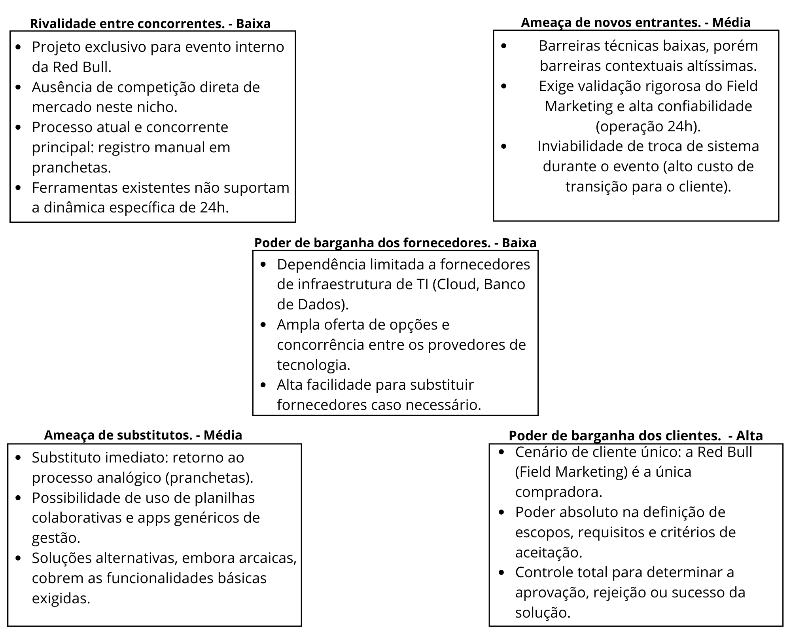<br>
  <sub>Fonte: Elaborado pelos autores (2026).</sub>
</div>
<br>

#### 1. Rivalidade entre concorrentes
A rivalidade é classificada como baixa. O projeto é direcionado a um evento interno exclusivo da Red Bull, o que elimina a competição direta de mercado por outros possíveis rivais. Atualmente, o maior "concorrente" é o processo manual feito com pranchetas. Embora existam ferramentas de gestão no mercado, nenhuma é adaptada para a dinâmica específica de um revezamento de 24 horas, classificando, assim, a rivalidade como praticamente inexistente no nosso nicho de atuação.

#### 2. Ameaça de novos entrantes
A ameaça de novos entrantes é média. Do ponto de vista técnico, o desenvolvimento de uma solução similar é simples; contudo, as barreiras de entrada são principalmente contextuais e operacionais. O sistema exige uma validação rigorosa do time de Field Marketing e uma garantia inegociável de confiabilidade para operar sem interrupções por 24 horas. Além disso, o custo de troca durante a execução do evento é extremamente inviável, o que protege a solução uma vez que ela é implementada.

#### 3. Poder de barganha dos fornecedores
O poder de barganha é baixo. A dependência de fornecedores se restringe à infraestrutura digital básica, como serviços de nuvem (cloud), bancos de dados e ferramentas de desenvolvimento. Como o mercado de tecnologia oferece uma ampla gama de provedores e opções intercambiáveis, o poder individual de cada fornecedor é mitigado, permitindo que o projeto mantenha autonomia sobre seus custos e escolhas técnicas.

#### 4. Ameaça de produtos substitutos
A ameaça é média. Os substitutos imediatos não são outras plataformas digitais, mas sim o método analógico (prancheta e papel), planilhas colaborativas ou aplicativos genéricos de produtividade. Embora sejam soluções arcaicas e menos eficientes para a análise de dados em tempo real, elas cumprem as funcionalidades básicas de registro. A viabilidade de uma regressão a esses formatos obriga o projeto a manter um alto nível de entrega de valor para justificar a digitalização.

#### 5. Poder de barganha dos clientes
O poder de barganha é alto. O projeto possui um cenário de monopsônio, onde há apenas um cliente direto: a Red Bull (representada pelo time de Field Marketing). Como único "comprador" e definidor de requisitos, o cliente tem total controle sobre o escopo, as prioridades e os critérios de aceitação. A ausência de outros clientes no horizonte do projeto aumenta a autoridade da Red Bull para exigir ajustes e determinar o sucesso ou fracasso da solução.

### Visão Geral
Com base nessa análise das cinco forças do projeto, pode ser concluído que o ambiente competitivo se mostra favorável à implementação da ferramenta. A rivalidade praticamente inexistente, somada ao baixo poder de barganha dos fornecedores, contribui para um cenário de "oceano azul", no qual a pressão externa de mercado é mínima pelo nível de especificidade do nicho e grande diversidade de recursos tecnológicos.

Entretanto, o equilíbrio estratégico do projeto é sensível a dois fatores: 
O primeiro é o poder de barganha elevado da Red Bull, que, por ser um cliente único, transforma a relação comercial em uma dependência direta de validação e alinhamento de expectativas. O segundo é a ameaça de substitutos, que foi classificada como média, uma vez que a simplicidade do método analógico já utilizado (prancheta) atua como uma zona de conforto para o usuário; qualquer falha técnica ou complexidade na usabilidade no sistema pode motivar uma regressão ao formato manual, que permanece viável e funcional para as necessidades básicas do evento.

Portanto, o equilíbrio geral das forças indica que o maior risco estratégico não é algum fator externo ou de competição, mas sim de relação com o parceiro e operacional. O sucesso do projeto não depende de vencer concorrentes, mas de garantir total alinhamento com os critérios do cliente, garantindo a superioridade da ferramenta desenvolvida em relação ao método substituto, tornando assim, a solução indispensável durante as 24 horas de operação.

### 2.1.2. Análise SWOT da Instituição Parceira (sprint 1)

A análise SWOT é uma ferramenta de diagnóstico estratégico utilizada para compreender a posição de uma organização ou projeto a partir de quatro dimensões: forças, fraquezas, oportunidades e ameaças. As forças e fraquezas dizem respeito a fatores internos, ou seja, elementos ligados à própria instituição, sua operação, seus recursos e suas limitações. Já as oportunidades e ameaças representam fatores externos, relacionados ao mercado, ao público, aos concorrentes, aos substitutos e ao ambiente em que o projeto está inserido [3](#ref-3).

No contexto do Red Bull 24 Horas, a SWOT foi utilizada para avaliar a situação da Red Bull enquanto parceira do projeto, considerando seu posicionamento institucional, a operação atual do evento e a proposta de desenvolvimento de uma solução web para registro e consolidação dos dados da competição. A análise permite identificar quais aspectos favorecem a implementação da solução, quais fragilidades precisam ser enfrentadas, quais oportunidades podem ampliar o valor do projeto e quais ameaças podem comprometer sua adoção.

<br>
<div align="center">
  <b>Figura 2 -  Matriz Swot</b><br>
  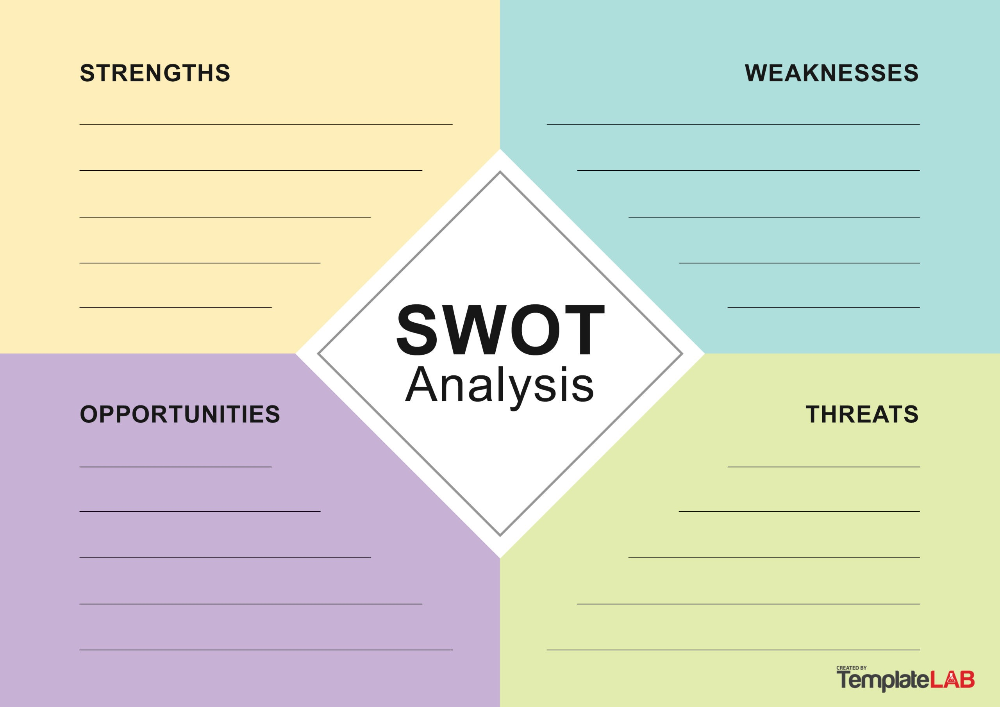<br>
  <sub>Fonte: Template Lab (2026).</sub>
</div>
<br>

#### Interno

#### Forças

As forças reúnem os pontos em que a Red Bull já chega na frente para tocar o projeto. São vantagens que vêm da própria marca, da estrutura de eventos e da relação com o público.

- Marca globalmente reconhecida e associada a esporte, energia, performance e experiências de alto impacto.
- Estrutura interna de Field Marketing experiente na execução de eventos proprietários.
- Capacidade de mobilizar público jovem e engajado em ativações esportivas e urbanas.
- Evento com identidade forte, formato competitivo claro e alto potencial de engajamento.
- Experiência prévia da Red Bull na criação de eventos próprios com apelo de marca.
- Posicionamento diferenciado em relação a concorrentes por unir esporte, entretenimento e experiência presencial.

As principais forças da Red Bull estão ligadas ao seu posicionamento institucional e à sua capacidade de criar experiências proprietárias. A marca já é reconhecida por sua associação com esporte, performance, energia e eventos de alto impacto, o que favorece a relevância do Red Bull 24 Horas dentro do seu ecossistema de marca.

Além disso, a existência de uma estrutura interna de Field Marketing é um fator importante para o projeto. A empresa já possui uma equipe acostumada a planejar e executar ativações presenciais, lidar com participantes e operar eventos em ambientes dinâmicos. Isso contribui para que as necessidades do evento sejam bem compreendidas e para que a solução proposta seja validada com base na realidade operacional.

Outro ponto forte é o próprio formato do Red Bull 24 Horas. Por ter uma dinâmica clara de equipes, revezamento, atletas, esteiras e apuração de quilometragem, o evento oferece um contexto bem definido para o desenvolvimento de uma solução específica. Essa clareza operacional facilita o entendimento do problema e permite que o projeto seja construído em torno de um fluxo real de uso.

Em relação aos concorrentes, a força da Red Bull está na dificuldade de replicar integralmente sua combinação de marca, público, experiência e operação proprietária. Outras marcas podem promover eventos esportivos, mas a Red Bull possui um posicionamento consolidado nesse tipo de ativação, o que favorece a diferenciação do evento.

#### Fraquezas

As fraquezas apontam os limites internos que o projeto precisa encarar. A maior parte delas vem do jeito como a apuração é feita hoje e das condições de operar 24 horas seguidas.

- Processo atual de apuração dependente de registros manuais em prancheta.
- Maior risco de erro humano, ilegibilidade, perda de dados ou inconsistência entre registros.
- Ausência de integração direta entre as esteiras Technogym e sistemas externos.
- Dependência da leitura visual do operador para registrar os dados da esteira.
- Operação prolongada por 24 horas, sujeita à fadiga e sobrecarga cognitiva da equipe operacional.
- Dificuldade de auditoria rápida quando os registros estão dispersos em papel, fotos ou anotações manuais.
- Baixa padronização do processo atual em comparação com um fluxo digital estruturado.
- Dependência de operadores manterem atenção contínua durante turnos longos de acompanhamento.

As fraquezas identificadas estão concentradas principalmente na operação atual de apuração. O registro manual em prancheta aumenta o risco de erros de preenchimento, atrasos, rasuras, divergências entre operadores e perda de informações relevantes. Em uma competição na qual o resultado depende diretamente da quilometragem registrada, essa fragilidade afeta a confiabilidade da apuração.

Outra limitação relevante está na infraestrutura tecnológica do evento. As esteiras Technogym utilizadas não possuem integração direta com o sistema proposto, o que impede a captura automática dos dados. Assim, a operação depende da leitura visual do display da esteira e da inserção manual das informações pelo time operacional.

A duração de 24 horas também intensifica essas fraquezas. Com o passar do evento, a fadiga dos operadores pode comprometer a atenção e aumentar a probabilidade de erro. Isso mostra que o problema não é apenas tecnológico, mas também operacional: o método atual exige consistência humana por um período longo e sob pressão.

Do ponto de vista do posicionamento da Red Bull, essa fragilidade gera uma contradição: a marca promove uma experiência associada à performance e à alta energia, mas a apuração ainda depende de um método manual vulnerável. A solução proposta surge justamente para reduzir essa distância entre a experiência de marca e o processo operacional de registro.

#### Externo

#### Oportunidades

As oportunidades mostram o que a solução pode destravar para além do evento atual. São ganhos que aparecem quando a apuração deixa de ser manual e passa a gerar dados organizados.

- Crescimento do interesse por corrida, fitness e desafios esportivos de resistência.
- Possibilidade de digitalizar e profissionalizar a apuração do Red Bull 24 Horas.
- Aumento da confiabilidade, rastreabilidade e transparência na apuração dos resultados.
- Criação de uma base de dados estruturada para conferência, auditoria e aprendizado pós-evento.
- Possibilidade de reaproveitamento da solução em futuras edições do Red Bull 24 Horas.
- Potencial de adaptação da solução para outras ativações esportivas da Red Bull.
- Possibilidade de expansão para edições internacionais com dinâmica semelhante, como o Red Bull 24 Horas da Suíça, caso o modelo seja validado.
- Diferenciação frente a eventos concorrentes por meio de uma operação mais organizada e confiável.
- Melhoria da experiência de acompanhamento para equipe organizadora, operadores e participantes.
- Redução de retrabalho pós-evento por meio da consolidação digital dos registros.

As oportunidades surgem principalmente da possibilidade de transformar uma operação manual em um processo digital mais organizado e confiável. Como a Red Bull já possui força de marca e experiência em eventos esportivos, a digitalização da apuração pode elevar o padrão operacional do Red Bull 24 Horas e reforçar a percepção de profissionalismo do evento.

O crescimento do interesse por corrida, fitness e desafios de resistência também favorece a relevância do projeto. Esse contexto amplia o potencial de engajamento do evento e aumenta a importância de uma apuração confiável, já que os participantes e a organização precisam ter segurança sobre os resultados finais.

A solução proposta pode ainda gerar valor além da edição atual. Ao estruturar dados de equipes, atletas, turnos, esteiras e checkpoints, o projeto cria uma base que pode ser reaproveitada em futuras edições do evento ou adaptada para outras ativações esportivas da marca. Caso o modelo seja validado no contexto brasileiro, existe a possibilidade de replicação para eventos internacionais com formato semelhante, como uma edição do Red Bull 24 Horas na Suíça.

Em relação ao posicionamento competitivo, essa oportunidade é relevante porque a Red Bull pode diferenciar sua operação não apenas pela força da marca, mas também pela qualidade da gestão dos dados do evento. A confiabilidade da apuração passa a ser parte da experiência entregue.

#### Ameaças

As ameaças são os fatores externos que podem travar a adoção do sistema. Boa parte delas tem a ver com o método manual continuar sendo uma saída fácil e com os riscos de uma prova longa.

- Concorrência com outros eventos esportivos e experiências de marca voltadas ao mesmo público.
- Existência de substitutos simples, como pranchetas, planilhas colaborativas e aplicativos genéricos.
- Risco de baixa adoção caso a solução proposta seja mais lenta ou complexa que o método manual.
- Imprevistos operacionais durante as 24 horas, como falhas de infraestrutura, equipamentos ou conexão.
- Possibilidade de falha técnica durante um momento crítico da competição.
- Resistência de operadores acostumados ao processo manual.
- Riscos de saúde, segurança e fadiga dos atletas em uma prova de longa duração.
- Dependência de validação e aceitação do time operacional da Red Bull.
- Pressão por alta confiabilidade, já que qualquer erro pode gerar contestação do resultado final.
- Dificuldade de adoção em futuras edições se o sistema não demonstrar ganho claro em relação à prancheta.

As ameaças mais relevantes não vêm apenas de concorrentes diretos, mas também de substitutos operacionais. A prancheta, as planilhas e os aplicativos genéricos continuam sendo alternativas possíveis porque são simples, conhecidos e exigem baixa preparação. Mesmo com limitações, esses métodos podem ser mantidos se a solução proposta não demonstrar ganhos claros de confiabilidade e facilidade de uso.

Também há concorrência indireta com outros eventos esportivos e ativações de marca que disputam a atenção do mesmo público. Nesse cenário, a qualidade da experiência oferecida pela Red Bull precisa se manter alta, inclusive nos bastidores da operação. Uma apuração confusa, lenta ou sujeita a questionamentos pode enfraquecer a percepção de profissionalismo do evento.

Além disso, a natureza do Red Bull 24 Horas cria riscos operacionais próprios. Uma prova contínua está sujeita a falhas de equipamento, instabilidade de infraestrutura, troca de operadores, cansaço da equipe e situações relacionadas à saúde dos atletas. Como a solução digital será inserida nesse ambiente, ela precisa ser simples, resiliente e adequada ao uso sob pressão.

A aceitação do time operacional também é uma ameaça importante. Se os operadores perceberem o sistema como difícil, lento ou pouco confiável, a tendência será recorrer ao método manual. Portanto, o sucesso do projeto depende de a solução proposta ser claramente melhor do que a prancheta, sem exigir complexidade adicional na operação.

#### Visão geral da SWOT

A análise SWOT mostra que a Red Bull parte de uma posição institucional forte para desenvolver o projeto. A marca possui reconhecimento global, associação consolidada com esporte e performance e experiência na criação de eventos proprietários de alto engajamento. Esses fatores favorecem o Red Bull 24 Horas e criam um ambiente positivo para a adoção de melhorias operacionais.

Por outro lado, a operação atual apresenta uma fraqueza clara: a apuração dos quilômetros ainda depende de registros manuais, leitura visual da esteira e consolidação posterior dos dados. Essa limitação é ainda mais sensível por se tratar de uma competição de 24 horas, na qual a fadiga, a pressão operacional e a repetição dos registros aumentam o risco de erro.

As oportunidades estão ligadas à possibilidade de a solução proposta digitalizar e padronizar uma etapa crítica do evento. O projeto pode reduzir inconsistências, melhorar a rastreabilidade, facilitar a auditoria e criar uma base replicável para futuras edições ou ativações semelhantes, inclusive em outros países, caso o modelo seja validado.

Já as ameaças indicam que a solução precisa provar valor rapidamente. O método manual, apesar de limitado, continua sendo um substituto viável por ser conhecido e simples. Portanto, o desafio estratégico não é apenas desenvolver uma aplicação digital, mas garantir que ela seja mais confiável, prática e aderente ao contexto do evento do que os métodos já utilizados.

Em síntese, a SWOT reforça que o projeto deve aproveitar as forças institucionais da Red Bull para resolver uma fragilidade operacional concreta. A solução proposta não parte de uma digitalização já existente; ela surge justamente para substituir um processo manual por um fluxo mais confiável, rastreável e adequado à complexidade do Red Bull 24 Horas.

### 2.1.3. Solução (sprints 1 a 5)

- Problema a ser resolvido     
    
  O controle dos quilômetros no Red Bull 24 Horas é realizado manualmente por meio de pranchetas, com registros de entrada dos atletas, checkpoints periódicos e encerramento dos turnos. Esse processo é vulnerável a erros de anotação, rasuras, perda de informações, divergência entre operadores e dificuldade de conferência ao longo das 24 horas de prova.

Como o resultado da competição depende diretamente da quilometragem registrada, qualquer inconsistência no processo de apuração pode comprometer a confiabilidade do resultado final. Além disso, a ausência de integração direta com as esteiras exige que os dados sejam lidos visualmente e inseridos manualmente pela equipe operacional.

- Dados disponíveis 

  Os dados disponíveis foram levantados a partir de três fontes principais: uma planilha fornecida pela Red Bull com registros de uma edição anterior do evento, o kick-off com o parceiro e o TAPI do projeto. A planilha permitiu identificar métricas já utilizadas na apuração, como equipe, participante, quilometragem, pace médio e velocidade média.

Já o kick-off e o TAPI ajudaram a definir o contexto operacional, incluindo o uso de equipes, atletas, esteiras, turnos, checkpoints e as restrições técnicas do evento, como a ausência de integração direta com as esteiras Technogym e a inviabilidade do uso de pulseiras como fonte automática de dados.

- Solução proposta

  A solução proposta consiste em uma aplicação web responsiva, otimizada para uso em iPad, com o objetivo de substituir a prancheta por um fluxo digital mais confiável e rastreável. O sistema permitirá selecionar equipe, atleta e esteira, iniciar turnos com timestamp automático, registrar checkpoints periódicos com KM acumulado obrigatório e campos opcionais de pace médio e velocidade média, além de encerrar turnos e exibir os resultados daquela sessão.

A aplicação também deverá permitir a visualização dos resultados consolidados por equipe, a comparação final entre as equipes competidoras e a exportação dos dados em CSV para auditoria. Dessa forma, a solução busca organizar os registros da competição, reduzir falhas humanas e facilitar a conferência dos dados após o evento.

- Forma de utilização

  Durante o evento, os operadores utilizarão um iPad ao lado da esteira para registrar o fluxo de cada turno. O processo seguirá a lógica operacional definida: seleção da equipe, seleção do atleta, vinculação com a esteira, início do turno, registro de checkpoints periódicos e encerramento da sessão.

A organização poderá acompanhar os resultados consolidados por equipe em uma visualização restrita, sem acesso aberto ao público. Ao final da competição, os dados registrados serão exportados em formato CSV para conferência, auditoria e validação dos resultados.

- Benefícios esperados 

  Os principais benefícios esperados são a redução de erros na apuração dos quilômetros, maior confiabilidade dos registros, rastreabilidade dos dados por equipe, atleta, esteira, turno e checkpoint, além de mais eficiência operacional para o time de Field Marketing.

A solução também deve facilitar a conferência dos resultados, reduzir retrabalho pós-evento, padronizar a coleta de dados e criar uma base estruturada para auditoria. Com isso, o processo de apuração se torna mais transparente, organizado e adequado à dinâmica de uma competição de 24 horas.

- Critérios de sucesso e como será avaliado 

  A solução será avaliada inicialmente por meio de testes internos com dados mockados, reproduzindo o fluxo principal da operação do evento: seleção de equipe, seleção de atleta, vinculação à esteira, início de turno, registro de checkpoints, encerramento do turno, consolidação dos resultados e exportação em CSV.

Os dados mockados deverão simular situações reais do Red Bull 24 Horas, como múltiplos atletas, diferentes turnos, registros de checkpoints, variação de quilometragem, campos opcionais de pace e velocidade média e possíveis inconsistências de preenchimento. Dessa forma, será possível validar se o sistema registra e relaciona corretamente equipe, atleta, esteira, turno e checkpoints.

A avaliação considerará como critérios de sucesso: consistência dos dados registrados, facilidade de uso no fluxo principal, funcionamento correto das validações, redução de erros em relação ao processo manual e geração adequada do arquivo CSV para auditoria.

Caso seja viável, em uma etapa posterior, a solução poderá ser validada com o parceiro em uma simulação assistida ou demonstração guiada, permitindo coletar feedback do time de Field Marketing sobre usabilidade, aderência ao fluxo real e confiabilidade percebida.  

### 2.1.4. Value Proposition Canvas (sprint 1): 

Esta seção detalha o alinhamento estratégico entre as necessidades operacionais de campo do parceiro Red Bull e as funcionalidades específicas da solução proposta, garantindo consistência entre as dores identificadas no monitoramento de atletas e o valor gerado para o ecossistema de Field Marketing. O Canva da proposta de valor é estruturado a partir de uma análise rigorosa do Perfil do Cliente, criando um Mapa de Valor que responde diretamente a cada desafio logístico e técnico do evento de 24 horas. [4](#ref-4).

<div align="center">
  <sub><b>Figura 3 – CANVA DA PROPOSTA DE VALOR</b></sub><br>
  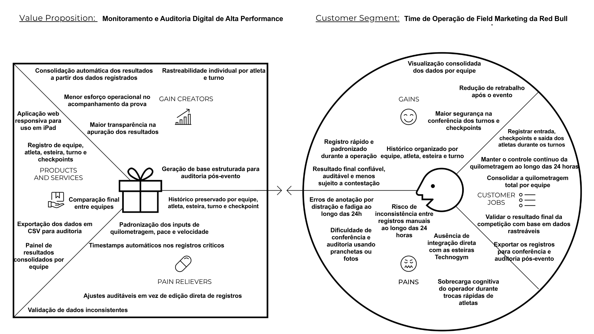<br>
  <sup>Fonte: Elaborado pelos autores (2026)</sup>
</div>

**Análise do Mapa do Perfil do Cliente**

**Tarefas do Cliente (Customer Jobs)**

O perfil do cliente está diretamente relacionado à operação do Red Bull 24 Horas, especialmente ao time de Field Marketing responsável por acompanhar a competição e registrar os dados produzidos durante os turnos dos atletas. A principal tarefa desse usuário é manter o controle contínuo da quilometragem ao longo das 24 horas de prova, registrando a entrada, os checkpoints e a saída de cada atleta nas esteiras.

Além do registro em si, o cliente precisa garantir que cada dado esteja corretamente associado à equipe, ao atleta, à esteira e ao turno correspondente. Essa tarefa é essencial porque a apuração final da competição depende da consolidação da quilometragem total por equipe. Portanto, o trabalho do operador não se limita ao preenchimento de informações: ele também precisa assegurar que os registros sejam confiáveis, organizados e utilizáveis para validação posterior.

Outro ponto relevante é a necessidade de exportar os registros para conferência e auditoria após o evento. Como a competição envolve revezamento contínuo e grande volume de dados, o cliente precisa de um processo que facilite a validação do resultado final com base em informações rastreáveis, reduzindo a dependência de anotações dispersas ou registros manuais difíceis de conferir.

**Dores do Cliente (Pains)**

As principais dores do cliente surgem da dependência do processo manual. O registro em prancheta, somado à necessidade de leitura visual da esteira, cria um ambiente propenso a erros de anotação, inconsistências e perda de informações ao longo das 24 horas. Como a operação ocorre de forma contínua, fatores como distração, fadiga e pressão operacional aumentam o risco de falhas.

A ausência de integração direta com as esteiras Technogym também representa uma limitação importante. Como os dados não podem ser capturados automaticamente, o operador precisa observar a informação exibida na esteira e registrá-la manualmente no momento correto. Esse processo aumenta a sobrecarga cognitiva, principalmente durante trocas rápidas de atletas ou em situações de parada inesperada da esteira.

Outra dor relevante está na dificuldade de conferência e auditoria. Quando os dados ficam espalhados entre pranchetas, fotos ou anotações manuais, torna-se mais difícil reconstruir o histórico da competição com segurança. Isso pode gerar dúvidas sobre turnos, checkpoints e resultados finais, especialmente se houver registros incompletos ou divergentes.

**Ganhos do Cliente (Gains)**

Os ganhos esperados estão associados à melhoria da confiabilidade, da organização e da transparência da apuração. O cliente busca um resultado final confiável, auditável e menos sujeito a contestação, baseado em registros bem estruturados ao longo da competição. Para isso, é necessário que os dados estejam organizados por equipe, atleta, esteira e turno.

Outro ganho importante é a redução de retrabalho após o evento. Com os dados registrados de forma padronizada durante a operação, a organização pode consultar informações consolidadas com maior rapidez e segurança. Isso facilita a conferência dos turnos, dos checkpoints e da quilometragem acumulada por equipe.

Além disso, a visualização consolidada dos dados por equipe contribui para um acompanhamento mais claro da competição. O registro rápido e padronizado durante a operação reduz a complexidade do processo para os operadores e aumenta a segurança da organização na validação dos resultados.

---

**Análise do Mapa de Valor**

**Produtos e Serviços (Products and Services)**

A entrega proposta consiste em uma aplicação web responsiva para uso em iPad, voltada ao registro da operação do Red Bull 24 Horas. A solução permite registrar equipe, atleta, esteira, turno e checkpoints, substituindo a prancheta por um fluxo digital mais estruturado e rastreável.

Além do registro operacional, o sistema oferece painel de resultados consolidados por equipe, comparação final entre equipes e exportação dos dados em CSV para auditoria. Esses recursos atendem diretamente às tarefas do cliente, pois apoiam tanto o acompanhamento da competição quanto a conferência posterior dos resultados.

É importante destacar que a solução não depende de integração automática com as esteiras. Seu papel é organizar e qualificar o registro manual feito pelo operador, tornando esse processo mais confiável, padronizado e adequado ao contexto de uma prova de 24 horas.

**Aliviadores de Dores (Pain Relievers)**

A solução alivia as dores do cliente ao reduzir a vulnerabilidade do processo manual. A padronização dos inputs de quilometragem, pace e velocidade diminui a chance de registros incompletos ou inconsistentes, enquanto a obrigatoriedade do KM acumulado nos checkpoints garante que o dado central da apuração seja sempre coletado.

Os timestamps automáticos nos registros críticos também contribuem para a confiabilidade da operação, pois reduzem a necessidade de controle manual de horários. Além disso, a validação de dados inconsistentes ajuda a evitar erros como a inserção de uma quilometragem menor que a anterior dentro do mesmo turno.

Outro aliviador relevante é a preservação do histórico por equipe, atleta, esteira, turno e checkpoint. Isso melhora a capacidade de auditoria e reduz a dependência de registros em papel. Caso sejam necessários ajustes, a lógica de ajustes auditáveis evita a edição direta e sem rastreabilidade, mantendo maior controle sobre o histórico da prova.

**Criadores de Ganhos (Gain Creators)**

Os criadores de ganho estão ligados à capacidade da solução de transformar registros operacionais em informações consolidadas e úteis para a tomada de decisão. A consolidação automática dos resultados a partir dos dados registrados permite que a organização acompanhe a evolução da competição com menor esforço manual.

A rastreabilidade individual por atleta e turno também gera valor, pois permite compreender de onde vem cada registro e como ele contribui para o resultado da equipe. Isso fortalece a transparência da apuração e reduz o risco de contestação ao final da prova.

Além disso, a geração de uma base estruturada para auditoria pós-evento amplia o valor da solução além do momento da competição. Os dados deixam de existir apenas como anotações manuais e passam a compor um histórico organizado, exportável e reutilizável para conferência. Dessa forma, o sistema cria ganhos tanto operacionais quanto estratégicos para futuras edições do evento.

---

**Visão Geral**

A análise do Mapa de Valor evidencia que a proposta da aplicação está alinhada às principais necessidades operacionais do Red Bull 24 Horas. O cliente precisa registrar e validar dados de forma contínua, confiável e rastreável, enquanto suas principais dores estão relacionadas ao processo manual, à ausência de integração direta com as esteiras e à dificuldade de auditoria dos registros.

Nesse contexto, a solução proposta atua como uma camada digital de organização e controle, sem depender de automação externa. Ao padronizar os registros, associar corretamente equipe, atleta, esteira, turno e checkpoints, e permitir a consolidação e exportação dos dados, o sistema contribui para uma apuração mais segura e eficiente.

Assim, o valor da solução não está apenas em substituir a prancheta por uma interface digital, mas em reduzir riscos operacionais, aumentar a confiabilidade dos dados e oferecer uma base estruturada para conferência e auditoria. Dessa forma, o projeto se posiciona como uma resposta direta às dores do cliente e como um apoio essencial para a gestão da competição durante as 24 horas de prova.


### 2.1.5. Matriz de Riscos do Projeto (sprint 1)

A matriz de riscos é uma ferramenta qualitativa e analítica que permite aos gestores mensurar, avaliar e ordenar eventos de incerteza que possam comprometer os objetivos estratégicos e operacionais. Estruturada em uma escala de 5x5, ela cruza os eixos de probabilidade, definida como a possibilidade de ocorrência, e impacto, que representa a severidade da consequência, para determinar a magnitude do risco. Essa metodologia possibilita a classificação dos eventos em níveis como pequeno, moderado, alto e crítico, orientando a adoção de respostas adequadas para evitar, reduzir, compartilhar ou aceitar o risco. Conforme o Ministério do Planejamento, Desenvolvimento e Gestão (2017) [5](#ref-5), tal abordagem foi aplicada em nosso projeto para identificar situações adversas e subsidiar a implementação de controles que mitiguem a probabilidade de falhas no andamento do trabalho.

<div align="center">
  <sub><b>Figura 4 - Matriz de risco</b></sub><br>
  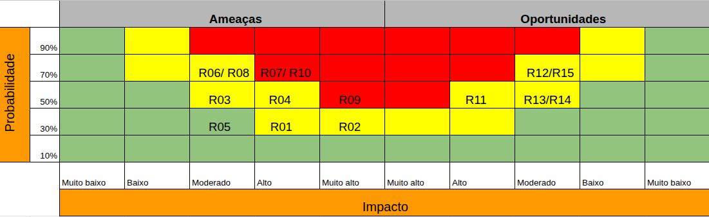<br>
  <sup>Material produzido pelos autores (2026)</sup>
</div>

#### Ameaças

| ID | Risco | Descrição Detalhada | Impacto | Probabilidade | Plano de Ação e Resposta (Mitigação) | Responsável |
| :--- | :--- | :--- | :--- | :--- | :--- | :--- |
| **R01** | Instabilidade de Conexão no Local do Evento | Queda ou oscilação do Wi-Fi durante o evento, impedindo o registro em tempo real dos checkpoints. | Alto | Baixa | Alinhar antecipadamente com a organizadora a infraestrutura de Wi-Fi (Starlink ou equivalente) e implementar cache local no app para manter o registro mesmo com queda momentânea. | Red Bull |
| **R02** | Indisponibilidade do Banco de Dados | O serviço de banco (Supabase) ficar fora do ar durante o evento, impedindo o registro de checkpoints. | Crítico | Baixa | Validação prévia do ambiente em simulação e backup local mínimo no app para continuar os registros caso o banco caia. | Cauan |
| **R03** | Inconsistência nos Checkpoints (KM Regressivo) | Operador digitar km menor que o checkpoint anterior por engano, comprometendo o cálculo do total acumulado. | Médio | Média | Validação no sistema que bloqueia o salvamento se o km for menor que o último registrado no mesmo turno. | Fernando |
| **R04** | Falha no Registro de Transição | Falha ao registar o momento exato da troca de atletas, corrompendo métricas individuais de pace. | Alto | Média | Interface de confirmação rápida para o "operadores de prova" e logs de segurança com timestamp de alta precisão. | André |
| **R05** | Não Conformidade visual (Brandbook) | Rejeição da interface pelo Compliance da Red Bull por descumprimento das diretrizes de marca. | Médio | Baixa | Validação contínua com a equipe de marca da Red Bull durante as sprints de design. | Augusto |
| **R06** | Latência na Atualização do Placar | Atraso perceptível entre o registro do checkpoint e a atualização do placar exibido em tela, prejudicando a experiência durante o evento. | Médio | Alta | Otimização do envio de dados e atualização eficiente do placar conforme a stack a ser definida no planejamento técnico. | Red Bull |
| **R07** | Erro Operacional (Digitação Incorreta) | Operador digitar quilometragem errada na transição, corrompendo os resultados. | Alto | Alta | Bloqueios lógicos (ex: impedir saltos de KM impossíveis) e dupla validação visual na UI. | Fernando / André |
| **R08** | Fadiga Operacional (Madrugada) | Queda de atenção e erros da equipe de apoio devido à exaustão física durante provas longas. | Médio | Alta | Escala de revezamento, pausas obrigatórias e área de descanso com alimentação e energéticos. | Produção / Red Bull |
| **R09** | Falha Mecânica da Esteira | Travamento ou reinicialização da esteira no meio da corrida de um atleta. | Crítico | Média | **Contingência:** Sistema assume último checkpoint + pace médio do atleta. Troca para esteira reserva. | André |
| **R10** | Descarregamento de iPads/Tablets | Dispositivos dos juízes ou de exibição ficarem sem bateria durante o evento. | Alto | Alta | iPads obrigatoriamente ligados à corrente, powerbanks de reserva e alertas de bateria a 20%. | Infraestrutura |

#### Oportunidades

| ID | Risco (Oportunidade) | Descrição Detalhada | Impacto | Probabilidade | Plano de Ação (Potencialização) | Responsável |
| :--- | :--- | :--- | :--- | :--- | :--- | :--- |
| **R11** | Reuso do Sistema em Outros Eventos | A solução pode ser reaproveitada em outros eventos esportivos da Red Bull (corridas, ciclismo, etc.), aumentando o impacto do projeto para marca. | Alto | Média | Documentar o sistema de forma genérica e modular, permitindo adaptação para diferentes formatos de competição. | Daniel |
| **R12** | Análise Pós-Evento dos Dados | Os dados consolidados ao longo das 24h podem virar insumo para planejamento de futuras edições do evento (descansos, ritmo, gestão de esteira). | Médio | Alta | Estruturar o relatório pós-evento com gráficos de evolução por hora e por esteira, facilitando a análise pelo time da Red Bull. | Augusto |
| **R13** | Engajamento por Gamificação | Inserir leaderboards e elementos visuais de competitividade no modo TV para aumentar o engajamento da plateia presente no evento. | Médio | Média | Aplicar diretrizes simples de design no painel de placar para deixar a disputa mais visualmente envolvente. | Cauan |
| **R14** | Case Interno Red Bull | A solução pode ser apresentada como case dentro da Red Bull para outras áreas que organizam eventos similares, gerando reconhecimento ao time de Field Marketing. | Médio | Média | Documentar o processo e os resultados de forma apresentável para divulgação interna após o evento. | André |
| **R15** | Geração de Conteúdo Pós-Evento | Os dados e o histórico podem ser usados pelo time de marketing para gerar conteúdo orgânico de redes sociais sobre a competição (totais finais, momentos de virada, recordes). | Médio | Alta | Garantir que a exportação CSV traga todos os dados necessários para o time de marketing montar o conteúdo manualmente. | Luckas |

## 2.2. Personas (sprint 1)

As personas auxiliam no projeto ao humanizar dados técnicos, permitindo que a equipe tome decisões baseadas em necessidades reais de uso, como a rapidez exigida pelo time operacional. Elas alinham as expectativas dos stakeholders e priorizam funcionalidades que resolvem dores críticas, garantindo a eficácia do produto final (COOPER, 2004, [6](#ref-6); NIELSEN, 2012, [7](#ref-7)).

<div align="center">
  <sub><b>Figura 5 - Primeira persona</b></sub><br>
  <br>
  <sup>Material produzido pelos autores (2026)</sup>
</div>

A primeira persona representa **Ricardo**, operador de campo responsável pelo registro dos dados durante o evento. Sua função é acompanhar a troca dos atletas, selecionar equipe, atleta e esteira, iniciar e encerrar turnos e registrar checkpoints no sistema ao longo da prova. Essa persona foi escolhida porque está diretamente ligada ao momento mais crítico da operação: a inserção manual dos dados sob pressão, cansaço e necessidade de rapidez. No sistema, Ricardo é o principal usuário operacional, utilizando a aplicação para substituir a prancheta e garantir que os registros fiquem vinculados corretamente a equipe, atleta, esteira, turno e checkpoint.

<div align="center">
  <sub><b>Figura 6 - Segunda persona</b></sub><br>
  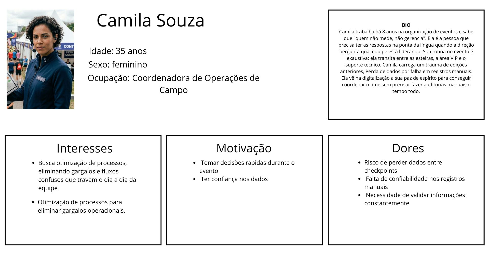<br>
  <sup>Material produzido pelos autores (2026)</sup>
</div>

A segunda persona representa **Camila**, coordenadora responsável pelo acompanhamento geral da competição e pela validação dos resultados. Sua função no evento é monitorar o andamento das equipes, conferir dados consolidados, tomar decisões em casos de inconsistência e garantir maior segurança na apuração final. Essa persona foi escolhida porque representa a necessidade de gestão, controle e confiabilidade dos dados ao longo das 24 horas. No sistema, Camila se relaciona principalmente com as telas de acompanhamento, Modo TV, resultados consolidados, comparação entre equipes e exportação dos dados para auditoria.

## 2.3. User Stories (sprints 1 a 5)

As User Stories são descrições objetivas das necessidades do usuário em relação ao sistema. Elas apresentam, de forma simples, quem utilizará a funcionalidade, qual ação deseja realizar e qual valor essa ação entrega para o produto. [8](#ref-8).

Esse formato ajuda a equipe a transformar necessidades reais em entregas planejáveis, mantendo o desenvolvimento orientado ao usuário e não apenas à implementação técnica. Além disso, as User Stories facilitam a priorização do backlog, pois permitem identificar quais funcionalidades são essenciais para o funcionamento inicial da solução e quais podem ser desenvolvidas em etapas posteriores.

Cada User Story também é acompanhada por critérios de aceite, que definem as condições mínimas para que a entrega seja considerada concluída. Dessa forma, a equipe consegue validar se a funcionalidade atende ao comportamento esperado antes de avançar no desenvolvimento.

---

### US01 — Selecionar perfil de acesso

| Campo | Descrição |
|---|---|
| **Identificação** | US01 |
| **Persona** | Promotor de Field Marketing / Gestora de Operações |
| **User Story** | Como usuário do sistema, seja **Promotor de Field Marketing** ou **Gestora de Operações**, quero selecionar meu perfil de acesso ao entrar na aplicação para que o sistema direcione minha experiência conforme minhas permissões e responsabilidades no evento. |

**Critérios de aceite**

| Critério | Descrição |
|---|---|
| **Critério de aceite 1** | Dado que o usuário acessa a aplicação, quando a tela inicial for carregada, então o sistema deve exibir as opções de perfil disponíveis: **Promotor de Field Marketing** e **Gestora de Operações**. |
| **Critério de aceite 2** | Dado que o usuário seleciona o perfil de **Promotor de Field Marketing**, então o sistema deve direcioná-lo para a identificação do promotor que realizará os registros operacionais. |
| **Critério de aceite 3** | Dado que o usuário seleciona o perfil de **Gestora de Operações**, então o sistema deve direcioná-la para uma etapa de acesso autenticado antes de liberar funcionalidades administrativas. |

**Critérios INVEST**

| Critério | Avaliação |
|---|---|
| **I — Independente** | Pode ser desenvolvida separadamente das demais telas, pois representa o primeiro ponto de entrada da aplicação e apenas define qual fluxo será acessado. |
| **N — Negociável** | A forma visual de seleção pode variar entre botões, cards ou tela de escolha simples. O ponto obrigatório é diferenciar claramente os perfis de acesso. |
| **V — Valiosa** | Garante que cada tipo de usuário acesse o sistema de acordo com suas permissões, evitando que um promotor entre diretamente em funcionalidades administrativas. |
| **E — Estimável** | A implementação envolve uma tela inicial com duas opções de perfil e redirecionamento para fluxos distintos, permitindo estimativa clara de esforço. |
| **S — Pequena** | Possui escopo reduzido, pois se limita à seleção inicial do perfil de acesso e ao encaminhamento para a próxima etapa do fluxo. |
| **T — Testável** | Pode ser validada verificando se cada opção de perfil leva corretamente à tela seguinte correspondente. |

---

### US02 — Identificar promotor responsável pela operação

| Campo | Descrição |
|---|---|
| **Identificação** | US02 |
| **Persona** | Promotor de Field Marketing |
| **User Story** | Como **Promotor de Field Marketing**, quero selecionar meu nome a partir de uma lista de promotores previamente cadastrados para que os registros feitos durante a operação fiquem associados corretamente à minha identidade. |

**Critérios de aceite**

| Critério | Descrição |
|---|---|
| **Critério de aceite 1** | Dado que o usuário selecionou o perfil de **Promotor de Field Marketing**, quando a tela de identificação for exibida, então o sistema deve apresentar uma lista com os promotores cadastrados. |
| **Critério de aceite 2** | Dado que o promotor seleciona seu nome, então o sistema deve registrar essa identidade como responsável pelas próximas ações operacionais realizadas na aplicação. |
| **Critério de aceite 3** | Dado que o promotor realizou uma ação, como iniciar turno, registrar checkpoint ou encerrar turno, então o registro salvo deve manter a identificação do promotor responsável. |

**Critérios INVEST**

| Critério | Avaliação |
|---|---|
| **I — Independente** | Pode ser implementada de forma isolada após a seleção do perfil de promotor, sem depender do fluxo completo de turnos e checkpoints. |
| **N — Negociável** | A forma de exibir os promotores pode variar entre lista, cards ou busca simples. O ponto obrigatório é que o promotor consiga se identificar antes de operar o sistema. |
| **V — Valiosa** | A identificação do responsável aumenta a rastreabilidade dos registros e permite saber quem realizou cada ação durante o evento. |
| **E — Estimável** | Envolve listagem de usuários cadastrados, seleção de um nome e persistência da identidade ativa na sessão operacional. |
| **S — Pequena** | A história trata de uma única ação principal: escolher quem está operando o sistema naquele momento. |
| **T — Testável** | Pode ser testada verificando se o nome selecionado é mantido como responsável nos registros criados posteriormente. |

---

### US03 — Trocar rapidamente o promotor ativo

| Campo | Descrição |
|---|---|
| **Identificação** | US03 |
| **Persona** | Promotor de Field Marketing |
| **User Story** | Como **Promotor de Field Marketing**, quero acessar um ícone de perfil em todas as telas operacionais para trocar rapidamente o promotor ativo quando outra pessoa assumir a operação do iPad. |

**Critérios de aceite**

| Critério | Descrição |
|---|---|
| **Critério de aceite 1** | Dado que o promotor está em uma tela operacional, então o sistema deve exibir um ícone de perfil visível e acessível. |
| **Critério de aceite 2** | Dado que o promotor clica no ícone de perfil, quando seleciona outro nome da lista de promotores cadastrados, então o sistema deve atualizar o responsável pelas próximas ações. |
| **Critério de aceite 3** | Dado que o promotor ativo foi alterado, então os registros anteriores devem manter o responsável original, sem sobrescrever o histórico já salvo. |

**Critérios INVEST**

| Critério | Avaliação |
|---|---|
| **I — Independente** | Pode ser desenvolvida como complemento da identificação do promotor, sem depender da implementação completa de todos os fluxos operacionais. |
| **N — Negociável** | O ícone pode estar no cabeçalho, menu superior ou lateral. O ponto obrigatório é permitir a troca rápida do responsável sem reiniciar todo o fluxo. |
| **V — Valiosa** | Reduz erros de autoria nos registros, especialmente em um evento longo, no qual operadores podem se alternar durante as 24 horas. |
| **E — Estimável** | A implementação envolve um componente de perfil, uma ação de troca de usuário ativo e a persistência da nova identidade para registros futuros. |
| **S — Pequena** | A história é focada em uma única funcionalidade: alterar rapidamente o promotor responsável pela operação. |
| **T — Testável** | Pode ser validada verificando se, após a troca de perfil, os novos registros ficam associados ao novo promotor e os registros antigos preservam o responsável anterior. |

---

### US04 — Acessar funcionalidades administrativas com autenticação

| Campo | Descrição |
|---|---|
| **Identificação** | US04 |
| **Persona** | Gestora de Operações |
| **User Story** | Como **Gestora de Operações**, quero acessar o sistema por meio de autenticação para utilizar funcionalidades operacionais e administrativas com privilégios, incluindo a correção de registros antigos e checkpoints. |

**Critérios de aceite**

| Critério | Descrição |
|---|---|
| **Critério de aceite 1** | Dado que a usuária seleciona o perfil de **Gestora de Operações**, então o sistema deve solicitar uma etapa de autenticação antes de liberar o acesso. |
| **Critério de aceite 2** | Dado que as credenciais informadas são válidas, então o sistema deve liberar o acesso às funcionalidades de gestora. |
| **Critério de aceite 3** | Dado que as credenciais informadas são inválidas, então o sistema deve impedir o acesso às funcionalidades administrativas. |
| **Critério de aceite 4** | Dado que a gestora está autenticada, então ela deve poder acessar as funcionalidades operacionais do promotor e também funcionalidades privilegiadas de correção e auditoria. |

**Critérios INVEST**

| Critério | Avaliação |
|---|---|
| **I — Independente** | Pode ser implementada separadamente do fluxo operacional, pois trata do acesso da gestora e da liberação de permissões administrativas. |
| **N — Negociável** | O método de autenticação pode variar conforme a decisão técnica do grupo, como senha simples, código de acesso ou autenticação integrada. O ponto obrigatório é restringir funções administrativas à gestora. |
| **V — Valiosa** | Protege ações sensíveis, como alteração de registros antigos, evitando que qualquer operador comum modifique dados importantes da apuração. |
| **E — Estimável** | Envolve tela de autenticação, validação de credenciais e definição de permissões, o que torna o escopo estimável. |
| **S — Pequena** | A história é limitada ao acesso autenticado da gestora e à liberação do perfil administrativo. |
| **T — Testável** | Pode ser testada com credenciais válidas e inválidas, verificando se o sistema libera ou bloqueia corretamente as funcionalidades administrativas. |

---

### US05 — Selecionar equipe em operação

| Campo | Descrição |
|---|---|
| **Identificação** | US05 |
| **Persona** | Promotor de Field Marketing |
| **User Story** | Como **Promotor de Field Marketing**, quero selecionar a equipe que será acompanhada para que todos os registros posteriores sejam vinculados corretamente ao grupo em competição. |

**Critérios de aceite**

| Critério | Descrição |
|---|---|
| **Critério de aceite 1** | Dado que o promotor está identificado no sistema, quando a tela de seleção de equipe for exibida, então o sistema deve apresentar as equipes cadastradas para o evento. |
| **Critério de aceite 2** | Dado que o promotor seleciona uma equipe, então o sistema deve direcioná-lo para o fluxo operacional daquela equipe. |
| **Critério de aceite 3** | Dado que uma equipe foi selecionada, então os registros seguintes, como seleção de atleta, vínculo de esteira, início de turno e checkpoints, devem permanecer associados à equipe escolhida. |

**Critérios INVEST**

| Critério | Avaliação |
|---|---|
| **I — Independente** | Pode ser implementada após a identificação do promotor, pois representa uma etapa específica do fluxo operacional e não exige que os turnos já estejam implementados. |
| **N — Negociável** | A seleção pode ser feita por cards, botões ou lista. O ponto obrigatório é que apenas uma equipe seja definida como contexto ativo da operação. |
| **V — Valiosa** | Garante que os registros da competição sejam associados à equipe correta, evitando inconsistências na consolidação da quilometragem. |
| **E — Estimável** | Envolve listagem de equipes, seleção de uma equipe e persistência desse contexto nas próximas telas. |
| **S — Pequena** | A história trata de uma ação única e bem delimitada: escolher a equipe em operação. |
| **T — Testável** | Pode ser validada verificando se a equipe selecionada permanece associada aos registros criados no fluxo seguinte. |

---

### US06 — Selecionar atleta da equipe

| Campo | Descrição |
|---|---|
| **Identificação** | US06 |
| **Persona** | Promotor de Field Marketing |
| **User Story** | Como **Promotor de Field Marketing**, quero selecionar um atleta da equipe escolhida para iniciar um novo turno associado ao participante correto. |

**Critérios de aceite**

| Critério | Descrição |
|---|---|
| **Critério de aceite 1** | Dado que uma equipe foi selecionada, quando a tela de atletas for exibida, então o sistema deve apresentar apenas os atletas cadastrados naquela equipe. |
| **Critério de aceite 2** | Dado que o promotor seleciona um atleta, então o sistema deve identificá-lo como atleta ativo para o próximo turno. |
| **Critério de aceite 3** | Dado que um atleta já possui turnos registrados anteriormente, quando ele for selecionado novamente, então o sistema deve permitir iniciar um novo turno sem sobrescrever o histórico anterior. |

**Critérios INVEST**

| Critério | Avaliação |
|---|---|
| **I — Independente** | Pode ser implementada após a seleção de equipe, sem depender da lógica completa de checkpoint ou encerramento de turno. |
| **N — Negociável** | A exibição dos atletas pode ocorrer em lista, cards ou grade. O ponto obrigatório é permitir a escolha de um atleta pertencente à equipe selecionada. |
| **V — Valiosa** | Garante rastreabilidade individual, permitindo associar cada turno ao atleta correto e preservar o histórico de participação ao longo da prova. |
| **E — Estimável** | A implementação envolve listar atletas da equipe, selecionar um atleta e manter esse atleta como contexto ativo para o próximo turno. |
| **S — Pequena** | A história é focada em uma única ação operacional: selecionar o atleta que será associado ao próximo turno. |
| **T — Testável** | Pode ser validada verificando se apenas atletas da equipe escolhida aparecem e se o atleta selecionado fica vinculado ao turno criado posteriormente. |

---

### US07 — Visualizar status das esteiras

| Campo | Descrição |
|---|---|
| **Identificação** | US07 |
| **Persona** | Promotor de Field Marketing |
| **User Story** | Como **Promotor de Field Marketing**, quero visualizar as esteiras da equipe e seus respectivos status para saber qual equipamento está livre ou em uso antes de iniciar um turno. |

**Critérios de aceite**

| Critério | Descrição |
|---|---|
| **Critério de aceite 1** | Dado que uma equipe foi selecionada, então o sistema deve exibir as esteiras vinculadas a essa equipe. |
| **Critério de aceite 2** | Dado que uma esteira está associada a um turno em andamento, então o sistema deve exibir seu status como **em uso**. |
| **Critério de aceite 3** | Dado que uma esteira não está associada a nenhum turno em andamento, então o sistema deve exibir seu status como **livre**. |
| **Critério de aceite 4** | Dado que uma esteira está indisponível por manutenção ou falha operacional, então o sistema deve indicar seu status como indisponível, caso essa condição esteja registrada. |

**Critérios INVEST**

| Critério | Avaliação |
|---|---|
| **I — Independente** | Pode ser implementada como uma visualização própria das esteiras da equipe, sem exigir a criação completa do fluxo de turno. |
| **N — Negociável** | A representação visual do status pode variar entre cores, ícones, etiquetas ou cards. O ponto obrigatório é deixar claro quais esteiras estão livres, em uso ou indisponíveis. |
| **V — Valiosa** | Ajuda o promotor a evitar erros operacionais, como tentar iniciar um turno em uma esteira já ocupada. |
| **E — Estimável** | Envolve consultar as esteiras da equipe e exibir seus estados conforme os turnos ativos e a situação operacional registrada. |
| **S — Pequena** | A história é restrita à visualização do estado das esteiras, sem incluir ainda o vínculo com o turno. |
| **T — Testável** | Pode ser validada verificando se o status exibido muda corretamente conforme a esteira esteja livre, em uso ou indisponível. |

---

### US08 — Vincular esteira ao turno

| Campo | Descrição |
|---|---|
| **Identificação** | US08 |
| **Persona** | Promotor de Field Marketing |
| **User Story** | Como **Promotor de Field Marketing**, quero vincular uma esteira ao turno do atleta para que todos os registros daquela sessão fiquem associados ao equipamento utilizado. |

**Critérios de aceite**

| Critério | Descrição |
|---|---|
| **Critério de aceite 1** | Dado que um atleta foi selecionado, quando o promotor escolher uma esteira livre, então o sistema deve permitir iniciar o turno vinculado a essa esteira. |
| **Critério de aceite 2** | Dado que a esteira foi vinculada ao turno, então todos os checkpoints desse turno devem manter associação com o mesmo equipamento. |
| **Critério de aceite 3** | Dado que uma esteira está em uso, então o sistema deve impedir que outro turno seja iniciado simultaneamente nessa mesma esteira. |
| **Critério de aceite 4** | Dado que uma esteira esteja indisponível, então ela não deve estar disponível para seleção no início de um novo turno. |

**Critérios INVEST**

| Critério | Avaliação |
|---|---|
| **I — Independente** | Pode ser implementada após a seleção de atleta e esteira, sem depender da tela de resultados ou da exportação de dados. |
| **N — Negociável** | A forma de seleção da esteira pode variar. O ponto obrigatório é garantir que o turno fique associado a uma esteira válida e disponível. |
| **V — Valiosa** | Garante rastreabilidade entre atleta, turno e equipamento, permitindo auditoria em caso de falha de esteira ou inconsistência operacional. |
| **E — Estimável** | A implementação envolve validar disponibilidade da esteira, vincular o equipamento ao turno e impedir conflitos de uso simultâneo. |
| **S — Pequena** | A história é focada em uma única responsabilidade: associar a esteira correta ao turno. |
| **T — Testável** | Pode ser validada tentando iniciar turnos com esteiras livres, em uso e indisponíveis, verificando se o sistema aceita ou bloqueia corretamente cada caso. |

---

### US09 — Iniciar turno do atleta

| Campo | Descrição |
|---|---|
| **Identificação** | US09 |
| **Persona** | Promotor de Field Marketing |
| **User Story** | Como **Promotor de Field Marketing**, quero iniciar o turno de um atleta para registrar o começo da sessão com timestamp automático e permitir que os checkpoints sejam vinculados ao turno correto. |

**Critérios de aceite**

| Critério | Descrição |
|---|---|
| **Critério de aceite 1** | Dado que o promotor selecionou equipe, atleta e esteira livre, quando clicar em **Iniciar turno**, então o sistema deve criar um novo turno vinculado a esses dados. |
| **Critério de aceite 2** | Dado que o turno foi iniciado, então o sistema deve registrar automaticamente o horário de início com timestamp do servidor. |
| **Critério de aceite 3** | Dado que já existe um turno em andamento para a mesma equipe, então o sistema deve impedir o início de outro turno até que o turno atual seja encerrado. |
| **Critério de aceite 4** | Dado que o turno foi iniciado com sucesso, então a esteira vinculada deve passar para o status **em uso**. |
| **Critério de aceite 5** | Dado que o turno foi iniciado, então o sistema deve associar a ação ao promotor ativo no momento do registro. |

**Critérios INVEST**

| Critério | Avaliação |
|---|---|
| **I — Independente** | Pode ser implementada após as etapas de seleção de equipe, atleta, esteira e promotor ativo, sem depender da exportação ou do placar final. |
| **N — Negociável** | A forma de iniciar o turno pode variar entre botão simples ou confirmação adicional. O ponto obrigatório é criar o turno com vínculo correto e timestamp automático. |
| **V — Valiosa** | É uma funcionalidade central do sistema, pois marca o início da sessão do atleta e permite que os checkpoints sejam organizados corretamente. |
| **E — Estimável** | Envolve validação de contexto ativo, criação de turno, timestamp automático, alteração de status da esteira e registro do promotor responsável. |
| **S — Pequena** | Apesar de envolver algumas validações, a história possui uma ação principal bem delimitada: iniciar um turno. |
| **T — Testável** | Pode ser validada verificando se o turno é criado corretamente, se o timestamp é automático, se a esteira muda de status e se o promotor responsável fica registrado. |

---

### US10 — Registrar checkpoint do turno

| Campo | Descrição |
|---|---|
| **Identificação** | US10 |
| **Persona** | Promotor de Field Marketing |
| **User Story** | Como **Promotor de Field Marketing**, quero registrar checkpoints durante um turno ativo para salvar o KM acumulado e, opcionalmente, o pace médio e a velocidade média lidos na esteira. |

**Critérios de aceite**

| Critério | Descrição |
|---|---|
| **Critério de aceite 1** | Dado que existe um turno ativo, quando o promotor registrar um checkpoint, então o sistema deve exigir o preenchimento do **KM acumulado**. |
| **Critério de aceite 2** | Dado que o promotor preenche pace médio e velocidade média, então o sistema deve salvar esses dados como campos opcionais do checkpoint. |
| **Critério de aceite 3** | Dado que o checkpoint é salvo, então o sistema deve registrar automaticamente o timestamp do servidor. |
| **Critério de aceite 4** | Dado que já existe um checkpoint anterior no mesmo turno, quando o promotor informar um KM acumulado menor que o último valor registrado, então o sistema deve impedir o salvamento e exibir uma mensagem de erro. |
| **Critério de aceite 5** | Dado que o checkpoint foi registrado, então ele deve ficar vinculado ao turno ativo, ao atleta, à equipe, à esteira e ao promotor responsável pela ação. |

**Critérios INVEST**

| Critério | Avaliação |
|---|---|
| **I — Independente** | Pode ser implementada a partir de um turno ativo previamente criado, sem depender da finalização da equipe ou da comparação final entre equipes. |
| **N — Negociável** | A disposição dos campos na interface pode variar. O ponto obrigatório é que o KM acumulado seja obrigatório e os campos de pace médio e velocidade média sejam opcionais. |
| **V — Valiosa** | É uma das funcionalidades mais importantes do sistema, pois substitui o registro em prancheta e cria o histórico de desempenho do atleta durante o turno. |
| **E — Estimável** | Envolve formulário de checkpoint, validação do KM acumulado, campos opcionais, timestamp automático e persistência vinculada ao turno. |
| **S — Pequena** | A história é focada no registro de um checkpoint, mesmo contendo validações internas relacionadas à consistência dos dados. |
| **T — Testável** | Pode ser validada registrando checkpoints válidos, tentando salvar checkpoint sem KM acumulado e tentando inserir KM menor que o último valor registrado. |

---

### US11 — Receber alerta de tempo para checkpoint

| Campo | Descrição |
|---|---|
| **Identificação** | US11 |
| **Persona** | Promotor de Field Marketing |
| **User Story** | Como **Promotor de Field Marketing**, quero receber um alerta de tempo durante o turno para lembrar o momento correto de registrar o próximo checkpoint. |

**Critérios de aceite**

| Critério | Descrição |
|---|---|
| **Critério de aceite 1** | Dado que um turno está em andamento, então o sistema deve exibir um timer regressivo para orientar o próximo registro de checkpoint. |
| **Critério de aceite 2** | Dado que o timer chega ao fim, então o sistema deve sinalizar visualmente que um novo checkpoint precisa ser registrado. |
| **Critério de aceite 3** | Dado que um checkpoint foi salvo, então o sistema deve reiniciar o timer para o próximo intervalo de registro. |
| **Critério de aceite 4** | Dado que o turno foi encerrado, então o sistema deve parar o timer daquele turno. |

**Critérios INVEST**

| Critério | Avaliação |
|---|---|
| **I — Independente** | Pode ser implementada como complemento visual do turno ativo, sem depender da exportação de dados ou da comparação final entre equipes. |
| **N — Negociável** | A forma do alerta pode variar entre mudança de cor, aviso textual, ícone ou destaque visual. O ponto obrigatório é lembrar o promotor de registrar o checkpoint no tempo correto. |
| **V — Valiosa** | Reduz o risco de esquecimento durante a operação, especialmente em um evento longo, repetitivo e sujeito à fadiga dos operadores. |
| **E — Estimável** | Envolve controle de tempo, exibição de timer, sinalização visual e reinício do contador após o registro de checkpoint. |
| **S — Pequena** | A história possui escopo bem delimitado: orientar o momento de registro dos checkpoints durante um turno ativo. |
| **T — Testável** | Pode ser validada verificando se o timer aparece durante o turno, sinaliza o momento do checkpoint, reinicia após o registro e para ao encerrar o turno. |

---

### US12 — Encerrar turno do atleta

| Campo | Descrição |
|---|---|
| **Identificação** | US12 |
| **Persona** | Promotor de Field Marketing |
| **User Story** | Como **Promotor de Field Marketing**, quero encerrar o turno do atleta para salvar o resultado daquela sessão, liberar a esteira e permitir a continuidade do revezamento. |

**Critérios de aceite**

| Critério | Descrição |
|---|---|
| **Critério de aceite 1** | Dado que existe um turno em andamento, quando o promotor clicar em **Encerrar turno**, então o sistema deve permitir o encerramento da sessão. |
| **Critério de aceite 2** | Dado que o turno está sendo encerrado, então o sistema deve registrar automaticamente o timestamp de encerramento. |
| **Critério de aceite 3** | Dado que existe um último checkpoint registrado, então o valor final do turno deve ser maior ou igual ao último KM acumulado salvo. |
| **Critério de aceite 4** | Dado que o turno foi encerrado, então a esteira vinculada deve voltar ao status **livre**. |
| **Critério de aceite 5** | Dado que o turno foi encerrado, então o sistema deve exibir ou disponibilizar o resumo da sessão associado ao atleta correspondente. |

**Critérios INVEST**

| Critério | Avaliação |
|---|---|
| **I — Independente** | Pode ser implementada após a criação de turnos e checkpoints, sem depender da finalização da equipe ou da exportação dos dados. |
| **N — Negociável** | A forma de encerramento pode incluir botão simples, modal de confirmação ou resumo antes de salvar. O ponto obrigatório é finalizar o turno com timestamp, consistência de KM e liberação da esteira. |
| **V — Valiosa** | Fecha o ciclo operacional de uma sessão de corrida e permite que o próximo atleta utilize a esteira sem sobrepor registros. |
| **E — Estimável** | Envolve atualização do status do turno, registro de horário final, validação do KM final, liberação da esteira e exibição de resumo. |
| **S — Pequena** | A história trata de uma única ação principal: encerrar um turno ativo. |
| **T — Testável** | Pode ser validada encerrando um turno válido, tentando encerrar sem turno ativo e verificando se o status da esteira e o resumo do turno são atualizados corretamente. |

---

### US13 — Visualizar registros antigos

| Campo | Descrição |
|---|---|
| **Identificação** | US13 |
| **Persona** | Gestora de Operações |
| **User Story** | Como **Gestora de Operações**, quero visualizar registros antigos de turnos e checkpoints para conferir informações lançadas durante a operação e identificar possíveis inconsistências. |

**Critérios de aceite**

| Critério | Descrição |
|---|---|
| **Critério de aceite 1** | Dado que a gestora está autenticada, quando acessar a área de registros, então o sistema deve exibir turnos e checkpoints já registrados. |
| **Critério de aceite 2** | Dado que os registros são exibidos, então eles devem apresentar informações como equipe, atleta, esteira, turno, KM acumulado, horário e responsável pelo registro. |
| **Critério de aceite 3** | Dado que a gestora deseja localizar um registro específico, então o sistema deve permitir consulta ou filtragem por informações relevantes, como equipe, atleta, turno ou período. |
| **Critério de aceite 4** | Dado que um registro foi encontrado, então a gestora deve conseguir visualizar seus detalhes antes de qualquer ação de correção. |

**Critérios INVEST**

| Critério | Avaliação |
|---|---|
| **I — Independente** | Pode ser implementada como uma tela de consulta administrativa, sem depender inicialmente da funcionalidade de correção. |
| **N — Negociável** | A visualização pode ser feita por tabela, lista, cards ou filtros. O ponto obrigatório é permitir que a gestora consulte registros anteriores com informações suficientes para auditoria. |
| **V — Valiosa** | Permite conferência e auditoria dos dados registrados, reduzindo o risco de decisões baseadas em informações incompletas ou difíceis de localizar. |
| **E — Estimável** | Envolve listagem de registros, exibição de detalhes e filtros básicos de consulta. |
| **S — Pequena** | A história se concentra na visualização de registros antigos, sem incluir ainda a alteração dos dados. |
| **T — Testável** | Pode ser validada verificando se a gestora autenticada consegue visualizar registros existentes e localizar informações específicas por filtros ou consulta. |

---

### US14 — Corrigir checkpoints e registros antigos

| Campo | Descrição |
|---|---|
| **Identificação** | US14 |
| **Persona** | Gestora de Operações |
| **User Story** | Como **Gestora de Operações**, quero corrigir checkpoints e registros antigos para ajustar inconsistências identificadas durante ou após a operação da prova. |

**Critérios de aceite**

| Critério | Descrição |
|---|---|
| **Critério de aceite 1** | Dado que a gestora está autenticada, quando acessar um registro antigo, então o sistema deve permitir iniciar uma correção. |
| **Critério de aceite 2** | Dado que um promotor comum tenta alterar um registro antigo, então o sistema deve impedir a alteração. |
| **Critério de aceite 3** | Dado que a gestora altera um valor de checkpoint ou registro antigo, então o sistema deve salvar a alteração sem apagar o histórico original. |
| **Critério de aceite 4** | Dado que uma correção foi realizada, então o sistema deve registrar a gestora responsável, o horário da alteração e os dados alterados. |

**Critérios INVEST**

| Critério | Avaliação |
|---|---|
| **I — Independente** | Pode ser implementada após a visualização de registros antigos, sem depender da exportação final em CSV. |
| **N — Negociável** | A forma de correção pode variar entre modal, tela dedicada ou formulário lateral. O ponto obrigatório é restringir a alteração à gestora autenticada e preservar o histórico. |
| **V — Valiosa** | Garante que inconsistências possam ser corrigidas sem comprometer a rastreabilidade da apuração, o que é essencial para a confiabilidade do resultado final. |
| **E — Estimável** | Envolve controle de permissão, formulário de alteração, persistência do novo valor e registro de autoria da correção. |
| **S — Pequena** | A história é focada na ação de corrigir registros antigos, deixando justificativas detalhadas e auditoria expandida para histórias complementares. |
| **T — Testável** | Pode ser validada testando uma correção feita pela gestora, uma tentativa de alteração feita por promotor e a preservação do registro original após a mudança. |

---

### US15 — Justificar alterações em registros antigos

| Campo | Descrição |
|---|---|
| **Identificação** | US15 |
| **Persona** | Gestora de Operações |
| **User Story** | Como **Gestora de Operações**, quero informar uma justificativa ao corrigir registros antigos para manter rastreabilidade sobre o motivo da alteração realizada. |

**Critérios de aceite**

| Critério | Descrição |
|---|---|
| **Critério de aceite 1** | Dado que a gestora tenta corrigir um registro antigo, então o sistema deve exigir o preenchimento de uma justificativa. |
| **Critério de aceite 2** | Dado que a justificativa não foi preenchida, então o sistema deve bloquear o salvamento da correção. |
| **Critério de aceite 3** | Dado que a correção foi confirmada com justificativa, então o sistema deve salvar o motivo informado junto ao registro de alteração. |
| **Critério de aceite 4** | Dado que uma alteração foi salva, então a justificativa deve ficar disponível para consulta posterior pela gestora. |

**Critérios INVEST**

| Critério | Avaliação |
|---|---|
| **I — Independente** | Pode ser implementada como complemento da correção de registros antigos, sem depender da exportação CSV ou da comparação final entre equipes. |
| **N — Negociável** | A justificativa pode ser inserida em campo de texto livre, modal ou formulário de confirmação. O ponto obrigatório é que ela seja exigida antes de salvar a correção. |
| **V — Valiosa** | Aumenta a transparência da operação e permite compreender por que determinado dado foi alterado, fortalecendo a auditoria do evento. |
| **E — Estimável** | Envolve campo obrigatório de justificativa, validação de preenchimento e armazenamento junto ao registro de alteração. |
| **S — Pequena** | A história é específica e limitada à justificativa das alterações, sem ampliar o escopo para toda a auditoria. |
| **T — Testável** | Pode ser validada tentando salvar uma alteração sem justificativa, salvando com justificativa e consultando posteriormente o motivo registrado. |

---

### US16 — Auditar responsáveis por registros e alterações

| Campo | Descrição |
|---|---|
| **Identificação** | US16 |
| **Persona** | Gestora de Operações |
| **User Story** | Como **Gestora de Operações**, quero visualizar quem realizou cada registro ou alteração no sistema para auditar a operação do evento e conferir a responsabilidade sobre os dados salvos. |

**Critérios de aceite**

| Critério | Descrição |
|---|---|
| **Critério de aceite 1** | Dado que a gestora está autenticada, quando acessar os detalhes de um turno, checkpoint ou alteração, então o sistema deve exibir o responsável pela ação registrada. |
| **Critério de aceite 2** | Dado que um promotor registrou um checkpoint, então o sistema deve manter associado ao registro o nome do promotor ativo no momento da ação. |
| **Critério de aceite 3** | Dado que a gestora realizou uma correção em um registro antigo, então o sistema deve exibir a gestora como responsável pela alteração. |
| **Critério de aceite 4** | Dado que houve alteração em um registro, então o sistema deve preservar o responsável original e o responsável pela correção, sem sobrescrever o histórico anterior. |

**Critérios INVEST**

| Critério | Avaliação |
|---|---|
| **I — Independente** | Pode ser implementada após a identificação dos usuários e o registro das ações no sistema, sem depender da exportação CSV ou da comparação final entre equipes. |
| **N — Negociável** | A forma de exibição da autoria pode variar entre tabela, detalhes do registro, modal ou histórico de alterações. O ponto obrigatório é que a gestora consiga identificar quem realizou cada ação relevante. |
| **V — Valiosa** | Essa US aumenta a rastreabilidade e a confiabilidade da operação, permitindo auditar registros e alterações feitas durante as 24 horas de prova. |
| **E — Estimável** | Envolve a exibição de dados já associados aos registros, como responsável, horário da ação e tipo de operação realizada. |
| **S — Pequena** | A história é focada na consulta da autoria dos registros e alterações, sem incluir novas regras de correção ou exportação. |
| **T — Testável** | Pode ser validada verificando se registros feitos por promotores e alterações feitas pela gestora exibem corretamente seus respectivos responsáveis. |

---

### US17 — Visualizar placar em Modo TV

| Campo | Descrição |
|---|---|
| **Identificação** | US17 |
| **Persona** | Gestora de Operações |
| **User Story** | Como **Gestora de Operações**, quero visualizar o placar das equipes em Modo TV para acompanhar o andamento da competição em uma tela consolidada e somente leitura. |

**Critérios de aceite**

| Critério | Descrição |
|---|---|
| **Critério de aceite 1** | Dado que a gestora acessa o Modo TV, então o sistema deve exibir as duas equipes lado a lado. |
| **Critério de aceite 2** | Dado que existam registros de turnos e checkpoints, então o sistema deve apresentar a quilometragem acumulada de cada equipe. |
| **Critério de aceite 3** | Dado que um novo checkpoint válido é registrado, então o placar deve refletir a atualização da quilometragem da equipe correspondente. |
| **Critério de aceite 4** | Dado que o Modo TV é uma tela de acompanhamento, então o sistema não deve permitir edição, exclusão ou alteração de registros por essa interface. |

**Critérios INVEST**

| Critério | Avaliação |
|---|---|
| **I — Independente** | Pode ser implementada como uma tela de visualização a partir dos dados já registrados, sem depender diretamente da exportação CSV. |
| **N — Negociável** | O layout do Modo TV pode variar, desde que apresente as duas equipes de forma clara, legível e adequada para acompanhamento da competição. |
| **V — Valiosa** | Permite que a gestão acompanhe a evolução das equipes sem depender de conferência manual, aumentando a visibilidade operacional durante o evento. |
| **E — Estimável** | Envolve consulta dos dados consolidados, exibição das equipes e atualização visual do placar conforme novos registros são salvos. |
| **S — Pequena** | A história se limita à visualização do placar em modo somente leitura, sem incluir funcionalidades administrativas. |
| **T — Testável** | Pode ser validada verificando se as equipes aparecem corretamente, se a quilometragem é atualizada e se nenhuma ação de edição é permitida no Modo TV. |

---

### US18 — Finalizar equipe

| Campo | Descrição |
|---|---|
| **Identificação** | US18 |
| **Persona** | Gestora de Operações |
| **User Story** | Como **Gestora de Operações**, quero finalizar uma equipe mediante confirmação para consolidar os resultados dos atletas e impedir alterações diretas nos registros consolidados. |

**Critérios de aceite**

| Critério | Descrição |
|---|---|
| **Critério de aceite 1** | Dado que a gestora está autenticada, quando acessar a ação de finalizar equipe, então o sistema deve solicitar confirmação antes de concluir a finalização. |
| **Critério de aceite 2** | Dado que existe turno em andamento para a equipe, então o sistema deve impedir a finalização até que o turno seja encerrado. |
| **Critério de aceite 3** | Dado que a finalização foi confirmada e não há turno ativo, então o sistema deve consolidar os resultados da equipe. |
| **Critério de aceite 4** | Dado que a equipe foi finalizada, então o sistema deve impedir alterações diretas nos registros consolidados, permitindo apenas correções auditáveis feitas pela gestora. |

**Critérios INVEST**

| Critério | Avaliação |
|---|---|
| **I — Independente** | Pode ser implementada após o fluxo de turnos e checkpoints, sem depender da comparação final entre equipes. |
| **N — Negociável** | A confirmação pode ocorrer por modal, tela dedicada ou etapa de revisão. O ponto obrigatório é impedir finalização acidental e garantir que não exista turno ativo. |
| **V — Valiosa** | Garante o fechamento seguro dos dados de uma equipe, permitindo consolidar os resultados antes da comparação final. |
| **E — Estimável** | Envolve validação de turnos ativos, confirmação da ação, atualização do status da equipe e bloqueio de alterações diretas. |
| **S — Pequena** | A história possui uma ação principal clara: finalizar uma equipe e consolidar seus dados. |
| **T — Testável** | Pode ser validada tentando finalizar uma equipe com turno ativo, finalizando uma equipe sem turno ativo e conferindo se os dados consolidados ficam protegidos contra alterações diretas. |

---

### US19 — Comparar resultado final entre equipes

| Campo | Descrição |
|---|---|
| **Identificação** | US19 |
| **Persona** | Gestora de Operações |
| **User Story** | Como **Gestora de Operações**, quero comparar os resultados finais das equipes para identificar a vencedora da competição ou registrar empate quando as quilometragens forem iguais. |

**Critérios de aceite**

| Critério | Descrição |
|---|---|
| **Critério de aceite 1** | Dado que as equipes foram finalizadas, quando a gestora acessar a comparação final, então o sistema deve exibir os resultados das duas equipes lado a lado. |
| **Critério de aceite 2** | Dado que uma equipe possui maior quilometragem consolidada que a outra, então o sistema deve destacá-la como vencedora. |
| **Critério de aceite 3** | Dado que as duas equipes possuem a mesma quilometragem consolidada, então o sistema deve exibir o resultado como empate. |
| **Critério de aceite 4** | Dado que uma das equipes ainda não foi finalizada, então o sistema deve informar que a comparação final ainda não pode ser concluída. |

**Critérios INVEST**

| Critério | Avaliação |
|---|---|
| **I — Independente** | Pode ser implementada após a finalização das equipes e consolidação dos resultados, sem depender da exportação CSV. |
| **N — Negociável** | A forma de destaque da equipe vencedora pode variar entre cor, selo, card maior ou texto indicativo. O ponto obrigatório é deixar claro o resultado final da competição. |
| **V — Valiosa** | Atende ao objetivo central do evento, que é identificar qual equipe acumulou a maior quilometragem ao final das 24 horas. |
| **E — Estimável** | Envolve consulta dos resultados consolidados, comparação de quilometragem e tratamento dos cenários de vitória ou empate. |
| **S — Pequena** | A história é focada na comparação final entre equipes, sem incluir auditoria ou exportação dos dados. |
| **T — Testável** | Pode ser validada com cenários em que a Equipe A vence, a Equipe B vence, ocorre empate ou uma das equipes ainda não foi finalizada. |

---

### US20 — Exportar dados consolidados em CSV

| Campo | Descrição |
|---|---|
| **Identificação** | US20 |
| **Persona** | Gestora de Operações |
| **User Story** | Como **Gestora de Operações**, quero exportar os dados consolidados em CSV para auditoria, conferência pós-evento e análise dos registros da competição. |

**Critérios de aceite**

| Critério | Descrição |
|---|---|
| **Critério de aceite 1** | Dado que os dados da competição estão disponíveis, quando a gestora acionar a exportação, então o sistema deve gerar um arquivo CSV com os registros do evento. |
| **Critério de aceite 2** | Dado que o arquivo CSV foi gerado, então ele deve conter informações de equipes, atletas, esteiras, turnos, checkpoints e timestamps registrados. |
| **Critério de aceite 3** | Dado que existam correções ou ajustes auditáveis, então o arquivo exportado deve preservar informações relevantes sobre os registros alterados, incluindo justificativas quando aplicável. |
| **Critério de aceite 4** | Dado que a exportação foi concluída, então o sistema deve disponibilizar o arquivo para download pela gestora. |

**Critérios INVEST**

| Critério | Avaliação |
|---|---|
| **I — Independente** | Pode ser implementada após a existência dos registros principais no banco, sem depender da visualização do Modo TV. |
| **N — Negociável** | O nome do arquivo, a ordem das colunas e os filtros de exportação podem ser ajustados. O ponto obrigatório é exportar os dados necessários para auditoria em formato CSV. |
| **V — Valiosa** | Permite que a Red Bull confira os dados após o evento, audite registros e utilize as informações para análises futuras. |
| **E — Estimável** | Envolve consulta dos dados consolidados, geração do arquivo CSV e disponibilização para download. |
| **S — Pequena** | A história é focada na exportação dos dados em CSV, sem incluir análises avançadas ou geração de relatórios visuais. |
| **T — Testável** | Pode ser validada gerando um CSV e conferindo se o arquivo contém os dados esperados de equipes, atletas, esteiras, turnos, checkpoints, timestamps e ajustes. |

# <a name="c3"></a>3. Projeto da Aplicação Web (sprints 1 a 5)

## 3.1. Requisitos do Sistema (sprints 1 a 5)

### Minimundo do sistema

O BullPace nasceu de um problema bem específico do Red Bull 24 Horas. O evento é uma competição de revezamento em esteira que dura 24 horas seguidas, com duas equipes de 16 atletas cada. Vence quem soma mais quilômetros no fim do tempo. Hoje o controle é feito em uma prancheta, manualmente, pelo time de Field Marketing: anotam quem entra na esteira, registram checkpoints a cada 5 minutos como backup e fotografam a esteira no fim de cada corrida. Esse processo gera problemas reais. Papel se molha, letras ficam ilegíveis na madrugada, números acabam digitados errado, e durante a prova ninguém consegue acompanhar o andamento das equipes.

Quem opera o sistema são duas personas com perfis bem diferentes. **Ricardo** é o operador de campo. Fica em pé durante horas no chão do evento, registra os checkpoints no iPad e sabe que cansaço é o maior inimigo da precisão. É freelancer, não quer aprender um sistema complexo, e se a tela demorar mais de três segundos para carregar, já fica impaciente. **Camila** é a coordenadora. Acompanha as duas equipes em paralelo e toma decisões com base no que está acontecendo na prova. Vem de edições passadas em que houve perda de dados e quer evitar que isso se repita. Os atletas também acessam o sistema, mas só para acompanhar o andamento, sem alterar nada.

O fluxo é simples. Ricardo abre o aplicativo, seleciona a equipe e escolhe o atleta que vai entrar, junto com a esteira que vai ser usada — o status dela passa de "livre" para "em uso". Aí ele marca o início da corrida. De cinco em cinco minutos o sistema pede um checkpoint com pace médio, km acumulado, velocidade média e um timestamp automático. Quando o atleta sai, Ricardo confirma o km final, a esteira volta para "livre" e o fluxo recomeça com o próximo atleta da equipe. Quando os 16 atletas terminam, o sistema soma o km de cada um para fechar o total da equipe. Os dados também ficam disponíveis para exportação em CSV.

O painel principal é o modo TV, que mostra as duas equipes juntas em uma única tela, sem comparar atleta com atleta. Esse foi um pedido direto da Red Bull. O modo TV é restrito à gestão do evento, sem exposição pública. Toda anotação pode ser editada depois, e existe um campo livre de observações para registrar incidentes, ajustes ou qualquer decisão da Camila no meio da prova.

Vale registrar algumas limitações que o sistema precisou considerar. As esteiras são da marca Technogym e não se integram a outros dispositivos além da pulseira própria, então a quilometragem é sempre digitada manualmente pelo Ricardo. O Wi-Fi do evento é responsabilidade da organizadora (Starlink ou equivalente), mas em caso de queda momentânea o aplicativo guarda os registros localmente até a conexão voltar. Se uma esteira travar no meio de uma corrida, o sistema usa o último checkpoint somado a uma estimativa baseada no pace médio do atleta, e a equipe troca para uma esteira reserva sem perder o total da prova.

Depois do evento, todo o histórico fica salvo: checkpoints, trocas, métricas. A Red Bull pode usar esses dados para gerar relatórios, planejar próximas edições ou produzir conteúdo de marketing.

### 3.1.1. Requisitos Funcionais (sprint 1, refinar até sprint 5)

Os Requisitos Funcionais (RF) descrevem as funcionalidades que o sistema deve oferecer para atender às necessidades dos usuários. Eles indicam quais ações a aplicação precisa permitir, quais dados devem ser registrados e quais resultados devem ser apresentados.

Neste projeto, os RFs foram definidos a partir do fluxo principal da operação: seleção de equipe e atleta, gestão de esteiras, controle de turnos, registro de checkpoints, consolidação de resultados e exportação dos dados. Assim, eles servem como base para orientar o desenvolvimento e validar se o sistema atende ao escopo planejado.

| ID | Descrição | Prioridade | Status |
|---|---|---|---|
| **RF001** | **Seleção de Perfil de Acesso:** o sistema deve apresentar, na tela inicial, a seleção entre dois perfis de acesso — Promotor de Field Marketing e Gestora de Operações — direcionando o usuário ao fluxo de autenticação correspondente. | Alta | Planejado |
| **RF002** | **Autenticação por Credenciais:** o sistema deve autenticar o usuário mediante validação de login e senha previamente cadastrados, considerando o perfil selecionado, e rejeitar tentativas com credenciais inválidas exibindo mensagem de erro. | Alta | Planejado |
| **RF003** | **Encerramento de Sessão:** o sistema deve permitir que o usuário autenticado encerre sua sessão a qualquer momento, retornando à tela inicial de seleção de perfil. | Alta | Planejado |
| **RF004** | **Seleção de Equipe:** o sistema deve permitir que o Promotor de Field Marketing selecione a equipe à qual os registros realizados naquela sessão serão vinculados. | Alta | Planejado |
| **RF005** | **Seleção de Atleta:** o sistema deve permitir que o Promotor de Field Marketing selecione um atleta dentro da equipe previamente selecionada, listando os atletas associados àquela equipe. | Alta | Planejado |
| **RF006** | **Exibição de Esteiras com Status:** o sistema deve exibir as esteiras associadas à equipe selecionada, indicando o status de cada esteira como “livre”, “em uso” ou “indisponível”. | Alta | Planejado |
| **RF007** | **Associação de Turno a Esteira:** o sistema deve permitir que o Promotor de Field Marketing associe um turno a uma esteira cujo status esteja marcado como “livre” no momento da associação. | Alta | Planejado |
| **RF008** | **Início de Turno:** o sistema deve permitir que o Promotor de Field Marketing inicie um turno para o atleta selecionado, em uma esteira previamente associada. | Alta | Planejado |
| **RF009** | **Encerramento de Turno:** o sistema deve permitir que o Promotor de Field Marketing encerre um turno em andamento, atualizando o status da esteira utilizada para “livre”. | Alta | Planejado |
| **RF010** | **Registro de Checkpoint:** o sistema deve permitir o registro de checkpoints durante um turno ativo, exigindo o preenchimento do KM acumulado e aceitando preenchimento opcional de pace médio e velocidade média. | Alta | Planejado |
| **RF011** | **Cálculo Automático de Pace:** o sistema deve calcular automaticamente o pace médio do checkpoint a partir do KM acumulado e do tempo decorrido sempre que o Promotor de Field Marketing não preencher esse campo manualmente. | Alta | Planejado |
| **RF012** | **Registro Automático de Timestamps:** o sistema deve gravar automaticamente o timestamp do servidor nas ações de início de turno, registro de checkpoint e encerramento de turno, sem permitir edição manual pelo usuário. | Alta | Planejado |
| **RF013** | **Exibição de Timer Regressivo:** o sistema deve exibir, durante um turno ativo, um timer regressivo até o próximo registro de checkpoint, sinalizando visualmente quando o tempo restante chega a zero. | Alta | Planejado |
| **RF014** | **Exibição de Resultados do Turno:** o sistema deve exibir, ao encerramento de um turno, os resultados daquela sessão contendo KM total, pace médio, velocidade média e duração. | Alta | Planejado |
| **RF015** | **Consulta de Registros Históricos:** o sistema deve permitir à Gestora de Operações consultar registros de turnos e checkpoints já gravados no sistema, independentemente do estado do turno ou da equipe correspondente, com filtros por equipe, atleta, esteira e período. | Alta | Planejado |
| **RF016** | **Correção de Registros Históricos:** o sistema deve permitir à Gestora de Operações alterar o valor de registros já existentes em turnos encerrados, inclusive os pertencentes a equipes já finalizadas, sobrescrevendo o dado anterior; não é permitida a criação de registros novos por meio dessa funcionalidade. | Alta | Planejado |
| **RF017** | **Justificativa em Correções:** o sistema deve registrar, junto a cada correção realizada em registro histórico, a justificativa textual informada pela Gestora de Operações. | Alta | Planejado |
| **RF018** | **Exibição de Autoria:** o sistema deve exibir, junto a cada registro de turno, checkpoint e finalização de equipe, a identidade do usuário responsável pela ação. | Alta | Planejado |
| **RF019** | **Consulta de Histórico de Alterações:** o sistema deve permitir à Gestora de Operações consultar o histórico de alterações realizadas em um registro, incluindo valor anterior, valor novo, autora da correção, timestamp e justificativa. | Alta | Planejado |
| **RF020** | **Finalização de Equipe:** o sistema deve permitir que a Gestora de Operações finalize uma equipe mediante confirmação explícita. | Alta | Planejado |
| **RF021** | **Bloqueio de Edição Direta após Finalização:** o sistema deve bloquear a edição direta dos dados de uma equipe após sua finalização para usuários do perfil Promotor de Field Marketing, mantendo os registros disponíveis para correção auditável pela Gestora de Operações. | Alta | Planejado |
| **RF022** | **Visualização de Resultados Consolidados da Equipe:** o sistema deve apresentar os dados consolidados de uma equipe finalizada, incluindo total de quilômetros acumulados pela equipe, KM acumulado por atleta e duração total. | Alta | Planejado |
| **RF023** | **Modo TV:** o sistema deve oferecer um painel de exibição em modo somente leitura, contendo a quilometragem total das duas equipes em destaque, sem permitir interação, edição ou navegação por parte do usuário. | Alta | Planejado |
| **RF024** | **Comparação Final entre Equipes:** o sistema deve exibir, após a finalização de ambas as equipes, uma tela de comparação contendo os resultados consolidados lado a lado e indicando a equipe vencedora ou o empate, conforme a maior quilometragem acumulada. | Média | Planejado |
| **RF025** | **Exportação de Dados em CSV:** o sistema deve permitir à Gestora de Operações exportar os dados consolidados em formato CSV, incluindo informações de equipes, atletas, esteiras, turnos, checkpoints, timestamps registrados e histórico de correções com justificativas. | Média | Planejado |
| **RF026** | **Resiliência a Indisponibilidade de Rede:** o sistema deve persistir localmente os registros de checkpoint criados durante períodos de indisponibilidade de rede e sincronizá-los automaticamente com o servidor quando a conexão for restabelecida, sem ação manual do Promotor de Field Marketing. | Alta | Planejado |

### 3.1.2. Regras de Negócio (sprint 1, refinar até sprint 5)

A tabela a seguir apresenta as Regras de Negócio do projeto, que definem os limites, restrições, condições e comportamentos que são obrigatórios e a aplicação deve respeitar para garantir sua confiabilidade e integridade dos registros da quilometragem ao longo das 24 horas de competição. Cada regra é obrigatoriamente numerada, implementável e testável, estando associada a um ou mais Requisitos Funcionais do sistema. [9](#ref-9), [10](#ref-10) e [11](#ref-11).


| ID | Título | Descrição | RF Associado |
|---|---|---|---|
| **RN01** | **Quantidade de Equipes** | A competição é composta por exatamente 2 equipes, denominadas Equipe A e Equipe B. | RF004 |
| **RN02** | **Composição de Atletas por Equipe** | Cada equipe é composta por exatamente 16 atletas previamente cadastrados pela Gestora de Operações, sem possibilidade de cadastro ou remoção de atletas durante o evento. | RF005 |
| **RN03** | **Esteiras por Equipe** | Cada equipe possui exatamente 2 esteiras físicas associadas a ela, utilizadas exclusivamente pelos atletas daquela equipe. | RF006 |
| **RN04** | **Pré-cadastro de Usuários** | Promotores de Field Marketing e Gestoras de Operações devem estar previamente cadastrados no sistema com credenciais (login e senha) antes do início do evento, não sendo permitida a criação de novos usuários por meio da aplicação durante a operação. | RF002 |
| **RN05** | **Autenticação Obrigatória** | Toda funcionalidade do sistema, exceto o Modo TV, exige que o usuário esteja autenticado por meio de login e senha válidos correspondentes ao perfil selecionado. | RF002 |
| **RN06** | **Sessões Simultâneas Permitidas** | Um mesmo usuário pode estar autenticado em múltiplos dispositivos simultaneamente, sem restrição de sessão única. | RF002 |
| **RN07** | **Permanência da Sessão** | A sessão de um usuário autenticado permanece ativa até que ele realize logout manual; o sistema não encerra sessões automaticamente por inatividade. | RF003 |
| **RN08** | **Permissão Exclusiva do Promotor para Operação** | As ações de seleção de equipe, seleção de atleta, associação de turno a esteira, início de turno, registro de checkpoint e encerramento de turno só podem ser executadas por usuários autenticados no perfil Promotor de Field Marketing. | RF004, RF005, RF007, RF008, RF009, RF010 |
| **RN09** | **Permissão Exclusiva da Gestora para Correções e Finalização** | As ações de finalização de equipe, correção de registros históricos e consulta ao histórico de alterações só podem ser executadas por usuários autenticados no perfil Gestora de Operações. | RF016, RF019, RF020 |
| **RN10** | **Autoria Automática de Registros** | Todo registro criado ou alterado no sistema deve armazenar automaticamente a identidade do usuário autenticado responsável pela ação no momento da gravação. | RF018 |
| **RN11** | **Seleção de Atleta Pré-cadastrado** | Para iniciar qualquer turno, o Promotor de Field Marketing deve obrigatoriamente selecionar um dos atletas previamente cadastrados da equipe correspondente, não sendo permitida a criação de novos perfis ou a entrada de nomes por digitação livre durante a operação. | RF005 |
| **RN12** | **Vinculação Obrigatória de Turno a Esteira** | Todo turno iniciado deve estar obrigatoriamente vinculado a uma das esteiras da equipe selecionada, garantindo rastreabilidade entre equipe, atleta, turno e equipamento utilizado. | RF007 |
| **RN13** | **Esteira Livre para Associação** | Um turno só pode ser associado a uma esteira cujo status esteja marcado como "livre" no momento da associação. | RF007 |
| **RN14** | **Controle de Turno Ativo por Esteira** | Cada esteira pode possuir apenas um turno em andamento por vez; para iniciar um novo turno na mesma esteira, o turno anterior precisa ter sido encerrado. | RF008, RF009 |
| **RN15** | **Múltiplos Turnos por Atleta** | Um mesmo atleta pode realizar múltiplos turnos ao longo do evento, sendo cada turno tratado como um registro independente vinculado àquele atleta. | RF008 |
| **RN16** | **Progressão de Quilometragem** | O valor de KM acumulado registrado em um checkpoint deve ser sempre maior ou igual ao registro imediatamente anterior do mesmo turno; o sistema deve impedir a gravação de um valor menor que o último registro válido, evitando regressões por erro de digitação. | RF010 |
| **RN17** | **Intervalo Padrão entre Checkpoints** | O intervalo padrão entre checkpoints durante um turno ativo é de 5 minutos, refletido no timer regressivo exibido ao Promotor de Field Marketing. | RF013 |
| **RN18** | **Encerramento Vinculado a Turno Ativo** | O encerramento de um turno só é permitido quando houver um turno ativo correspondente; o sistema deve rejeitar tentativas de encerramento fora dessa condição. | RF009 |
| **RN19** | **Validação de KM no Encerramento** | O valor de KM acumulado registrado no encerramento de um turno deve ser maior ou igual ao último checkpoint registrado naquele mesmo turno; caso contrário, o sistema deve exibir erro e impedir o salvamento. | RF009 |
| **RN20** | **Bloqueio de Checkpoints em Turno Encerrado** | Após o encerramento de um turno, nenhum novo checkpoint pode ser registrado naquele turno; a Gestora de Operações pode apenas corrigir valores de checkpoints já existentes, sem adicionar registros novos. | RF009, RF010, RF016 |
| **RN21** | **Registro Automático de Timestamps** | Todo registro de início de turno, checkpoint e encerramento de turno deve armazenar automaticamente o timestamp do servidor no momento da gravação, não sendo permitida edição manual de horários pelo usuário. | RF012 |
| **RN22** | **Obrigatoriedade do KM Acumulado** | No registro de um novo checkpoint, o preenchimento do campo de KM acumulado é obrigatório; os campos de pace médio e velocidade média permanecem opcionais. | RF010 |
| **RN23** | **Checkpoint Vinculado a Turno Ativo** | Um checkpoint só pode ser registrado quando houver um turno ativo, e estará obrigatoriamente vinculado ao turno correspondente e, por consequência, ao atleta, à equipe e à esteira daquela sessão. | RF008, RF010 |
| **RN24** | **Inserção Estritamente Manual** | O sistema não possui qualquer integração ou comunicação direta com as esteiras físicas; a apuração depende da leitura visual da esteira e da inserção manual dos dados pelo Promotor de Field Marketing na interface. | RF010 |
| **RN25** | **Fórmula do Cálculo Automático de Pace** | Quando o pace médio não for preenchido manualmente no registro de checkpoint, o sistema deve calculá-lo como tempo_decorrido / KM_acumulado, expresso em minutos por quilômetro (min/km). | RF011 |
| **RN26** | **Definição de Registro Histórico** | Um registro é considerado histórico a partir do momento em que o turno ao qual pertence é encerrado; registros históricos permanecem disponíveis para consulta e correção auditável pela Gestora de Operações independentemente do estado da equipe correspondente. | RF015, RF016 |
| **RN27** | **Imutabilidade Direta e Ajuste Auditável** | Os registros confirmados de turnos, checkpoints e finalizações de equipe não podem ser excluídos ou sobrescritos diretamente pelo Promotor de Field Marketing após o encerramento do turno; alterações posteriores ficam restritas à Gestora de Operações, sempre por meio de correção auditável que preserva o histórico do valor anterior. | RF016, RF021 |
| **RN28** | **Justificativa Obrigatória em Correções** | Toda correção realizada pela Gestora de Operações em registro histórico exige o preenchimento de uma justificativa textual; o sistema deve impedir o salvamento da correção caso a justificativa não seja informada. | RF017 |
| **RN29** | **Persistência do Histórico de Alterações** | Toda correção realizada em registro histórico deve gerar um lançamento em log paralelo contendo, no mínimo, o identificador do registro alterado, o valor anterior, o valor novo, a autora da correção, o timestamp da alteração e a justificativa informada. | RF017, RF019 |
| **RN30** | **Finalização de Equipe com Confirmação Explícita** | A finalização de uma equipe só pode ser realizada mediante confirmação explícita da Gestora de Operações e desde que não exista turno ativo em andamento para aquela equipe. | RF020 |
| **RN31** | **Modo TV em Somente Leitura** | O Modo TV deve exibir apenas informações públicas de acompanhamento (KM total por equipe) em formato somente leitura, sem permitir interação, edição de dados ou navegação interna por parte do usuário; o acesso ao Modo TV não exige autenticação. | RF023 |
| **RN32** | **Cálculo do Placar Parcial** | O placar parcial deve ser calculado como a soma dos turnos encerrados acrescida do valor do último checkpoint validado do turno em andamento, quando houver. | RF022 |
| **RN33** | **Cálculo do Resultado Final** | O resultado final de uma equipe deve ser calculado considerando os turnos encerrados antes da finalização da equipe, acrescido de eventuais correções auditáveis realizadas posteriormente pela Gestora de Operações. | RF022, RF024 |
| **RN34** | **Critério de Vitória** | A equipe vencedora será aquela que possuir a maior quilometragem total consolidada ao final da competição. | RF024 |
| **RN35** | **Tratamento de Empate** | Caso as duas equipes tenham a mesma quilometragem total consolidada, o sistema deve exibir o resultado como empate, sem destacar uma equipe vencedora. | RF024 |
| **RN36** | **Escopo da Exportação CSV** | A exportação em CSV deve incluir todos os dados consolidados da competição: equipes, atletas, esteiras, turnos, checkpoints, timestamps registrados, autoria das ações e histórico de correções com justificativas. | RF025 |
| **RN37** | **Escopo do Cache Offline** | A persistência local durante indisponibilidade de rede é restrita a registros de checkpoint criados durante turno ativo; demais operações (início de turno, encerramento de turno, finalização de equipe, correções) exigem conexão ativa para execução. | RF026 |
| **RN38** | **Timestamp em Cache Offline** | Registros de checkpoint criados em modo offline armazenam o timestamp do cliente como referência provisória, substituído pelo timestamp do servidor (RN21) no momento da sincronização efetiva com o backend. | RF026 |

### 3.1.3. Requisitos Não Funcionais — 8 Eixos ISO/IEC 25010 (sprints 1 a 5)

Os Requisitos Não Funcionais (RNFs) foram organizados segundo a norma ISO/IEC 25010:2011, que estrutura a qualidade de software em características como usabilidade, confiabilidade, eficiência de desempenho, segurança, compatibilidade, portabilidade e manutenibilidade. A tabela a seguir apresenta cada requisito, sua métrica verificável e a forma como o sistema o atende.

| ID | Requisito | Métrica / Critério | Como atendido |
| :--- | :--- | :--- | :--- |
| **USAB01** | Um Promotor de Field Marketing sem treinamento prévio deve conseguir completar o fluxo principal (selecionar equipe, atleta, iniciar turno, registrar checkpoint e encerrar turno) sem auxílio externo. | Taxa de conclusão ≥ 90% em teste de primeiro uso com no mínimo 3 participantes; fluxo completo concluído em até 3 minutos sem erros críticos nem abandono de tela. | A interface foi projetada com hierarquia visual clara, affordance explícita nos elementos interativos e progressão linear de telas, reduzindo a carga cognitiva do operador. A lógica de fluxo espelha o processo já conhecido da prancheta para facilitar a curva de aprendizado. |
| **USAB02** | Todos os elementos interativos, como botões e campos de formulário, devem possuir área de toque mínima de 44×44pt, compatível com uso em iPad sob condições de fadiga ou movimento. | 100% dos elementos interativos com dimensão ≥ 44×44pt conforme Apple Human Interface Guidelines e WCAG 2.1 target size guideline; verificado por inspeção de CSS em todas as telas operacionais. | Os componentes de interface foram dimensionados com unidades relativas e restrições mínimas aplicadas globalmente via CSS, garantindo conformidade independentemente do tamanho de viewport. |
| **USAB03** | O sistema deve bloquear ativamente entradas inválidas antes do envio ao banco, notificando o erro específico por campo sem necessidade de recarregamento de página. | 0 registros inválidos persistidos decorrentes de erro de digitação; o sistema deve notificar visualmente o erro após submissão inválida; testado com entradas intencionalmente incorretas, como KM regressivo, campo obrigatório vazio e turno inexistente. | As validações foram implementadas na camada Service (RN16, RN22, RN23) e replicadas como validação client-side no formulário de checkpoint, garantindo bloqueio duplo: no front-end para resposta imediata e no back-end como camada de segurança. |
| **CONF01** | O sistema deve preservar checkpoints registrados em caso de queda momentânea de conectividade, sem perda de dados e sem intervenção do Promotor de Field Marketing. | 0% de perda de checkpoints em simulação de queda de rede durante turno ativo; dados sincronizados automaticamente após reconexão. | Foi implementado cache local no cliente para enfileirar registros durante indisponibilidade de rede, com reenvio automático ao restabelecer conexão. Alinhado ao RF026 e às RN37 e RN38, e ao plano de contingência do R01 (Matriz de Riscos). |
| **CONF02** | O sistema deve manter operação contínua durante as 24 horas do evento, tolerando uma janela de indisponibilidade máxima acumulada de 30 minutos. | Uptime ≥ 97,9% durante a janela do evento, equivalente a ≤ 30 minutos de downtime acumulado em 24h; monitorado via Supabase e logs de aplicação. | O ambiente de produção foi configurado no Supabase com backups automáticos e monitoramento ativo. O plano de contingência documentado para R02 (indisponibilidade do banco) inclui fallback para registro local temporário. |
| **CONF03** | Após qualquer falha técnica, como crash de browser ou queda de energia no dispositivo, o sistema deve retomar a operação com todos os dados confirmados previamente intactos. | 100% dos registros confirmados antes da falha recuperados após reinicialização, sem ação manual além de reabrir o browser; verificado em teste de kill de processo durante turno ativo. | A persistência de dados é garantida pelo Supabase (PostgreSQL) com confirmação transacional. O estado da sessão operacional é recuperável via consulta ao banco sem dependência de estado local volátil. |
| **DES01** | As ações do fluxo operacional principal (iniciar turno, registrar checkpoint e encerrar turno) devem responder dentro do limiar de percepção de fluidez do usuário. | p95 < 1.000 ms nos endpoints POST /turnos, POST /checkpoints e PATCH /turnos/{id}/encerrar, medido em teste de carga com 2 sessões simultâneas via k6 ou ferramenta equivalente. | As consultas SQL foram otimizadas com índices definidos nas migrations para os campos de busca frequente (id_turno, id_atleta, status). As validações de negócio na camada Service evitam round-trips desnecessários ao banco antes da confirmação de dados válidos. |
| **DES02** | O Modo TV deve refletir o último checkpoint registrado em tempo hábil para acompanhamento gerencial da competição. | Latência de atualização do placar ≤ 5.000 ms medida desde a confirmação do POST /checkpoints até a atualização visual na tela do Modo TV; verificado em teste manual cronometrado com 2 checkpoints simultâneos. | O placar parcial é calculado pela view vw_placar_parcial conforme RN32, com polling ou atualização reativa configurada no front-end. O limiar de 5 segundos foi definido como adequado para uso gerencial, sem necessidade de websocket no MVP. |
| **SEG01** | Todo registro de início de turno, checkpoint e encerramento deve armazenar timestamp gerado pelo servidor, sem possibilidade de edição manual pelo Promotor de Field Marketing ou via API. | 100% dos registros auditáveis com created_at gerado por DEFAULT NOW() no banco; tentativa de envio de timestamp pelo cliente é rejeitada ou ignorada; verificado por teste de chamada direta à API com campo created_at no body. | Os campos de timestamp foram definidos com DEFAULT NOW() diretamente no schema PostgreSQL, tornando-os imunes a manipulação pela camada de aplicação. Alinhado à RN21. |
| **SEG02** | Nenhum registro confirmado pode ser deletado permanentemente do banco durante ou após o evento; correções realizadas pela Gestora de Operações devem preservar o histórico do valor anterior em log paralelo, com justificativa obrigatória. | 0 registros com hard delete identificados em auditoria pós-evento; toda correção em registro histórico gera entrada na tabela paralela de log contendo valor anterior, valor novo, autora, timestamp e justificativa; verificado por query de auditoria após simulação de correção via interface. | A imutabilidade direta dos registros é garantida pela RN27. As correções pela Gestora seguem o modelo de "sobrescreve no registro principal + log paralelo de alterações", implementado via tabela dedicada de histórico de alterações. Alinhado às RN27, RN28 e RN29. |
| **CAP** | O sistema deve suportar dois Promotores de Field Marketing realizando inputs simultâneos, um por equipe, sem conflito de escrita, sobrescrita de dados ou degradação de desempenho. | 0 conflitos de escrita em teste de concorrência com 2 sessões ativas simultâneas registrando checkpoints em equipes distintas ao mesmo tempo; isolamento de dados por equipe verificado em cada requisição. | O índice único condicional uq_turnos_ativo_esteira e uq_turnos_ativo_atleta impede dois turnos ativos para a mesma esteira ou atleta simultaneamente. A arquitetura stateless da API garante que requisições paralelas sejam processadas de forma independente. |
| **COMP** | O sistema deve operar corretamente nos quatro ambientes de uso previstos e o CSV exportado deve ser legível sem configuração adicional nas principais ferramentas de planilha. | 0 erros funcionais e 0 quebras de layout nos ambientes Safari iOS 16+, Chrome iOS, Chrome Android 10+ e Chrome Desktop; arquivo CSV aberto no Excel, Google Sheets e Numbers sem distorção de colunas e sem apresentar erros de caracteres; charset UTF-8 com BOM. | O desenvolvimento foi baseado em padrões web responsivos sem dependências de APIs proprietárias de browser. A exportação CSV foi gerada com charset UTF-8 com BOM para compatibilidade com Excel no Windows. Alinhado ao RF025 e à RN36. |
| **PORT** | O sistema deve ser acessível via URL sem instalação de aplicativo nativo, eliminando dependência de App Store em iPads de terceiros durante o evento. | Acesso completo via browser sem prompt de instalação obrigatório; sistema carregado e operável em ≤ 3 segundos após abertura da URL em iPad com conexão de dados móveis ou rede local. | A aplicação web foi desenvolvida de forma responsiva sem camada nativa obrigatória. A estrutura de assets foi otimizada para carregamento rápido no primeiro acesso. A compatibilidade com modo PWA está disponível como opção, sem obrigatoriedade. |
| **MANUT01** | A arquitetura deve seguir o padrão MVC com separação estrita entre Controller, Service e Repository, de modo que alterações em regras de negócio não exijam modificação das camadas de apresentação ou persistência. | Cada camada possui responsabilidade única verificada em code review; nenhuma regra de negócio (RN16, RN22, RN23) implementada nas camadas Controller ou Repository; alteração de limiar de validação exige modificação apenas na camada Service. | A arquitetura em camadas verticais está documentada no Diagrama de Classes Arquitetural (Seção 3.2.3.1). As validações de domínio estão concentradas exclusivamente no Service, conforme padrão definido no Diagrama de Sequência (Seção 3.2.4). |
| **MANUT02** | O código de back-end deve atingir cobertura mínima de testes automatizados que garanta rastreabilidade dos fluxos críticos da operação. | Cobertura ≥ 70% reportada pelo Jest (--coverage); cobertura de 100% nos testes dos fluxos de registro de checkpoint (RF010) e encerramento de turno (RF009), que concentram as validações de negócio mais sensíveis. | A suite de testes Jest foi estruturada com abordagem white-box nos Services (validações RN16, RN22, RN23) e black-box nos endpoints via Supertest (contratos HTTP). O relatório de cobertura é gerado automaticamente e está documentado na Seção 5.1. |
| **REST** | O sistema não deve possuir dependência de integração automática com as esteiras Technogym, pulseiras ou qualquer hardware de terceiros para seu funcionamento completo. | 0% de dependência de integração via pulseiras, Bluetooth, API das esteiras ou captura automática de dados; sistema operável integralmente com apenas um browser e conexão à internet. | A interface foi projetada exclusivamente para entrada manual assistida, sem chamadas a APIs externas de hardware. Toda a operação depende apenas da leitura visual da esteira pelo Promotor de Field Marketing e da inserção manual no formulário. Alinhado à RN24. |

A definição desses requisitos foi orientada pelo contexto operacional do BullPace, que opera em ambiente de alta pressão, com Promotores de Field Marketing em campo utilizando iPads e sem integração automática com as esteiras. Dessa forma, qualquer falha não funcional representa risco direto ao resultado da competição, o que justifica os critérios estabelecidos para cada eixo.

### 3.1.4. Matriz RF → RN → Endpoint (sprints 3 a 5)

A Matriz RF → RN → Endpoint é um mapa técnico que interliga o que o sistema deve fazer (Requisitos Funcionais), as regras que deve respeitar (Regras de Negócio) e a sua implementação real no servidor (Endpoints). Ela serve como guia para os programadores, garantindo que toda funcionalidade exigida seja desenvolvida e processada no local correto da API.

| RF    | RN associadas | Endpoint    | Método |
|-------|---------------|-------------|--------|
| RF001 | RN01 | `/api/equipes` | GET |
| RF002 | RN02, RN11 | `/api/turnos` | POST |
| RF003 | RN03, RN06, RN10, RN11, RN16, RN17 | `/api/checkpoints` | POST |
| RF004 | RN04, RN06, RN07, RN10, RN16 | `/api/turnos/{id}/encerrar` | PATCH |
| RF005 | RN04, RN05, RN07, RN09, RN10, RN16, RN17, RN18 | `/api/checkpoints/{id}` | PUT |
| RF006 | RN08 | `/api/placar/tempo` | GET |
| RF007 | RN09, RN12 | `/api/estatisticas/trocas` | GET |
| RF008 | RN13, RN14 | `/api/placar/geral` | GET |
| RF009 | RN15 | `/api/placar/geral` | GET |
| RF010 | - | `/api/placar/geral` | GET |
| RF011 | - | `/api/relatorios/exportar` | GET |

## 3.2. Arquitetura (sprints 1 a 5)

### 3.2.1. Diagrama de Arquitetura (sprint 3 e 4)

O sistema Bull Pace segue o padrão de Arquitetura em Camadas, organizado no fluxo `Routes → Controller → Service → Repository → Banco de Dados`, com apoio da camada `Models` para tipagem das entidades e contratos trafegados entre as camadas.

Essa organização separa responsabilidades e evita que regras de negócio, acesso ao banco de dados e respostas HTTP fiquem misturados no mesmo arquivo. Dessa forma, cada parte do sistema pode evoluir com menor acoplamento e maior clareza.

<div align="center">
  <sub><b>Figura x - Diagrama de Arquitetura</b></sub><br>
  <br>
  <sup>Material produzido pelos autores (2026)</sup>
</div>

#### Responsabilidades das camadas

| Camada | Responsabilidade | Pasta/arquivo no projeto | Pode chamar | Não deve fazer |
|---|---|---|---|---|
| Routes | Define URLs, métodos HTTP e encaminha a requisição para o controller ou handler correto. | `src/server.ts` | Controller | Conter regra de negócio, validação complexa ou acesso direto ao banco. |
| Controller | Recebe `req` e `res`, extrai os dados da requisição, chama o service e devolve a resposta HTTP. | `src/Controller/*.ts` | Service | Fazer query, acessar Supabase diretamente ou concentrar regras de negócio. |
| Service | Centraliza regras de negócio, validações e coordenação do fluxo da aplicação. | `src/Service/*.ts` | Repository | Usar `req`/`res` ou montar resposta HTTP. |
| Repository | Isola o acesso aos dados, realizando consultas, inserções e atualizações. | `src/Repository/*.ts` e `src/supabase.ts` | Banco de dados / Supabase | Conter regras de negócio do domínio ou depender de objetos HTTP. |
| Models | Define interfaces TypeScript, entidades e formatos de dados trafegados entre as camadas. | `src/Models/*.ts` | Usado pelas demais camadas | Executar regras, acessar banco ou responder requisições. |
| Banco de Dados | Armazena os dados persistentes do sistema, como eventos, atletas, esteiras, turnos, checkpoints e sessões operacionais. | Supabase / PostgreSQL | Não se aplica | Conter lógica de aplicação fora das constraints e regras de persistência. |

#### Regra de comunicação

O fluxo esperado da arquitetura é:

```text
Routes → Controller → Service → Repository → Banco de Dados
```

Nenhuma camada deve pular a camada imediatamente abaixo. Assim, um `Controller` não deve chamar diretamente um `Repository`, um `Service` não deve depender de `req` ou `res`, e um `Repository` não deve conter regras de negócio. Essa separação facilita testes, manutenção e evolução da aplicação.

#### Observação sobre o estado atual do projeto

No código atual, parte das rotas está registrada diretamente em `src/server.ts`, incluindo rotas HTML e a API genérica `/api/:tabela`. Isso ainda é compatível com a existência da camada `Routes`, pois o arquivo principal do servidor exerce essa responsabilidade. Para as próximas evoluções, a arquitetura pode ser refinada separando essas rotas em arquivos específicos e conectando todos os endpoints REST ao fluxo `Controller → Service → Repository`.

### 3.2.2. Diagrama de Casos de Uso (sprint 1)

Esta seção apresenta os principais casos de uso do sistema, descrevendo como os usuários interagem com a aplicação ao longo do evento. Os casos de uso ajudam a entender quais funcionalidades o sistema oferece, em que condições elas acontecem e quais resultados são esperados.
Quando necessário, são utilizadas as relações 'include' e 'extend' no diagrama para indicar dependências ou comportamentos opcionais entre os casos de uso.

<div align="center">
  <sub>Figura 7 - Diagrama de casos de uso</sub><br>
  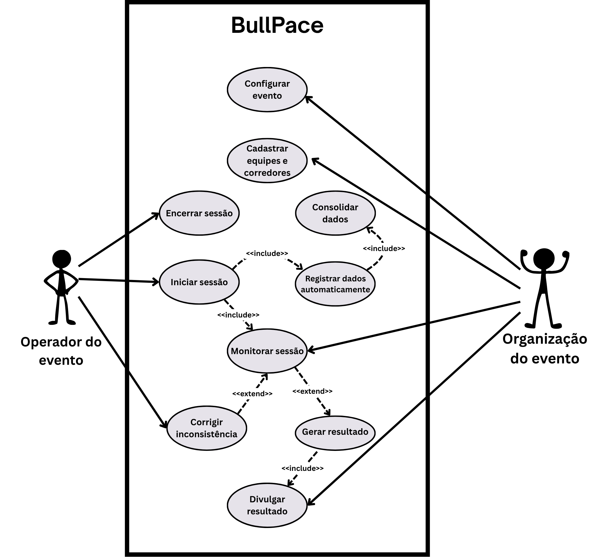<br>
  <sup>Material produzido pelos autores (2026)</sup>
</div>

**Casos de Uso:** 

**Configurar evento**
* **Ator:** Organização do evento
* **Pré-condição:** Sistema disponível para uso
* **Pós-condição:** Evento configurado com regras definidas
* **Descrição:** A organização define os parâmetros do evento, como duração, regras e estrutura geral da competição.

**Cadastrar equipes e atletas**
* **Ator:** Organização do evento
* **Pré-condição:** Evento previamente configurado
* **Pós-condição:** Equipes e atletas registrados no sistema
* **Descrição:** A organização cadastra as equipes participantes e seus atletas

**Iniciar sessão de corrida**
* **Ator:** Operador do evento
* **Ator secundário:** Sistema de captura de dados
* **Pré-condições:** Evento configurado | atletas cadastrados | Esteiras disponíveis
* **Pós-condições:** Sessão de corrida iniciada | Registro automático de dados ativado
* **Descrição:** O operador inicia uma sessão de corrida associando um atleta a uma esteira, permitindo o início da coleta de dados.

**Encerrar sessão de corrida**
* **Ator:** Operador do evento
* **Pré-condição:** Sessão de corrida ativa
* **Pós-condição:** Sessão finalizada
* **Descrição:** O operador encerra a sessão de corrida.

**Monitorar sessão**
* **Ator:** Organização do evento
* **Pré-condição:** Sessão de corrida ativa
* **Pós-condição:** Dados atualizados continuamente e coerentes no sistema
* **Descrição:** O operador acompanha o andamento da sessão e verifica se os dados estão sendo registrados corretamente.

**Registrar dados automaticamente**
* **Ator:** Sistema de captura de dados
* **Pré-condição:** Sessão de corrida iniciada
* **Pós-condição:** Dados de tempo e distância armazenados continuamente
* **Descrição:** O sistema coleta automaticamente os dados da esteira e os envia para a aplicação web.

**Corrigir inconsistência**
* **Ator:** Operador do evento
* **Pré-condição:** Existência de erro ou inconsistência nos dados
* **Pós-condição:** Dados corrigidos e atualizados
* **Descrição:** O operador ajusta dados incorretos, como sessões incompletas ou falhas na captura automática dos dados.

**Gerar resultado final**
* **Atores:** Organização do evento
* **Pré-condições:** Evento encerrado (fim das 24 horas) | Todos os dados registrados
* **Pós-condição:** Resultado consolidado gerado
* **Descrição:** O sistema calcula o total de quilômetros percorridos por cada equipe ao longo das 24 horas.

**Consolidar dados**
* **Atores:** Sistema
* **Pré-condição:** Dados de todas as sessões disponíveis
* **Pós-condição:** Dados agregados por equipe
* **Descrição:** O sistema processa e agrupa os dados das corridas para viabilizar o cálculo do resultado final.

**Divulgar resultado**
* **Atores:** Organização do evento
* **Pré-condição:** Resultado final gerado
**Pós-condição:** Resultado disponibilizado ao público
* **Descrição:** A organização divulga o resultado final da competição ao término do evento.

### 3.2.3. Diagrama de Classes do Domínio (sprint 2)

O Diagrama de Classes do Domínio representa a estrutura estática do sistema em notação UML, apresentando as principais classes do domínio, seus atributos, responsabilidades e relacionamentos. Diferentemente do DER, que organiza a estrutura lógica do banco de dados com chaves primárias e estrangeiras, o diagrama de classes representa os conceitos do domínio e suas associações por meio de multiplicidades, associação, agregação, composição e herança.

No contexto do BullPace, o diagrama foi construído a partir das entidades centrais consolidadas na modelagem de dados: **Evento**, **Equipe**, **Atleta**, **Esteira**, **Turno**, **Checkpoint**, **Funcao** e **SessaoOperacional**. Dessa forma, o modelo mantém coerência com o DER e com o modelo relacional, mas sem representar chaves estrangeiras como atributos técnicos. As relações que no DER aparecem como FKs são representadas aqui como associações UML entre classes.

<div align="center">
  <sub><b>Figura 8 - Diagrama de Classes do Domínio</b></sub><br>
  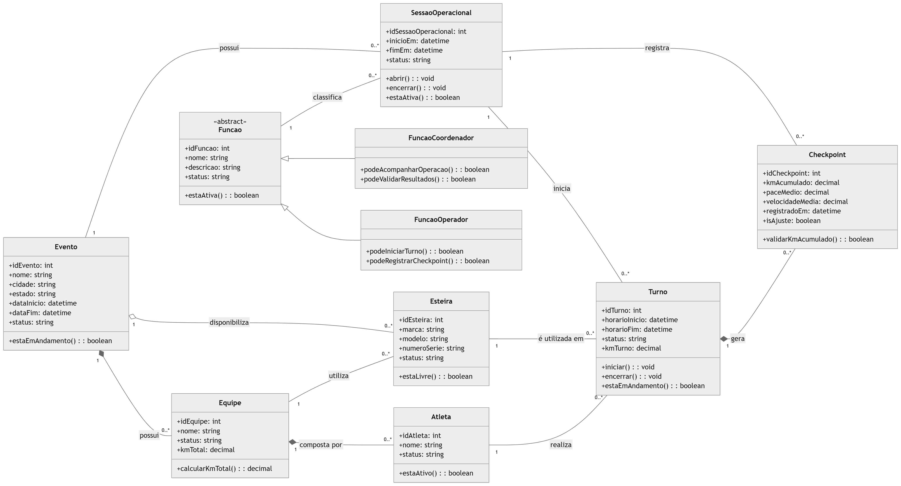<br>
  <sup>Fonte: Elaborado pelos autores (2026)</sup>
</div>

#### Classes principais do domínio

A classe **Evento** representa a edição da prova e funciona como ponto central da operação. Ela possui atributos como `idEvento`, `nome`, `cidade`, `estado`, `dataInicio`, `dataFim` e `status`. Suas responsabilidades estão associadas ao controle do ciclo de vida do evento, por meio de métodos como `iniciarEvento()`, `encerrarEvento()` e `estaEmAndamento()`.

A classe **Equipe** representa uma equipe participante do evento. Seus principais atributos são `idEquipe`, `nome`, `status` e `kmTotal`. O atributo `kmTotal` representa a quilometragem consolidada da equipe, utilizada para acompanhamento do desempenho. A responsabilidade principal da classe é consolidar a distância percorrida, representada pelo método `calcularKmTotal()`.

A classe **Atleta** representa o participante que realiza turnos durante a prova. Ela possui `idAtleta`, `nome` e `status`. Sua relação com **Equipe** indica que uma equipe é composta por atletas, enquanto sua relação com **Turno** indica que um atleta pode realizar vários turnos ao longo do evento.

A classe **Esteira** representa o equipamento físico utilizado durante a prova. Seus atributos são `idEsteira`, `marca`, `modelo`, `numeroSerie` e `status`. A classe possui responsabilidades relacionadas à disponibilidade operacional do equipamento, como `estaLivre()` e `marcarComoEmUso()`.

A classe **Turno** representa o período em que um atleta corre em uma esteira. Seus atributos incluem `idTurno`, `horarioInicio`, `horarioFim`, `status` e `kmTurno`. Essa classe concentra responsabilidades importantes da operação, como `iniciar()`, `encerrar()`, `estaEmAndamento()` e `calcularKmTurno()`.

A classe **Checkpoint** representa os registros feitos durante um turno. Ela possui os atributos `idCheckpoint`, `kmAcumulado`, `paceMedio`, `velocidadeMedia`, `registradoEm` e `isAjuste`. Sua responsabilidade principal é validar e armazenar dados parciais da corrida, representada pelo método `validarKmAcumulado()`.

A classe **Funcao** representa o tipo de atuação exercida em uma sessão operacional, como operador ou coordenador. Ela possui `idFuncao`, `nome`, `descricao` e `status`. No diagrama UML, **Funcao** é especializada em **FuncaoOperador** e **FuncaoCoordenador**, utilizando herança para representar diferentes responsabilidades dentro da operação. No modelo relacional, essa estrutura pode continuar sendo implementada por uma única tabela `funcoes`.

A classe **SessaoOperacional** representa o contexto operacional em que ações do sistema são realizadas. Seus atributos são `idSessaoOperacional`, `inicioEm`, `fimEm` e `status`. Essa classe permite rastrear ações como o início de turnos e o registro de checkpoints, por meio de sua associação com **Turno** e **Checkpoint**.

#### Relacionamentos

| Relacionamento | Tipo UML | Multiplicidade | Descrição |
|---|---|---|---|
| **Evento — Equipe** | Composição | 1 : 0..* | Um evento possui equipes vinculadas a ele. |
| **Evento — Esteira** | Agregação | 1 : 0..* | Um evento disponibiliza esteiras para a operação. |
| **Evento — SessaoOperacional** | Associação | 1 : 0..* | Um evento possui sessões operacionais associadas. |
| **Equipe — Atleta** | Composição | 1 : 0..* | Uma equipe é composta por atletas. |
| **Equipe — Esteira** | Associação | 1 : 0..* | Uma equipe utiliza uma ou mais esteiras no escopo atual. |
| **Atleta — Turno** | Associação | 1 : 0..* | Um atleta pode realizar vários turnos. |
| **Esteira — Turno** | Associação | 1 : 0..* | Uma esteira pode ser utilizada em vários turnos. |
| **SessaoOperacional — Turno** | Associação | 1 : 0..* | Uma sessão operacional pode iniciar vários turnos. |
| **Turno — Checkpoint** | Composição | 1 : 0..* | Um turno gera vários checkpoints. |
| **SessaoOperacional — Checkpoint** | Associação | 1 : 0..* | Uma sessão operacional pode registrar vários checkpoints. |
| **Funcao — SessaoOperacional** | Associação | 1 : 0..* | Uma função pode estar associada a várias sessões operacionais. |
| **Funcao — FuncaoOperador / FuncaoCoordenador** | Herança | - | Operador e coordenador são especializações de função. |

### 3.2.3.1. Diagrama de classes arquitetural

<div align="center">
  <sub><b>Figura 9 - Diagrama de Classes Arquitetural</b></sub><br>
  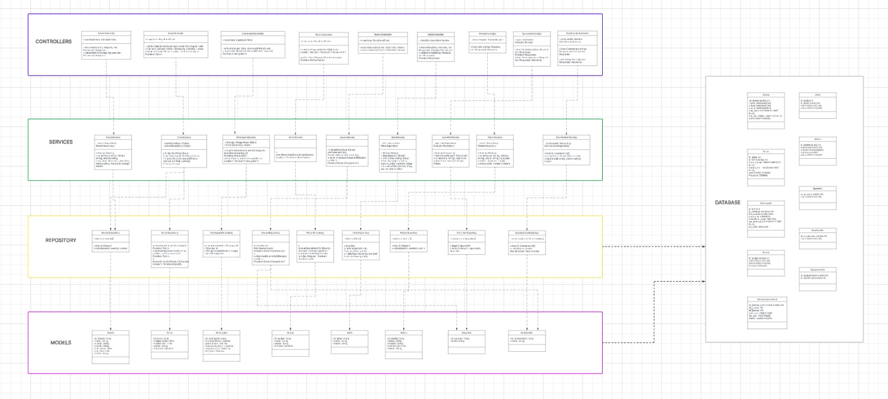<br>
  <sup>Fonte: Elaborado pelos autores (2026)</sup>
</div>

O Diagrama de Classes Arquitetural do BullPace modela a estrutura de alto nível do software em quatro camadas com responsabilidades bem delimitadas sendo elas,Controllers, Services, Repositories e Models , seguindo o padrão de Arquitetura em Camadas Verticais com fluxo de dependência estritamente unidirecional.
 
---
 
#### Controllers
 
Porta de entrada da aplicação. Recebem as requisições HTTP dos dispositivos utilizados no evento (iPads dos operadores e tela de TV do organizador) e delegam o processamento à camada de Service, sem conter lógica de negócio. O `TurnoController` e o `CheckpointController` são os de maior criticidade, por serem acionados a cada troca de atleta e a cada registro de quilometragem.
 
| Classe | Responsabilidades principais |
|---|---|
| `EventoController` | `listarEventos()`, `cadastrarEvento()` |
| `TurnoController` | `validarDadosInicioTurno()`, `iniciarTurno()`, `finalizarTurno()` |
| `CheckpointController` | `validarCheckpoint()`, `buscarCheckpointsPorTurno()` |
| `PlacarController` | `alternarBloqueioModoTV()`, `obterDadosPlacar()` |
| `SessaoController` | `IniciarSessao()`, `encerrarSessao()` |
| `AtletaController` | `listarAtletas()`, `cadastrarAtleta()` |
| `EsteiraController` | `listarEsteiras()` |
| `OperadorController` | `listarOperadores()`, `listarPermissoes()` |
| `CoodenadorController` | `listarCoordenadores()`, `login()` |
 
---
 
#### Services
 
Camada onde vivem todas as regras de negócio do BullPace. É aqui que são aplicadas as regras definidas anteriormente, como a obrigatoriedade do `km_acumulado` (RN18), progressão crescente de quilometragem (RN06), vínculo de checkpoint a turno ativo (RN19) e timestamp automático (RN12). O `TurnoService` e o `CheckpointService` são o núcleo da operação: garantem a integridade dos dados de revezamento e quilometragem ao longo das 24 horas da prova.
 
| Classe | Responsabilidades principais |
|---|---|
| `EventoService` | `listar()`, `criar()` |
| `TurnoService` | `iniciarNovoTurno()`, `finalizarTurnoExistente()` |
| `CheckpointService` | `registrarNovoCheckpoint()`, `listarCheckpointsPorTurno()` |
| `placarService` | `obterPlacarGeralDoEvento()` |
| `sessaoService` | `iniciarNovaSessao()`, `encerrarSessaoExistente()` |
| `atletaService` | `listar()`, `criar()`, `cadastrarAtleta()` |
| `operadorService` | `listar()`, `criar()`, `listarPermissoes()` |
| `EsteiraService` | `listar()`, `criar()` |
| `CoordenadorService` | `listar()`, `criar()`, `login()` |
 
---
 
#### Repositories
 
Responsáveis exclusivamente pela comunicação com o banco de dados (Supabase). Recebem objetos já validados pelo Service e os traduzem em operações SQL. Não há regra de negócio nesta camada — sua existência isola o banco do restante da aplicação, de forma que uma eventual troca de provedor afete somente este nível. O `PlacarRepository` tem papel especial ao controlar o estado do Modo TV na arena.
 
| Classe | Operações principais |
|---|---|
| `EventoRepository` | `listar()`, `salvar()` |
| `TurnoRepository` | `insert()`, `updateParaEncerrado()`, `buscarTurnosPorSessao()` |
| `CheckpointRepository` | `save()`, `findByTurnold()` |
| `SessaoRepository` | `insert()`, `updateParaEncerrada()` |
| `PlacarRepository` | `buscarStatusModoTv()`, `atualizarModoTv()` |
| `atletaRepository` | `insert()`, `findByTurno()` |
| `EsteiraRepositoy` | `listar()`, `salvar()` |
| `OperadorRepositoy` | `listar()`, `salvar()` |
| `CoordenadorRepositoy` | `listar()`, `salvar()` |
 
---
 
#### Models
 
Representam as entidades centrais do domínio da competição. São objetos simples de dados que trafegam entre as camadas e são mapeados diretamente para as tabelas do Supabase.
 
| Classe | Atributos principais |
|---|---|
| `Evento` | `id_evento`, `nome`, `cidade`, `estado`, `data_inicio`, `data_fim`, `status` |
| `Turno` | `id_turno`, `horario_inicio`, `horario_fim`, `status`, `km_turno` |
| `Checkpoint` | `id_checkpoint`, `km_acumulado`, `pace_medio`, `velocidade_media`, `registrado_em`, `is_ajuste` |
| `Equipe` | `id_equipe`, `nome`, `status`, `km_total` |
| `atleta` | `id_atleta`, `nome`, `status` |
| `Esteira` | `id_esteira`, `marca`, `modelo`, `numero_serie`, `status` |
| `Operador` | `id_operador`, `nome` |
| `Coodenador` | `id_coordenador`, `nome` |
 
---

Para entender melhor o Diagrama, veja nos anexos [Diagrama de Classes Arquitetural](#diagrama-de-classes-arquitetural).


### 3.2.4. Diagrama de Sequência UML (sprint 3)


#### Fluxo 1: Login de Coordenadores (Autenticação)

<div align="center">
  <sub>Figura 7 - Fluxo login do coordenador</sub><br>
  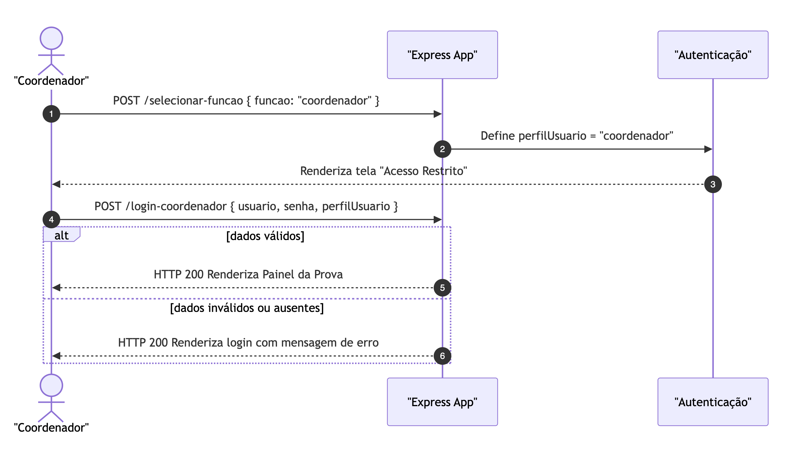<br>
  <sup>Material produzido pelos autores (2026)</sup>
</div>

O cliente faz uma requisição HTTP GET para coletar todos os coordenadores registrados. O CoordenadorController aciona o método listar() do CoordenadorService, que por sua vez consulta a coleção de dados exposta pelo CoordenadorRepository para retornar o array com os objetos ao usuário final.


#### Fluxo 2: Login do Administrador (Autenticação)

<div align="center">
  <sub>Figura 7 - Fluxo de login do Administrador</sub><br>
  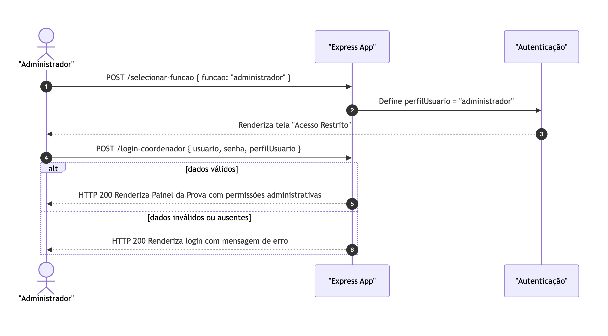<br>
  <sup>Material produzido pelos autores (2026)</sup>
</div>

O usuário submete suas credenciais (email e senha) via corpo da requisição (POST). O CoordenadorController delega os parâmetros ao CoordenadorService, que realiza uma validação booleana em memória para certificar que ambos os campos foram preenchidos, retornando o status de autenticado e o e-mail do usuário.

---


#### Fluxo 3: Listar Permissões dos Operadores (Consulta)

<div align="center">
  <sub>Figura 7 - Fluxo listar permissões dos operadores</sub><br>
  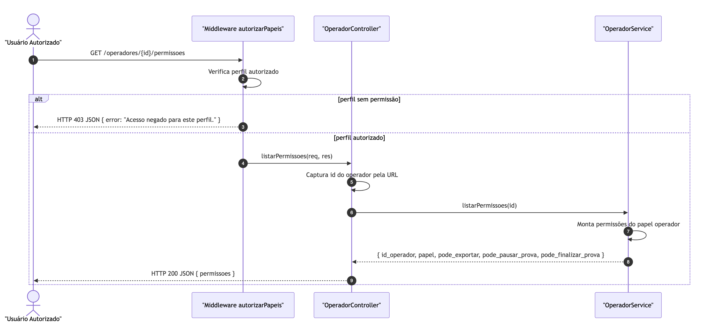<br>
  <sup>Material produzido pelos autores (2026)</sup>
</div>

Requisição voltada para coletar as informações técnicas dos equipamentos do evento. O estímulo trafega do EsteiraController para o EsteiraService, que consome o método de listagem do EsteiraRepository, retornando a lista contendo as marcas, modelos, números de série e status de conectividade das esteiras registradas no banco.

---

### Módulo: Eventos

#### Fluxo 4: Listar Operadores (Leitura)

<div align="center">
  <sub>Figura 7 - Fluxo listar operadores</sub><br>
  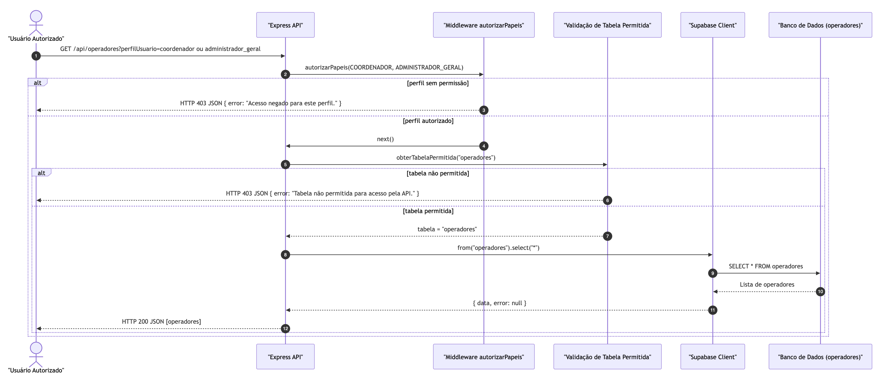<br>
  <sup>Material produzido pelos autores (2026)</sup>
</div>

Fluxo síncrono para retornar todos os eventos agendados ou finalizados na plataforma. O EventoController intercepta a chamada de leitura e consome a camada EventoService, que extrai o conjunto completo de registros contidos na tabela correspondente através do EventoRepository.

#### Fluxo 5: Listar Esteiras (Leitura)

<div align="center">
  <sub>Figura 7 - Fluxo listar esteiras</sub><br>
  <br>
  <sup>Material produzido pelos autores (2026)</sup>
</div>

Trata o fluxo de criação de uma nova competição/evento no ecossistema. O EventoController desestrutura o payload recebido e aciona o EventoService; a camada de serviço atribui um identificador único temporal ao objeto e invoca o método salvar() do EventoRepository, inserindo os dados estruturados de localidade, nome e período direto no banco de dados.

---

### Módulo: Operador

#### Fluxo 6: Listar Operadores (Leitura)

<div align="center">
  <sub>Figura 7 - Fluxo listar Operadores</sub><br>
  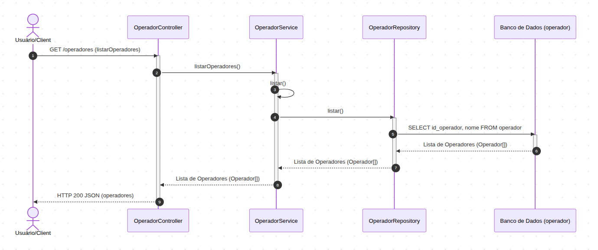<br>
  <sup>Material produzido pelos autores (2026)</sup>
</div>

Recupera a listagem de funcionários/operadores encarregados da telemetria do sistema. O OperadorController delega a chamada à função de alto nível do OperadorService, que executa internamente a consulta ao repositório especializado (OperadorRepository) para resgatar os perfis.

#### Fluxo 7: Listar Permissões do Operador (Consulta)

<div align="center">
  <sub>Figura 7 - Fluxo Permissões do operador</sub><br>
  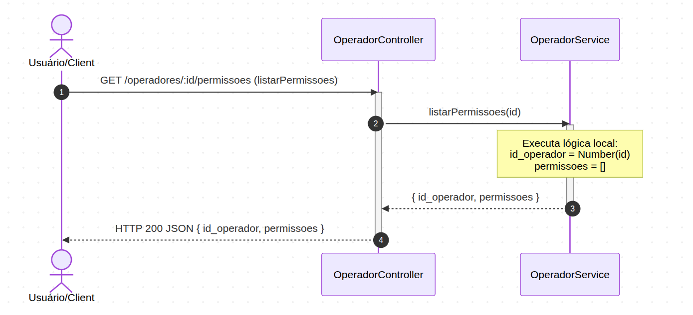<br>
  <sup>Material produzido pelos autores (2026)</sup>
</div>

Acionado para inspecionar os privilégios de controle de um operador específico na interface através do seu identificador (id). O OperadorController extrai o parâmetro de rota e aciona a regra no OperadorService, que processa a tipagem do ID e gera de forma controlada o objeto com o escopo de acessos permitidos.

---

### Módulo: Placar

#### Fluxo 8: Obter Placar Geral do Evento (Com Regra de Ocultação/Suspense)

<div align="center">
  <sub>Figura 7 - Fluxo obter placar</sub><br>
  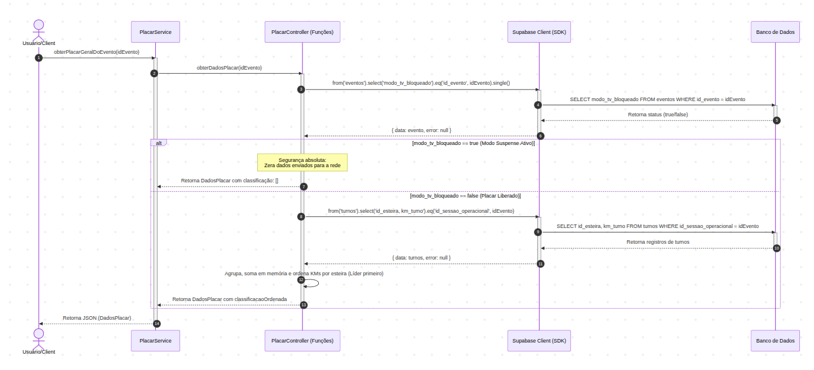<br>
  <sup>Material produzido pelos autores (2026)</sup>
</div>

Fluxo crítico do painel visual (Modo TV). O PlacarService aciona a função de leitura que executa uma query no cliente do Supabase para extrair a flag de segurança (modo_tv_bloqueado). Caso esteja ativa, o fluxo intercepta o processamento e retorna uma classificação vazia; caso esteja livre, o sistema busca os turnos associados, calcula as somas de quilometragens em memória e devolve a classificação ranqueada do líder ao lanterna.

#### Fluxo 9: Alternar Bloqueio do Modo TV (Ação de Controle do Coordenador)

<div align="center">
  <sub>Figura 7 - Fluxo Alternar bloqueio do modo tv</sub><br>
  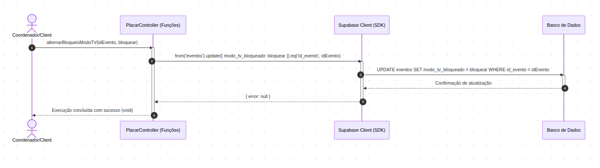<br>
  <sup>Material produzido pelos autores (2026)</sup>
</div>

Fluxo administrativo em que o coordenador altera a experiência do público. A função no controlador dispara uma instrução direta de atualização (UPDATE) no cliente de configuração global do Supabase, modificando o estado lógico da coluna de suspense na tabela de eventos para o evento corrente.

---

### Módulo: Sessões Operacionais

#### Fluxo 10: Iniciar Nova Sessão de Trabalho (Auditoria/Abertura)

<div align="center">
  <sub>Figura 7 - Fluxo Iniciar nova sessão</sub><br>
  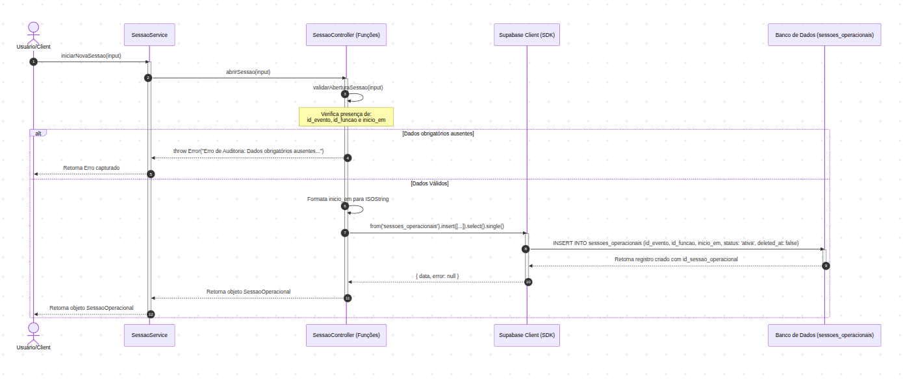<br>
  <sup>Material produzido pelos autores (2026)</sup>
</div>

Inicia o período de trabalho do operador registrando sua função e o evento associado para fins de auditoria. O SessaoService aciona o mecanismo que submete os dados à validação estrutural do controlador, e após a verificação de consistência, grava o registro no Supabase com o timestamp inicial e a marcação de status igual a 'ativa'.

#### Fluxo 11: Encerrar Sessão Existente (Auditoria/Fechamento)

<div align="center">
  <sub>Figura 7 - Fluxo sessão existente</sub><br>
  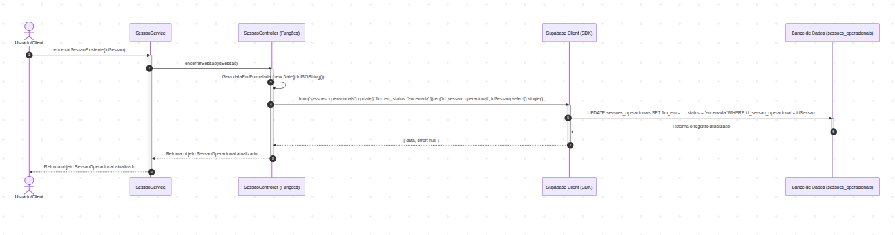<br>
  <sup>Material produzido pelos autores (2026)</sup>
</div>

Registra a saída do operador do painel de controle. O SessaoService aciona o encerramento fornecendo o identificador da sessão; o sistema injeta o timestamp corrente do servidor (fim_em) e atualiza o estado do registro para 'encerrada', salvando e blindando o histórico de auditoria.

---

### Módulo: Turnos

#### Fluxo 12: Iniciar Novo Turno de Revezamento (Entrada do Atleta)

<div align="center">
  <sub>Figura 7 - Fluxo Iniciar novo turno</sub><br>
  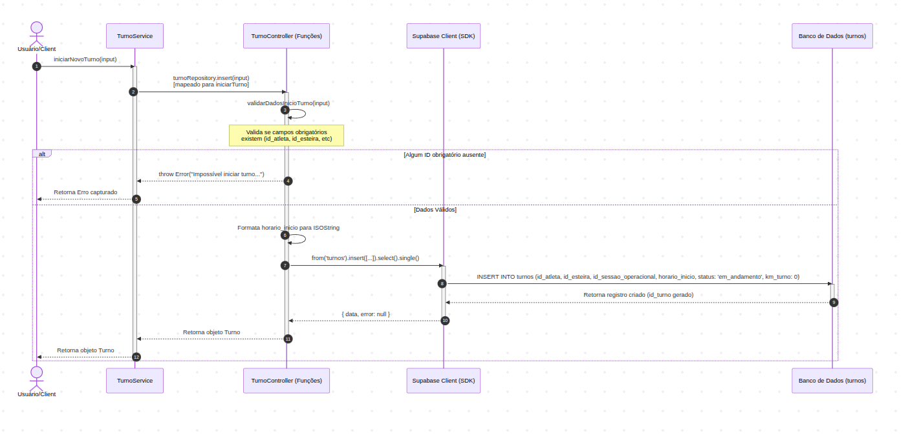<br>
  <sup>Material produzido pelos autores (2026)</sup>
</div>

Mapeia o momento exato em que um atleta assume uma determinada esteira dentro da sessão operacional. O TurnoService encaminha a requisição de inserção de turno, que valida os dados obrigatórios e insere o registro com status definido em 'em_andamento' e a quilometragem inicializada estritamente em 0.

#### Fluxo 13: Finalizar Turno Existente (Saída do Atleta com Gravação de KM)

<div align="center">
  <sub>Figura 7 - fluxo finalizar turno</sub><br>
  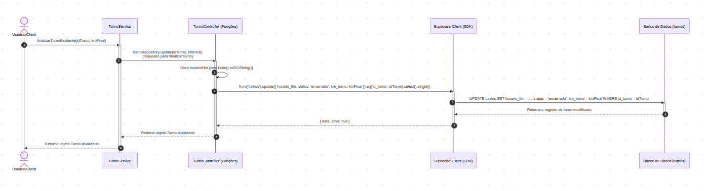<br>
  <sup>Material produzido pelos autores (2026)</sup>
</div>

Conclui o ciclo de corrida de um participante. O TurnoService repassa o identificador do turno e a marcação do odômetro final coletada; a camada controladora processa a requisição e realiza uma operação de atualização no banco de dados, imputando o horário final do revezamento, computando a quilometragem total acumulada e chaveando o status para 'encerrado'.

### 3.2.5. Diagrama de Atividades ou Estados (sprint 3)

*Ao menos um fluxo relevante em UML ou BPMN. Use a notação da ferramenta escolhida de forma consistente (sem misturar convenções).*

### 3.2.6. Diagrama de Implantação (sprints 4 e 5)

<div align="center">
  <sub><b>Figura 7 - fluxo finalizar turno</b></sub><br>
  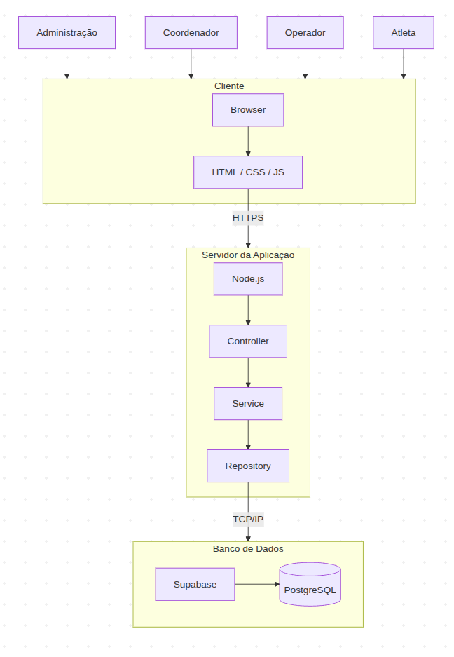<br>
  <sup>Material produzido pelos autores (2026)</sup>
</div>


### 3.2.7. Padrões de Projeto Aplicados (sprints 3 a 5)

Essa seção documenta os padrões de projeto adotados, apresentando a justificativa de cada escolha com base nas necessidades reais identificadas. Os padrões foram selecionados para resolver problemas de organização do código, separação de responsabilidades da solução ao longo das 24 horas de operação do evento.

#### Repository

O padrão Repository foi aplicado para isolar o acesso ao banco de dados do restante da aplicação. Cada entidade do possui seu próprio repositório, como `TurnoRepository`, `CheckpointRepository` e `EsteiraRepository`, concentrando todos os comandos SQL executados.

A justificativa está diretamente ligada ao contexto. O BullPace precisa garantir que alterações nas regras de negócio, não impactem a camada de persistência. Com o Repository, qualquer mudança de query ou de estrutura de tabela fica restrita a um único ponto do código, sem necessidade de ajuste nos Services ou Controllers.

Além disso, o padrão facilita a criação de testes automatizados. Os Services podem ser testados isolados, utilizando repositórios simulados, o que é essencial para validar as regras de negócio críticas do sistema, como a progressão obrigatória do KM acumulado (RN16) e vinculação de checkpoint a turno ativo (RN23), sem depender de uma conexão real com o banco durante os testes.

No contexto do projeto, o isolamento oferecido pelo Repository também reduz o risco operacional. Como o evento dura 24 horas, qualquer instabilidade que exija manutenção emergencial no banco precisa ser resolvida no menor número de arquivos possível. O padrão garante que esse escopo seja previsível e delimitado.

#### Service Layer

O padrão Service Layer foi adotado para centralizar a lógica de negócio em uma camada específica, mantendo os Controllers focados exclusivamente no contrato HTTP e os Repositories restritos ao acesso ao banco.

A necessidade desse padrão ficou clara ao longo do desenvolvimento das regras de negócio (seção 3.1.2). A obrigatoriedade do KM acumulado no registro de checkpoint (RN22), o bloqueio de turnos em esteiras já ocupadas (RN13 e RN14) e o cálculo automático de pace médio quando o campo não é preenchido manualmente (RN25) precisavam de um local específico para residir, sem contaminar a apresentação e a persistência.

Na prática, o `CheckpointService` é responsável por executar três validações antes de qualquer inserção no banco: verificar se o turno está ativo, confirmar que o KM acumulado foi informado e garantir que o novo valor não é inferior ao último checkpoint registrado. Após essas verificações o objeto é encaminhado ao `CheckpointRepository` para persistência (Diagrama de Sequência da seção 3.2.4).

O padrão também cumpre o requisito não funcional MANUT01, que exige separação estrita entre as camadas de modo que as alterações em regras de negócio não exijam modificação das camadas de apresentação ou persistência.

#### Data Transfer Object (DTO)

O padrão DTO foi utilizado para estruturar os dados que estão entre as camadas da aplicação, evitando que objetos do banco de dados sejam expostos diretamente nas respostas da API ou que dados desnecessários circulem entre as camadas internas.

Esse padrão se torna relevante principalmente no contexto dos checkpoints/turnos. Quando o `CheckpointService` monta o objeto antes de enviá-lo ao `CheckpointRepository`, ele constrói uma estrutura com campos muito bem definidos, incluindo o timestamp automatico gerado pelo servidor conforme a RN21, e exclui campos que não devem ser manipulados, como o campo `is_ajuste`, que identifica correções feitas pela Gestora de Operações.

A adoção do DTO também contribui para a segurança da aplicação. Como dito  no requisito SEG01, o timestamp registrado não pode ser enviado pelo cliente nem editado manualmente. O DTO garante que esse campo seja sempre descartado antes de chegar ao banco.

#### Singleton

O padrão foi aplicado na gestão da conexão com o Supabase. Em vez de criar uma nova instância do cliente a cada requisição, a aplicação mantém uma única instância compartilhada entre todos os repositórios.

A justificativa para esse padrão está nos requisitos de desempenho e confiabilidade. O requisito DES01 exige que as ações do fluxo principal respondam em menos de 1.000 ms no percentil 95. Criar e destruir conexões com o banco a cada requisição introduziria latência desnecessária, especialmente em momentos de maior volume de registros, como os picos de checkpoints simultâneos das duas equipes operando ao mesmo tempo.

Além disso também reduz o risco de esgotamento do pool de conexões durante as 24 horas do evento, cenário esse que poderia comprometer o requisito de disponibilidade CONF02, que exige um tempo de funcionamento mínimo de aproximadamente 98% durante o evento.

#### Middleware de Autenticação

O padrão foi adotado para separar a lógica de verificação de autenticação e autorização do código de negócio dos Controllers. Em vez de cada rota verificar individualmente se o usuário está autenticado e qual é o seu perfil, essa responsabilidade foi extraída para um middleware que é reutilizável e que intercepta as requisições antes de chegarem ao Controller correspondente.

Esse padrão responde diretamente às regras de negócio RN08 e RN09, que limitam ações operacionais para o Promotor de Field Marketing e ações administrativas à Gestora de Operações. Como o middleware é aplicado nas rotas antes do processamento, o Controller nunca chega a executar sua lógica caso o usuário não possua o perfil adequado, diminuindo a superfície de erros relacionados a autorização.

A separação também facilita a manutenção. Caso as regras de autorização precisem ser ajustadas, a alteração ocorre em um único ponto sem precisar revisar cada Controller de forma individual.

#### Princípios SOLID Aplicados

Os padrões descritos acima foram adotados em conjunto com os princípios SOLID, que orientam a estrutura da aplicação de forma mais aberta.

O **Princípio da Responsabilidade Única** é o que sustenta toda a arquitetura em camadas. Controller, Service, Repository e Model têm responsabilidades bem definidas e que não se sobrepõem. O `TurnoController`, por exemplo, nunca contém validações de KM, e o `TurnoRepository` nunca toma decisões de negócio sobre quando um turno pode ser encerrado.

O **Princípio Aberto-Fechado** foi considerado na modelagem das funções de usuário. A entidade `Funcao` foi projetada para permitir que novos perfis sejam adicionados sem modificar o código existente dos Services que verificam permissões. Um novo perfil de acesso pode ser implementado na tabela de funções e tratado pelo middleware sem que os Controllers precisem ser alterados.

O **Princípio da Inversão de Dependências** se manifesta na relação entre Services e Repositories. Os Services dependem de abstrações dos Repositories e não de implementações concretas, o que permite substituir o Supabase por outro provedor sem impacto na camada de negócio. 

#### Justificativa Geral

Portanto, conclui-se que a combinação dos padrões Repository, Service Layer, DTO, Singleton e Middleware de Autenticação foi escolhida pois cada um resolve um problema específicoe: isolamento do banco, concentração de regras de negócio, controle de dados expostos pela API, eficiência na gestão de conexões e separação da lógica de autorização.

## 3.3. Wireframes (sprint 2)

Um wireframe consiste em uma representação visual esquemática que atua como o esqueleto estrutural de uma interface de usuário. O objetivo dessa ferramenta é estabelecer a hierarquia da informação e fluxos básicos de navegação, sem a aplicação de estilos visuais definitivos, como cores ou tipografia. A partir dessa estruturação inicial, é possível organizar a tela com foco exclusivo nas suas funcionalidades e usabilidades. A utilização de wireframes é fundamental no processo de desenvolvimento de um software, pois garante que toda a interface seja coerente com a lógica estabelecida pelos requisitos e regras de negócio do projeto. Além disso, a validação prévia desses layouts reduz a necessidade de retrabalho nas fases de design final e programação, garantindo, principalmente, o alinhamento entre a arquitetura e a solução desenvolvida.

### Fluxo geral dos Wireframes:

A figura abaixo é o wireframe completo da aplicação web, incluindo as principais telas, o fluxo de navegação entre elas e comentários explicativos, sendo representados na imagem como quadros, setas pretas e setas vermelhas, respectivamente.

No diagrama, é possível visualizar quais telas estão associadas à função do operador (representada pela área contornada por linhas vermelhas) e do organizador do evento (representada pela área contornada por linhas azuis).

<br>
<div align="center">
  <b>Figura 10 — Wireframe de todas as telas e seu fluxo</b><br>
  <br>
  <sub>Fonte: Elaborado pelos autores (2026).</sub>
</div>
<br>

Para todo o desenvolvimento gráfico do wireframe, foi utilizado o Figma, um software que age como uma ferramenta de design gráfico.

### 3.3.1 Descrição detalhada das telas do wireframe e seus fluxos de navegação

#### Tela de seleção de função

A tela de seleção de função do sistema é responsável por definir qual tipo de acesso será utilizado pelo usuário. Sua principal função é direcionar o usuário para o conjunto de funcionalidades correspondente às suas responsabilidades dentro da operação do evento.

<br>
<div align="center">
  <b>Figura 11 — Tela de seleção de função</b><br>
  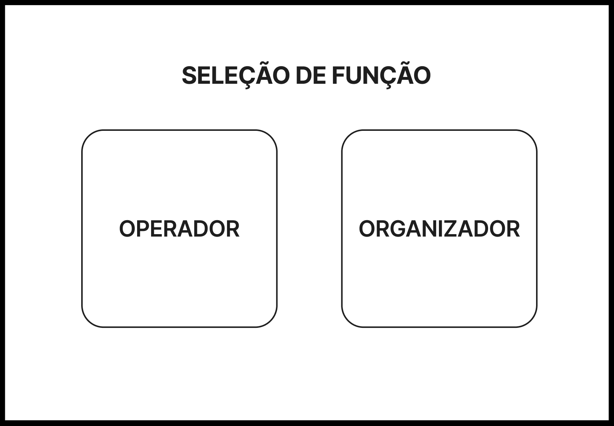<br>
  <sub>Fonte: Elaborado pelos autores (2026).</sub>
</div>
<br>

A tela apresenta dois blocos interativos em formato de botão, identificados como “OPERADOR” e “ORGANIZADOR”. Os elementos foram posicionados de forma centralizada e com grande destaque visual para tornar a escolha rápida, intuitiva e objetiva.

Ao selecionar a opção “OPERADOR”, o usuário é direcionado para o fluxo operacional de telas para o operador do evento, utilizado durante o acompanhamento da corrida e das trocas de turno dos atletas. Esse acesso contempla funcionalidades relacionadas ao controle dos turnos, definição da esteira utilizada e registro manual de checkpoints.

Já a opção “ORGANIZADOR” direciona o usuário para as funcionalidades administrativas do sistema, voltadas ao acompanhamento das informações organizacionais da competição.

A simplicidade visual da tela foi planejada para facilitar a identificação imediata das funções disponíveis e agilizar o acesso ao fluxo correto do sistema, especialmente em contextos de operação dinâmica durante o evento.

#### Tela de seleção de equipe


A tela de escolha de equipe, apresentada na figura 12, é responsável por permitir que o operador do evento defina qual equipe terá seus atletas e turnos acompanhados durante o registro de dados.

<br>
<div align="center">
  <b>Figura 12 — Tela de seleção de equipe</b><br>
  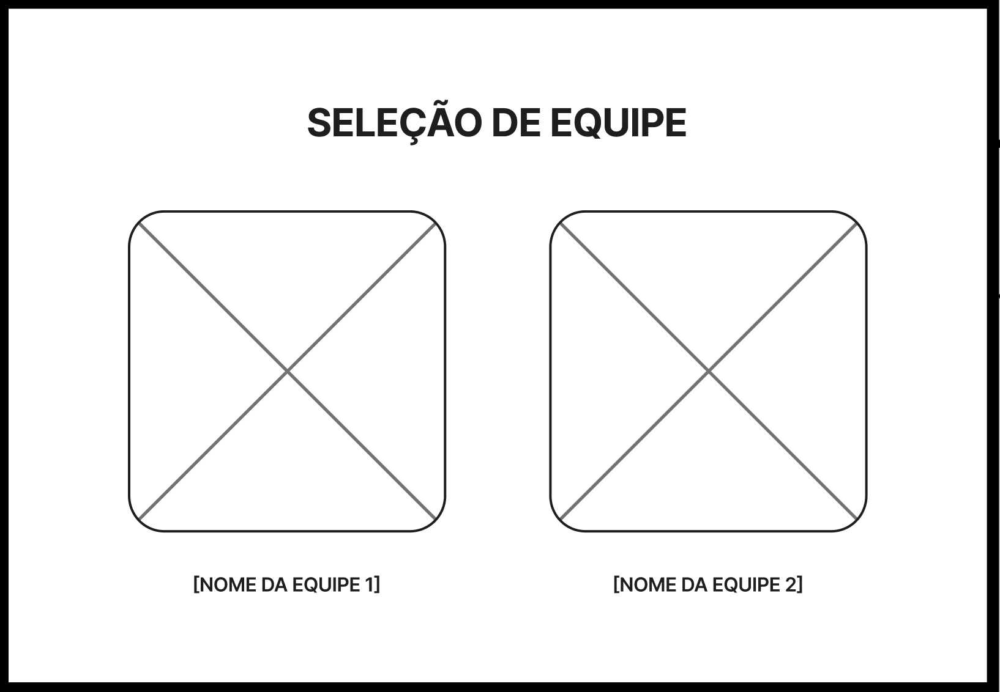<br>
  <sub>Fonte: Elaborado pelos autores (2026).</sub>
</div>
<br>

A interface apresenta dois elementos interativos em formato de botão, cada um representando uma equipe distinta. A organização visual desses elementos foi projetada para facilitar a identificação rápida das equipes e tornar a navegação mais intuitiva para o usuário.

Apenas uma equipe pode ser escolhida por vez. Ao clicar em um dos botões, o usuário é direcionado para a tela de seleção dos atletas vinculados à equipe correspondente.

#### Tela de seleção dos atletas

A interface de seleção de atleta é acessada pelo operador do evento após a escolha de uma equipe. Sua principal função é apresentar a lista de integrantes do time e permitir a rápida seleção do próximo participante que assumirá a esteira.

<br>
<div align="center">
  <b>Figura 13 — Tela de seleção dos atletas</b><br>
  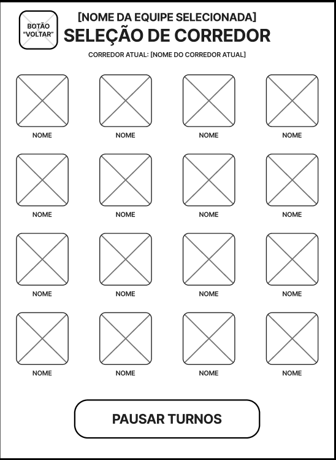<br>
  <sub>Fonte: Elaborado pelos autores (2026).</sub>
</div>
<br>

Na parte superior da interface, o sistema apresenta o nome da equipe que foi selecionada e, logo abaixo, destaca o nome do atleta que está atualmente em atividade. Essa disposição contextualiza o operador, garantindo que ele tenha certeza de qual time está gerenciando e quem é o atleta responsável pela esteira naquele exato momento.

A região central da interface é dedicada à exibição dos integrantes da equipe por meio de uma grade interativa. Cada espaço apresenta um contêiner para a fotografia do participante, acompanhado do seu respectivo nome logo abaixo. É a partir dessa listagem que o operador realiza a seleção do próximo participante. Ao clicar no perfil de um dos atletas, o operador é direcionado para a interface de gerenciamento de turnos, dando continuidade ao processo de captação de informações do revezamento.

Na parte inferior da tela, encontra-se o botão de ação “PAUSAR TURNOS”. Essa funcionalidade de controle permite que o operador interrompa temporariamente o fluxo do revezamento daquela equipe, seja por uma possível troca de equipamento ou qualquer eventualidade que exija a pausa do monitoramento antes da escolha de um novo atleta.

Por fim, a interface conta com o botão “VOLTAR” posicionado no canto superior esquerdo. Este elemento de navegação permite ao operador retornar para a tela anterior de menu de seleção de equipes, descartando o fluxo de troca de atleta atual sem realizar nenhuma alteração no sistema.

#### Tela de gerenciamento de turnos

A interface de gerenciamento de turno dos atletas é acessada pelo operador do evento após a escolha de um participante na tela de seleção de atleta. Sua principal função é permitir o acompanhamento e o controle operacional do revezamento da equipe, além de centralizar o registro manual dos checkpoints utilizados para atualização dos dados capturados da esteira vinculada ao atleta em atividade.

<br>
<div align="center">
  <b>Figura 14 — Tela de gerenciamento de turnos</b><br>
  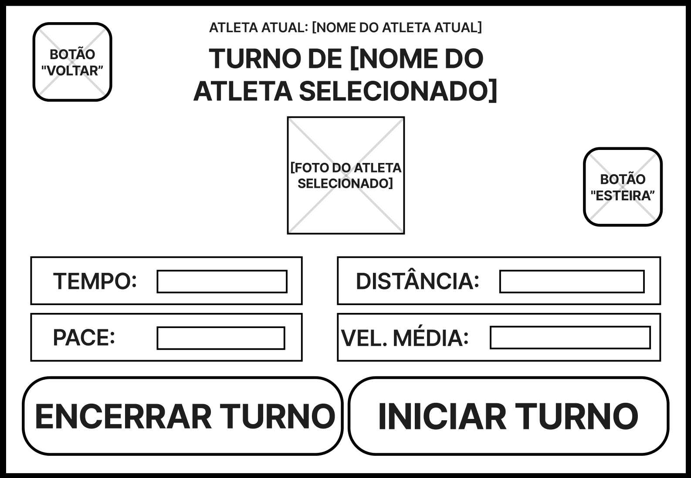<br>
  <sub>Fonte: Elaborado pelos autores (2026).</sub>
</div>
<br>

Na parte superior da interface, é exibido o nome do atleta atualmente em atividade, permitindo que o operador identifique rapidamente qual participante está utilizando a esteira naquele momento. Logo abaixo, são apresentados em destaque o nome e a fotografia do atleta selecionado na tela anterior, indicando qual integrante da equipe será associado ao próximo início de turno.

A região central da interface é composta pelos campos responsáveis por exibir as informações obtidas da esteira atualmente vinculada ao atleta em atividade. Os indicadores apresentados são: duração do turno atual, distância percorrida, pace e velocidade média. Antes do início da atividade, todos os campos permanecem zerados. Após o início da corrida, os dados passam a ser atualizados gradualmente por meio do sistema de checkpoints, responsável por substituir os valores exibidos pelas informações mais recentes capturadas da esteira.

O botão “INICIAR TURNO”, localizado na parte inferior direita da interface, é responsável por iniciar a corrida do atleta selecionado. Caso outro participante ainda esteja em atividade, o sistema encerra automaticamente o monitoramento anterior antes de iniciar o novo registro, garantindo que apenas um atleta permaneça associado ao registro de dados naquele momento.

Após o início da corrida, o botão “INICIAR TURNO” altera seu comportamento e passa a atuar como botão de checkpoint. A partir desse momento, o operador pode utilizá-lo para registrar manualmente os dados atuais da esteira em intervalos regulares de cinco minutos. Sempre que um novo checkpoint é realizado, os dados exibidos nos campos de monitoramento são atualizados com as informações mais recentes recebidas pelo sistema.

O botão “ENCERRAR TURNO”, localizado na parte inferior esquerda, permite que o operador finalize manualmente a corrida atualmente em andamento. Ao ser acionado, o monitoramento do atleta ativo é interrompido imediatamente, encerrando a atualização dos dados exibidos na interface.

A interface também apresenta dois elementos auxiliares de navegação. O botão “voltar”, posicionado no canto superior esquerdo, retorna o operador para a interface de seleção dos atletas sem alterar os dados já associados à corrida em andamento. Já o botão “esteira”, localizado no lado direito da interface, direciona o operador para a interface de definição da esteira utilizada durante o turno atual, permitindo escolher qual equipamento terá seus dados considerados pelo sistema durante o registro das informações do atleta ativo.

#### Tela de seleção de esteira

Esse é o wireframe da interface de definição de esteira utilizada durante o turno de um atleta. Ela é acessada pelo operador do evento a partir da interface de gerenciamento de turno e faz parte do fluxo operacional necessário para que o sistema associe corretamente os dados registrados ao atleta atualmente em atividade.

Sua principal função é permitir que o operador defina qual das duas esteiras disponíveis da equipe será utilizada durante o turno em andamento.

<br>
<div align="center">
  <b>Figura 15 — Tela de seleção de esteira</b><br>
  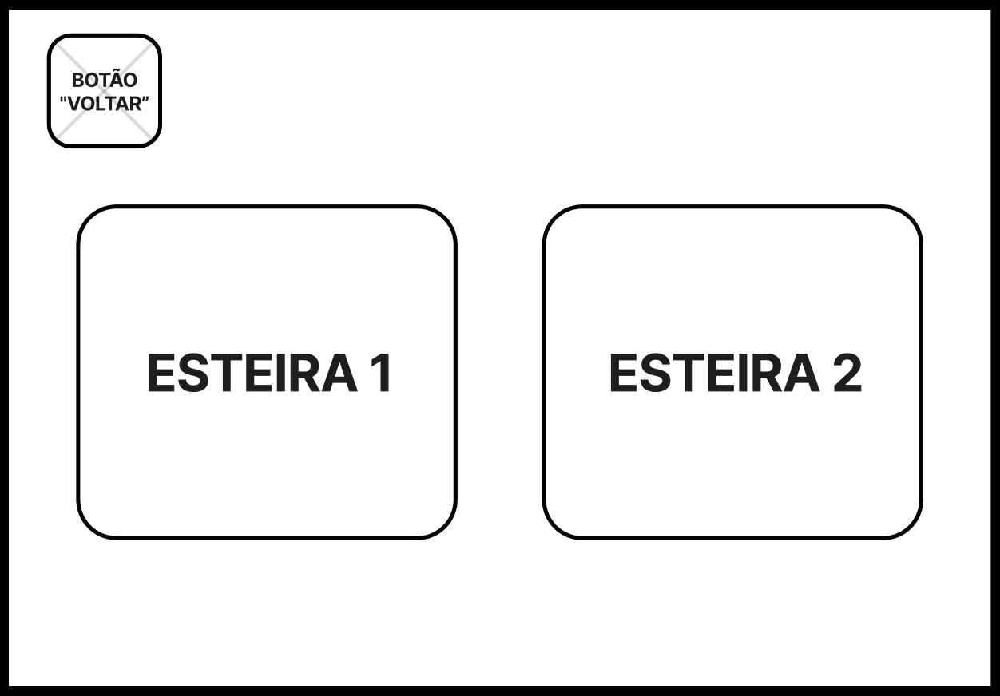<br>
  <sub>Fonte: Elaborado pelos autores (2026).</sub>
</div>
<br>

A interface apresenta dois blocos interativos que agem como botões, identificados como “Esteira 1” e “Esteira 2”. Esses elementos foram organizados de forma simples e objetiva para tornar a operação mais rápida durante o evento, reduzindo o tempo necessário para navegação e minimizando possíveis erros de identificação por parte do operador.

Ao selecionar uma das opções, o sistema passa a considerar exclusivamente os dados provenientes da esteira escolhida durante o registro do turno do atleta. Dessa forma, as informações exibidas na interface de gerenciamento de turno (como duração do turno, distância percorrida, pace e velocidade média) passam a ser associadas à esteira definida pelo operador.

A interface também disponibiliza um botão “voltar”, localizado no canto superior esquerdo, responsável por retornar o operador para a interface de gerenciamento de turno sem alterar os dados já registrados ou a esteira atualmente vinculada ao turno em andamento.

#### Modo TV

O Modo TV é uma interface destinada especialmente para a exibição da competição ao gestor. A organização estrutural e a disposição dos elementos dessa interface são apresentadas na figura 16. 

<br>
<div align="center">
  <b>Figura 16 — Visualização modo TV</b><br>
  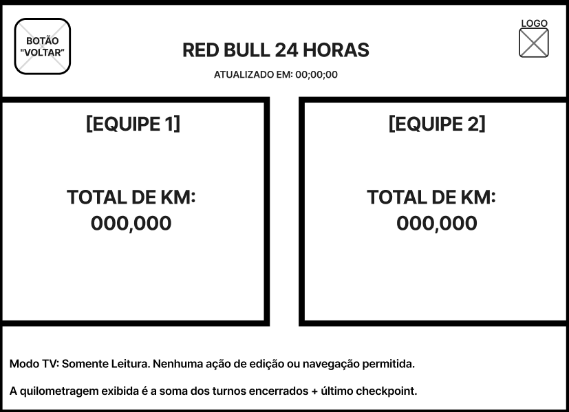<br>
  <sub>Fonte: Elaborado pelos autores (2026).</sub>
</div>
<br>

Este layout representa o primeiro estado do Modo TV, que corresponde ao período no qual a competição está em andamento. A partir deste layout, é possível concluir que a tela exibe as duas equipes lado a lado, com o total de quilômetros de cada equipe posicionado como elemento de maior destaque visual, garantindo fácil interpretação e usabilidade. A composição do valor exibido segue a lógica estabelecida pela RN10, sendo calculado a partir da soma dos quilômetros registrados nos turnos já encerrados acrescida do valor do último checkpoint válido do turno em andamento, o que garante que o placar reflita o progresso das equipes em tempo real. Além disso, a atualização do placar ocorre de forma automática a cada novo checkpoint registrado, sem necessidade de nenhuma ação por parte do usuário. 

#### Tela de placar final

A Figura 17 ilustra o wireframe da tela de placar final. Atendendo à necessidade de comparação simultânea entre as equipes (US12), a tela é estruturada em dois painéis, cada um exibindo os indicadores de desempenho da respectiva equipe: total de quilômetros percorridos, total de trocas realizadas e velocidade média. O painel da equipe vencedora é exibido em tamanho maior, estabelecendo uma hierarquia visual clara que destaca seu desempenho superior na competição.
<br>
<div align="center">
  <b>Figura 17 — Tela de comparação final entre equipes </b><br>
  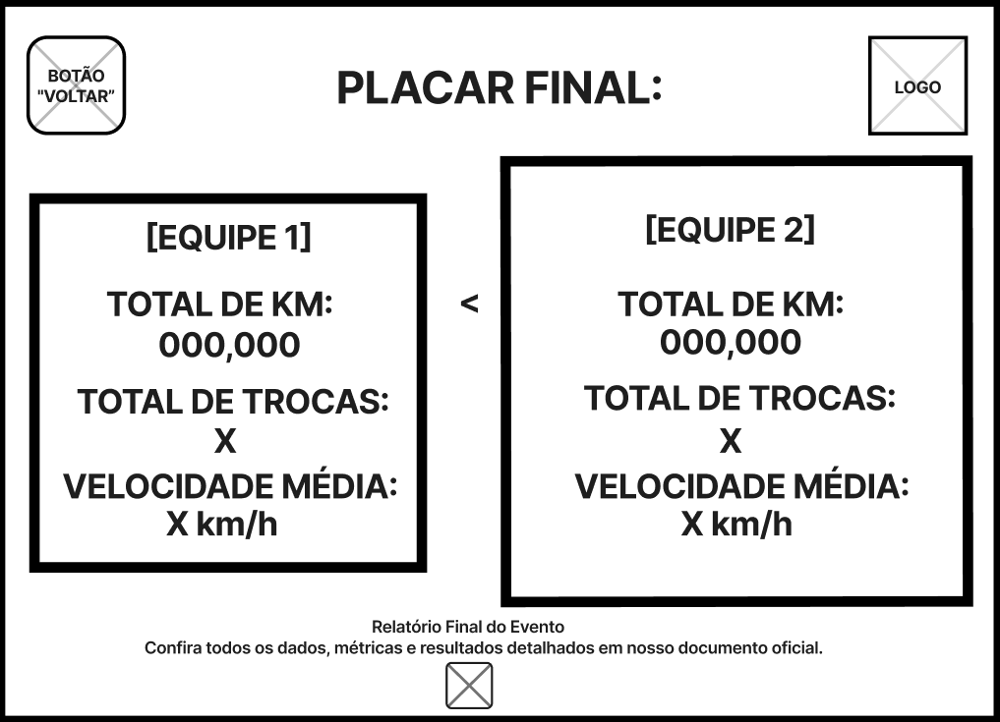<br>
  <sub>Fonte: Elaborado pelos autores (2026).</sub>
</div>
<br>


O _layout_ dos painéis permite identificar o desfecho da competição de forma direta, sem a necessidade de navegação adicional. Na parte inferior, um atalho direciona ao relatório final do evento, onde métricas e dados mais completos estão disponíveis para consulta e possíveis alterações. A tela representa o encerramento do fluxo principal da aplicação, consolidando os resultados de ambas as equipes em uma visualização conclusiva.

#### Tela de exportação de dados

A interface de exportação de dados é acessada a partir da tela de placar final após a conclusão do evento. Sua principal finalidade é viabilizar a extração e o download de relatórios detalhados referentes às métricas e aos resultados consolidados da competição, conferindo ao usuário flexibilidade na parametrização dos dados que comporão o documento gerado.

<br>
<div align="center">
  <b>Figura 18 — Exportação de dados</b><br>
  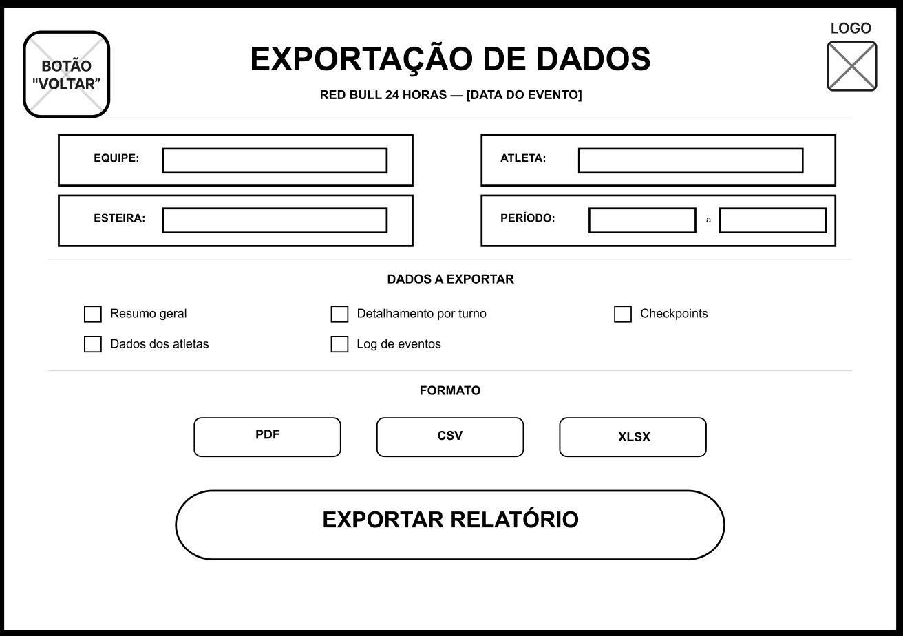<br>
  <sub>Fonte: Elaborado pelos autores (2026).</sub>
</div>
<br>
Conforme ilustrado na Figura 18, a interface permite que o usuário aplique filtros opcionais por equipe, atleta, esteira ou período de tempo para restringir o escopo dos dados exportados. Além disso, é possível selecionar simultaneamente uma ou mais categorias de informações a serem incluídas no documento, como resumo geral, detalhamento por turno, histórico de checkpoints, dados individuais dos atletas e log de eventos.

Para a geração dos arquivos, o formato PDF cria um documento em formato de "texto corrido", enquanto os formatos CSV e XLSX produzem planilhas com dados estruturados para análise em ferramentas externas. Ao acionar o botão "EXPORTAR RELATÓRIO", o sistema processa as informações conforme as parametrizações definidas e disponibiliza para o download. Por fim, o botão "voltar" encerra a operação de exportação e redireciona o usuário de volta à tela de Placar Final.

## 3.4. Guia de estilos (sprint 3)

O Guia de Estilos é o documento que define a identidade visual e regras de interface da solução. Serve principalmente para padronizar todos os elementos visuais do projeto, como por exemplo a paleta de cores, tipografia, iconografia, espaçamentos e o comportamento dos componentes interativos, a fim de garantir coesão visual e funcional em toda a aplicação desenvolvida.
A estruturação desta seção é fundamental pois um padrão bem definido acelera o processo de desenvolvimento, além de facilitar a manutenção do código e proporcionar uma experiência de usuário mais fluida e intuitiva, evitando divergências significativas entre as telas. As escolhas visuais foram também orientadas pela identidade do evento Red Bull 24 horas, procurando passar uma imagem ousada, dinâmica e reconhecível.

### 3.4.1 Cores

A definição da paleta de cores da aplicação tem um papel funcional e, principalmente, ergonômico na comunicação de estados do sistema e na orientação da equipe. Considerando o cenário de uma competição de 24 horas consecutivas, em que os operadores interagem com os dispositivos sob diferentes condições de iluminação ambiental, da intensa luz diurna à baixa luz da madrugada, o uso padronizado das cores é essencial para minimizar o esforço cognitivo e prevenir erros operacionais causados pela exaustão.

Nesse contexto, as escolhas cromáticas foram fundamentadas em princípios de acessibilidade e alto contraste, com referência direta à paleta oficial do evento Red Bull 24. O objetivo principal é garantir que a hierarquia da informação seja percebida intuitivamente, permitindo que os usuários identifiquem rapidamente os indicadores essenciais, sem a necessidade de processar textos extensos. As cores atuam, portanto, como os primeiros sinalizadores de ação e estado da interface, garantindo uma navegação segura e mais eficiente em momentos de alta pressão.

O Quadro 1 apresenta a paleta de cores utilizadas, organizadas por função na interface.

**Quadro 1 – Paleta de cores e funções na interface**
| Nome da Cor | Código HEX | Função na Interface |
| :--- | :--- | :--- |
| **Red Bull Red** | `#DB0840` | Usada em botões de ação principal, CTAs, destakes e elementos de urgência. |
| **Deep Navy** | `#001E3C` | Cor de fundo. Aplicada em cabeçalhos escuros e seções de destaque. |
| **Bright Green** | `#7ED32C` | Usada em indicadores de vitória ou vantagem das equipes, e elementos de confirmação. |
| **Vibrant Pink** | `#F30B47` | Reservada para alertas importantes, chamadas urgentes, locais de atenção em geral e elementos de alta ênfase visual. |
<div align="center"> Fonte: Elaborado pelos autores (2026).
</div>
Para ilustrar a harmonia visual prática da combinação de cores escolhida, a Figura 19 apresenta a paleta do sistema, exibindo as amostras visuais correspondentes aos códigos de identificação citados.

<div align="center">

**Figura 19 – Amostras cromáticas e distribuição da paleta de cores**

  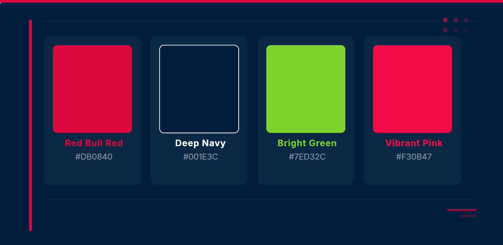<br>

*Fonte: Elaborado pelos autores (2026).*

</div>

A combinação e contraste gerados por essa seleção de cores cumprem os requisitos de acessibilidade estipulados para o projeto, viabilizando uma navegação mais fluida mesmo em ambientes com iluminação oscilante. Desse modo, a identidade visual estabelecida atua diretamente na redução da fadiga visual e aprimoramento da usabilidade da interface ao longo de todo o período da competição.
### 3.4.2 Tipografia
A escolha da tipografia para a aplicação web surge da necessidade de garantir uma leitura clara e facilitada em relação a inserção de dados durante a competição. Como a equipe de campo pode sofrer com o cansaço visual, a interface precisa de letras muito fáceis de ler.

Por isso, definimos o uso da fonte Inter para todo o projeto. Ela é simples e sem serifa. Além disso, apresenta os números de forma muito clara, o que ajuda na administração correta dos dados da prova, evitando erros.

Como utilizamos apenas a fonte Inter, a hierarquia visual do sistema foi criada variando apenas o tamanho e o peso da letra, conforme apresentado no Quadro 2.

**Quadro 2 – Hierarquia visual da tipografia**
| Estilo | Fonte | Especificações | Uso |
| :--- | :--- | :--- | :--- |
| **Título Principal (H1)** | Inter | 48px, Negrito | Títulos de destaque e páginas principais |
| **Título de Seção (H2)** | Inter | 24px, Negrito | Divisões importantes do sistema |
| **Texto Padrão (Body)** | Inter | 16px, Normal | Textos gerais, listas e tabelas |
| **Texto Menor (Caption)** | Inter | 14px, Normal | Legendas e informações secundárias |
| **Botão (Button)** | Inter | 16px, Negrito | Botões de ação do sistema |
<div align="center">

*Fonte: Elaborado pelos autores (2026).*

</div>

A fim de proporcionar uma visualização concreta da aplicação prática desses estilos na interface, a Figura 20 demonstra a tipográfia completa, exibindo a variação do alfabeto e dos caracteres numéricos da fonte Inter.

<div align="center">

**Figura 20 – Espécime tipográfico e variações de estilo da fonte Inter**
 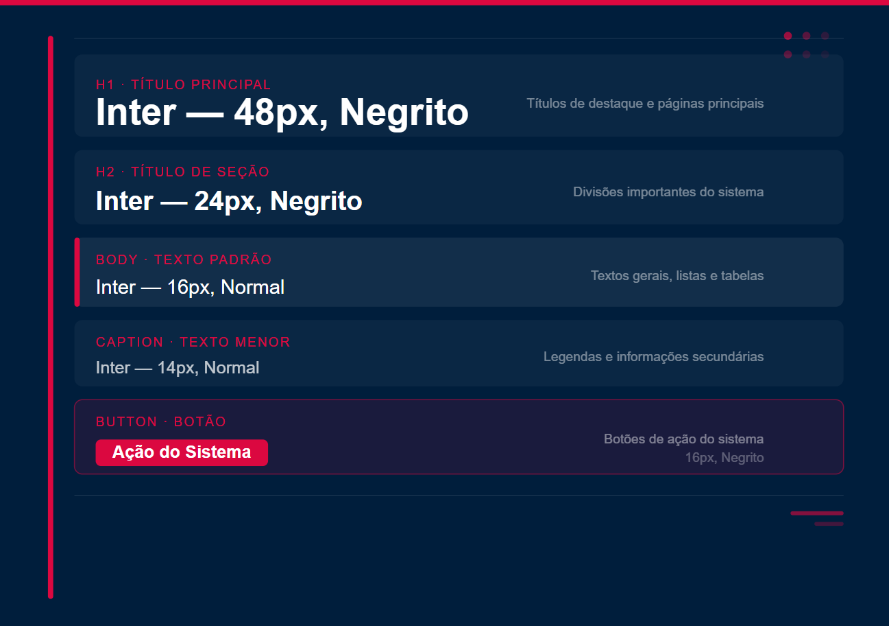<br>
*Fonte: Elaborado pelos autores (2026).*

</div>

A disposição gráfica apresentada evidencia que a uniformidade da fonte Inter, mesmo operando sob diferentes escalas de peso e tamanho, apresenta o conforto visual necessário para a operação. Essa consistência contribui diretamente para a redução do esforço cognitivo do usuário, mitigando a ocorrência de falhas operacionais durante a inserção de dados no sistema.

### 3.4.3 Iconografia e imagens 

A definição do conjunto de ícones da aplicação tem uma função muito importante na comunicação rápida das ações disponíveis ao usuário. No contexto operacional como o da competição Red Bull 24 horas, onde os operadores precisam realizar interações ágeis sob condições de pressão constante, a iconografia atua como um sistema de sinalização visual que reduz a dependência de leitura de textos e agiliza a tomada de decisão.

Para garantir a reconhecibilidade, os ícones foram organizados em quatro categorias: navegação, usuário e perfil, operação e dados, e localização e checkpoint. Dessa forma, distribuem-se os elementos na solução, o que facilita a localização intuitiva das funcionalidades pelo usuário. Todos os ícones seguem um padrão visual único, com traços consistentes e fundos arredondados, alinhados à identidade visual de toda a interface do projeto. Os ícones de estado, como Confirmado, Erro, Alerta, Ativo e Inativo, utilizam as cores definidas na paleta do sistema para reforçar o significado de cada ação ou condição da operação.

A Figura 21 apresenta o conjunto completo de ícones utilizados na interface, organizados por categoria funcional.

<div align="center">

**Figura 21 – Espécime tipográfico e variações de estilo da fonte Inter**
 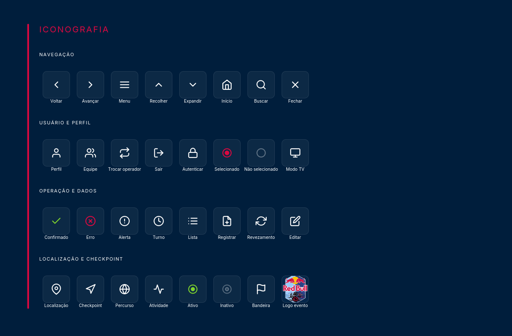<br>
*Fonte: Elaborado pelos autores (2026).*
</div>

A organização apresentada mostra que a padronização do conjunto de ícones contribui diretamente para a coerência visual da interface. A uniformidade no estilo gráfico dos ícones, junto ao uso das cores para estados operacionais, assegura que o usuário entenda o significado de cada elemento de uma forma muito simples, sem a necessidade de nenhum texto adicional. Dessa forma, a iconografia definida reforça a usabilidade e a acessibilidade do sistema, além de colaborar com a redução de erros operacionais ao longo das 24 horas de competição. 

## 3.5 Protótipo de alta fidelidade (sprint 3)

O protótipo de alta fidelidade do BullPace foi desenvolvido no Figma para representar a experiência final esperada da aplicação web. Ele apresenta os principais fluxos de navegação do sistema, contemplando tanto o uso operacional do promotor quanto o acompanhamento administrativo da coordenadora durante a prova.

O protótipo navegável completo está disponível no link abaixo:

[Protótipo navegável BullPace no Figma](https://www.figma.com/proto/PcgrQX9uFsYl5BrW1WKM3y/prototipo-bullpace?node-id=89-89&p=f&t=r4UGCO89YUV6yPny-0&scaling=min-zoom&content-scaling=fixed&page-id=0%3A1&starting-point-node-id=89%3A89&show-proto-sidebar=1)

<br>
<div align="center">
  <b>Figura 21 — Fluxo do promotor no protótipo de alta fidelidade</b><br>
  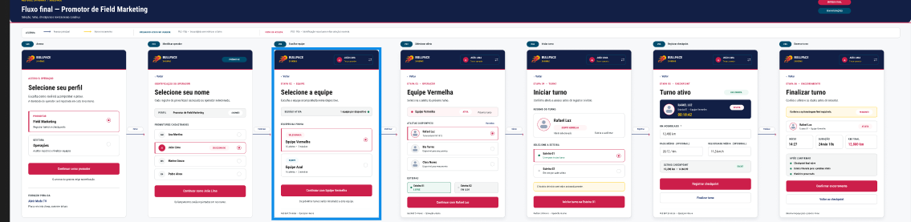<br>
  <sub>Fonte: Elaborado pelos autores no Figma (2026).</sub>
</div>
<br>

O fluxo do promotor contempla a seleção de perfil, identificação do responsável pela operação, escolha da equipe, seleção do atleta, vínculo com a esteira, início do turno, registro de checkpoints e encerramento da corrida.

<br>
<div align="center">
  <b>Figura 22 — Fluxo da coordenadora no protótipo de alta fidelidade</b><br>
  <br>
  <sub>Fonte: Elaborado pelos autores no Figma (2026).</sub>
</div>
<br>

O fluxo da coordenadora foi estruturado para apoiar o acompanhamento geral da competição, a auditoria dos registros, o Modo TV, o fechamento da prova e a validação dos resultados oficiais.

## 3.6. Modelagem do banco de dados (sprints 2 e 4)

### 3.6.1. Modelo Entidade-Relacionamento (ER) (sprint 2)

Nesta seção, é apresentado o Modelo Entidade-Relacionamento do sistema em nível conceitual. O objetivo é identificar as principais entidades, seus atributos e os relacionamentos que representam as regras do domínio, sem ainda entrar em detalhes como tipos de dados, chaves primárias, chaves estrangeiras ou restrições de implementação.

No contexto deste projeto, o modelo conceitual contempla a organização da prova por meio de **EVENTO**, a estruturação das **EQUIPES** e de seus **ATLETAS**, a disponibilização de **ESTEIRAS**, a realização de **TURNOS**, o registro de **CHECKPOINTS** e o controle operacional associado a **FUNCAO** e **SESSAO_OPERACIONAL**. Nesta etapa, o foco está na identificação das entidades, de seus atributos relevantes e dos relacionamentos que expressam as regras do domínio.

<div align="center">
  <sub><b>Figura 19 - Modelo Entidade-Relacionamento Conceitual</b></sub><br>
  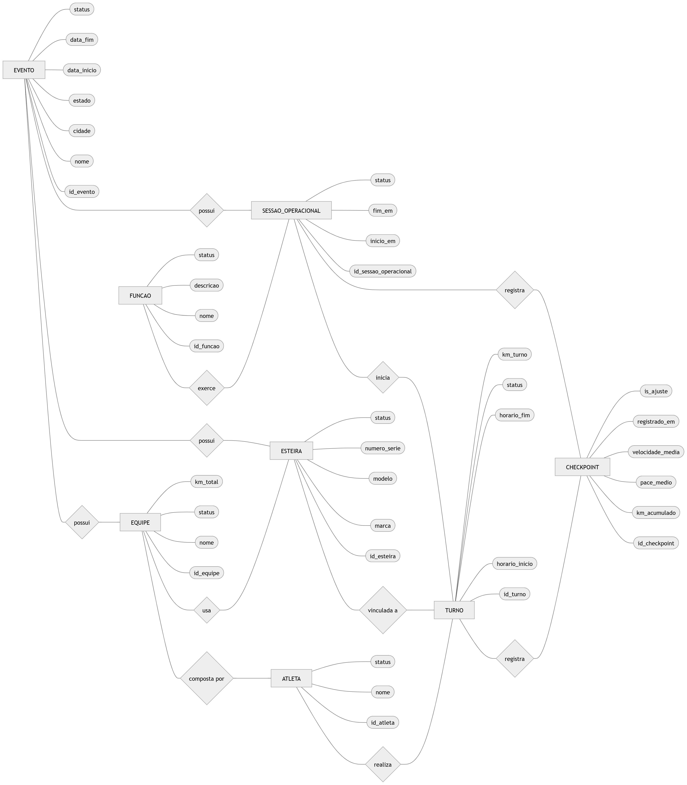<br>
  <sup>Fonte: Autores</sup>
</div>

No modelo apresentado, **EVENTO** atua como entidade organizadora da prova, relacionando-se com **EQUIPE**, **ESTEIRA** e **SESSAO_OPERACIONAL**. Cada **EQUIPE** é composta por **ATLETA**; cada **ATLETA** realiza **TURNO**; e cada **TURNO** gera registros de **CHECKPOINT**. A entidade **FUNCAO** classifica o tipo de atuação associado às sessões operacionais, permitindo representar funções como operador e coordenador sem adicionar entidades para cada perfil, fornecendo um modelo mais escalável. 

Como se trata de um modelo conceitual, os atributos exibidos no diagrama devem ser interpretados apenas como características relevantes das entidades, e não como definição formal de tipos, chaves primárias, chaves estrangeiras ou restrições de implementação. Dessa forma, o modelo ER cumpre seu papel de estabilizar o vocabulário do domínio e servir de base para o detalhamento lógico apresentado no DER e, posteriormente, para sua tradução em relações no modelo relacional.

### 3.6.2. Diagrama Entidade-Relacionamento (DER) (sprint 2)

O **Diagrama Entidade-Relacionamento (DER)** representa o refinamento lógico do Modelo Entidade-Relacionamento apresentado na seção anterior. Enquanto o ER conceitual tem como foco identificar entidades, atributos e relacionamentos do domínio, o DER detalha essa estrutura com **chaves primárias (PK)**, **chaves estrangeiras (FK)** e cardinalidades explícitas em cada relação (LUCIDCHART, 2026).

Dessa forma, o DER aproxima a modelagem da estrutura que será usada no banco de dados, indicando quais entidades dependem de outras e como os vínculos entre os dados serão representados logicamente. O diagrama também foi mantido coerente com o **Diagrama de Classes do Domínio (Seção 3.2.3)**, preservando as entidades centrais do sistema: **EVENTO**, **EQUIPE**, **ATLETA**, **ESTEIRA**, **TURNO**, **CHECKPOINT**, **FUNCAO** e **SESSAO_OPERACIONAL**.

<div align="center">
  <sub><b>Figura 20 - Diagrama Entidade-Relacionamento (DER)</b></sub><br>
  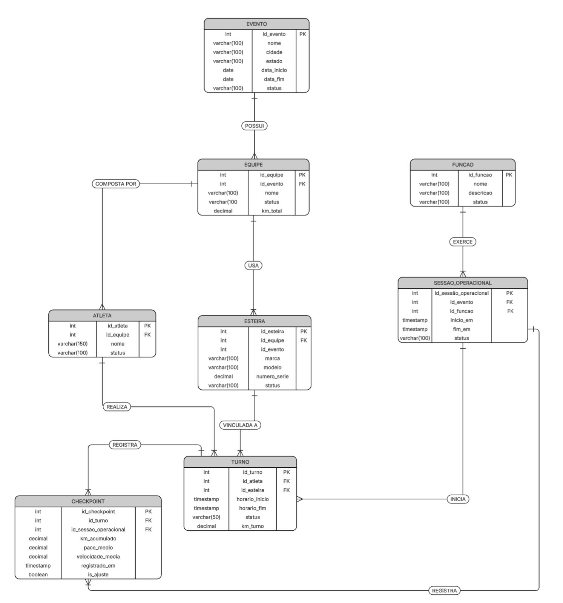<br>
  <sup>Fonte: Elaborado pelos autores (2026)</sup>
</div>

No DER, as cardinalidades indicam a quantidade de ocorrências possíveis entre as entidades. No núcleo da prova, as relações principais foram modeladas como **1:N**, como em **EVENTO–EQUIPE**, **EVENTO–ESTEIRA**, **EQUIPE–ATLETA**, **ATLETA–TURNO**, **ESTEIRA–TURNO** e **TURNO–CHECKPOINT**. Isso significa que um evento pode possuir várias equipes e esteiras, uma equipe pode conter vários atletas, um atleta pode realizar vários turnos, uma esteira pode ser vinculada a vários turnos e um turno pode gerar vários checkpoints.

Na parte operacional, **FUNCAO** se relaciona com **SESSAO_OPERACIONAL** em uma relação **1:N**, pois uma função pode estar associada a várias sessões operacionais, enquanto cada sessão está vinculada a uma única função. Essa função representa o perfil de atuação utilizado no sistema, como operador ou coordenador. Além disso, cada **SESSAO_OPERACIONAL** pertence a um **EVENTO** e pode registrar ações relevantes da operação, como o início de turnos e o registro de checkpoints.

A relação **EQUIPE–ESTEIRA** também foi definida como **1:N**, pois, no escopo atual, as esteiras são atribuídas diretamente a uma equipe durante o evento. Assim, uma equipe pode utilizar uma ou mais esteiras, enquanto cada esteira permanece vinculada a apenas uma equipe. Como o modelo atual não contempla histórico de compartilhamento, troca ou realocação de esteiras entre equipes, não foi criada uma tabela associativa para esse vínculo.

A nomenclatura das chaves segue o padrão `id_<entidade>` para facilitar a leitura e a futura implementação. As chaves primárias identificam unicamente cada registro, enquanto as chaves estrangeiras indicam as dependências entre as entidades. Por exemplo, a presença de `id_evento` em **EQUIPE** representa o vínculo entre equipe e evento, enquanto `id_turno` em **CHECKPOINT** indica a qual turno cada checkpoint pertence.

Assim, o DER complementa o modelo ER ao detalhar cardinalidades, dependências e chaves necessárias para a estrutura lógica dos dados. Com isso, ele prepara a transição para o modelo relacional, no qual esses relacionamentos passam a ser representados por tabelas e chaves estrangeiras.

### 3.6.3. Modelo Relacional e Modelo Físico (sprints 2 e 4)

Nesta seção, a modelagem do banco de dados avança do DER para uma representação mais próxima da implementação. O **modelo relacional** organiza as entidades em tabelas, indicando chaves primárias e estrangeiras. Já o **modelo físico** detalha como essa estrutura será implementada no banco de dados, com tipos, restrições, índices e comandos SQL.

Nesta etapa, é apresentado o modelo relacional textual derivado do DER da seção 3.6.2. O modelo físico será complementado posteriormente com a migration responsável pela criação do esquema no PostgreSQL.

#### 3.6.3.1. Modelo Relacional Textual

O modelo relacional textual apresenta as tabelas do sistema em formato resumido, destacando suas chaves primárias e estrangeiras. Ele funciona como uma tradução direta do DER para uma estrutura lógica de banco de dados, servindo como base para a implementação física.

O modelo relacional descreve os esquemas em formato textual:

eventos(id_evento, nome, cidade, estado, data_inicio, data_fim, status)

equipes(id_equipe, id_evento, nome, status, km_total)

atletas(id_atleta, id_equipe, nome, status)

esteiras(id_esteira, id_equipe, id_evento, marca, modelo, numero_serie, status)

funcoes(id_funcao, nome, descricao, status)

sessoes_operacionais(id_sessao_operacional, id_evento, id_funcao, inicio_em, fim_em, status)

turnos(id_turno, id_atleta, id_esteira, id_sessao_operacional, horario_inicio, horario_fim, status, km_turno)

checkpoints(id_checkpoint, id_turno, id_sessao_operacional, km_acumulado, pace_medio, velocidade_media, registrado_em, is_ajuste)

operador(id_operador, nome, id_sessao_operacional)

coordenador(id_coordenador, nome, id_sessao_operacional)


#### 3.6.3.2 Modelo Físico

O Modelo Físico representa a implementação real do banco de dados a partir do modelo relacional. Nesta etapa, as relações são convertidas em comandos SQL, com definição de tipos, chaves primárias, chaves estrangeiras, restrições de integridade e índices para apoiar consultas e regras operacionais do sistema.

A implementação abaixo foi organizada em migrations para garantir a criação das tabelas na ordem correta de dependência.

### Migrations

A ordem das migrations respeita as dependências entre as tabelas. Tabelas independentes, como `eventos` e `funcoes`, são criadas primeiro. Em seguida, são criadas tabelas dependentes, como `equipes`, `atletas`, `esteiras`, `sessoes_operacionais`, `turnos` ,`checkpoints`, `operador` e `coordenador`.

- `0001_create_eventos.sql`: sem dependências externas;
- `0002_create_funcoes.sql`: sem dependências externas;
- `0003_create_equipes.sql`: depende de eventos;
- `0004_create_atletas.sql`: depende de equipes;
- `0005_create_esteiras.sql`: depende de eventos e equipes;
- `0006_create_sessoes_operacionais.sql`: depende de eventos e funcoes;
- `0007_create_turnos.sql`: depende de atletas, esteiras e sessoes_operacionais;
- `0008_create_checkpoints.sql`: depende de turnos e sessoes_operacionais;
- `0009_insert_dados_iniciais.sql`: depende de funcoes;
- `0010_create_views.sql`: depende das tabelas anteriores;
- `0011_create_operador.sql`: depende de sessoes_operacionais;
- `0012_create_coordenador.sql`: depende de sessoes_operacionais.

### Scripts das Migrations

**0001_create_eventos.sql**

```sql
CREATE TABLE eventos (
    id_evento      SERIAL PRIMARY KEY,
    nome           VARCHAR(100) NOT NULL,
    cidade         VARCHAR(100) NOT NULL,
    estado         VARCHAR(100) NOT NULL,
    data_inicio    TIMESTAMP NOT NULL,
    data_fim       TIMESTAMP NOT NULL,
    status         VARCHAR(50) NOT NULL DEFAULT 'planejado',
    deleted_at     BOOLEAN,

    CONSTRAINT ck_eventos_status
        CHECK (status IN ('planejado', 'em_andamento', 'finalizado', 'cancelado')),

    CONSTRAINT ck_eventos_datas
        CHECK (data_fim > data_inicio)
);
```

**0002_create_funcoes.sql**

```sql
CREATE TABLE funcoes (
    id_funcao      SERIAL PRIMARY KEY,
    nome           VARCHAR(100) NOT NULL,
    descricao      TEXT,
    status         VARCHAR(50) NOT NULL DEFAULT 'ativa',
    deleted_at     BOOLEAN,

    CONSTRAINT uq_funcoes_nome
        UNIQUE (nome),

    CONSTRAINT ck_funcoes_status
        CHECK (status IN ('ativa', 'inativa'))
);
```

**0003_create_equipes.sql**

```sql
CREATE TABLE equipes (
    id_equipe      SERIAL PRIMARY KEY,
    id_evento      INT NOT NULL,
    nome           VARCHAR(100) NOT NULL,
    status         VARCHAR(50) NOT NULL DEFAULT 'ativa',
    km_total       DECIMAL(10,3) NOT NULL DEFAULT 0,
    deleted_at     BOOLEAN,

    CONSTRAINT fk_equipes_eventos
        FOREIGN KEY (id_evento)
        REFERENCES eventos(id_evento)
        ON DELETE RESTRICT,

    CONSTRAINT uq_equipes_nome_evento
        UNIQUE (id_evento, nome),

    CONSTRAINT ck_equipes_status
        CHECK (status IN ('ativa', 'inativa', 'finalizada')),

    CONSTRAINT ck_equipes_km_total
        CHECK (km_total >= 0)
);

CREATE INDEX idx_equipes_evento
    ON equipes(id_evento);
```

**0004_create_atletas.sql**

```sql
CREATE TABLE atletas (
    id_atleta      SERIAL PRIMARY KEY,
    id_equipe      INT NOT NULL,
    nome           VARCHAR(150) NOT NULL,
    status         VARCHAR(50) NOT NULL DEFAULT 'ativo',
    deleted_at     BOOLEAN,

    CONSTRAINT fk_atletas_equipes
        FOREIGN KEY (id_equipe)
        REFERENCES equipes(id_equipe)
        ON DELETE RESTRICT,

    CONSTRAINT uq_atletas_nome_equipe
        UNIQUE (id_equipe, nome),

    CONSTRAINT ck_atletas_status
        CHECK (status IN ('ativo', 'inativo'))
);

CREATE INDEX idx_atletas_equipe
    ON atletas(id_equipe);
```

**0005_create_esteiras.sql**

```sql
CREATE TABLE esteiras (
    id_esteira     SERIAL PRIMARY KEY,
    id_equipe      INT NOT NULL,
    id_evento      INT NOT NULL,
    marca          VARCHAR(100) NOT NULL DEFAULT 'Technogym',
    modelo         VARCHAR(100),
    numero_serie   VARCHAR(100),
    status         VARCHAR(50) NOT NULL DEFAULT 'livre',
    delet_at       BOOLEAN,

    CONSTRAINT fk_esteiras_equipes
        FOREIGN KEY (id_equipe)
        REFERENCES equipes(id_equipe)
        ON DELETE RESTRICT,

    CONSTRAINT fk_esteiras_eventos
        FOREIGN KEY (id_evento)
        REFERENCES eventos(id_evento)
        ON DELETE RESTRICT,

    CONSTRAINT uq_esteiras_numero_serie
        UNIQUE (numero_serie),

    CONSTRAINT ck_esteiras_status
        CHECK (status IN ('livre', 'em_uso', 'manutencao', 'indisponivel'))
);

CREATE INDEX idx_esteiras_equipe
    ON esteiras(id_equipe);

CREATE INDEX idx_esteiras_evento
    ON esteiras(id_evento);
```

**0006_create_sessoes_operacionais.sql**

```sql
CREATE TABLE sessoes_operacionais (
    id_sessao_operacional SERIAL PRIMARY KEY,
    id_evento             INT NOT NULL,
    id_funcao             INT NOT NULL,
    inicio_em             TIMESTAMP NOT NULL DEFAULT NOW(),
    fim_em                TIMESTAMP,
    status                VARCHAR(50) NOT NULL DEFAULT 'ativa',
    deleted_at            BOOLEAN,

    CONSTRAINT fk_sessoes_operacionais_eventos
        FOREIGN KEY (id_evento)
        REFERENCES eventos(id_evento)
        ON DELETE RESTRICT,

    CONSTRAINT fk_sessoes_operacionais_funcoes
        FOREIGN KEY (id_funcao)
        REFERENCES funcoes(id_funcao)
        ON DELETE RESTRICT,

    CONSTRAINT ck_sessoes_operacionais_status
        CHECK (status IN ('ativa', 'encerrada', 'cancelada')),

    CONSTRAINT ck_sessoes_operacionais_datas
        CHECK (fim_em IS NULL OR fim_em > inicio_em)
);

CREATE INDEX idx_sessoes_operacionais_evento
    ON sessoes_operacionais(id_evento);

CREATE INDEX idx_sessoes_operacionais_funcao
    ON sessoes_operacionais(id_funcao);

CREATE INDEX idx_sessoes_operacionais_status
    ON sessoes_operacionais(status);
```

**0007_create_turnos.sql**

```sql
CREATE TABLE turnos (
    id_turno               SERIAL PRIMARY KEY,
    id_atleta              INT NOT NULL,
    id_esteira             INT NOT NULL,
    id_sessao_operacional  INT NOT NULL,
    horario_inicio         TIMESTAMP NOT NULL DEFAULT NOW(),
    horario_fim            TIMESTAMP,
    status                 VARCHAR(50) NOT NULL DEFAULT 'em_andamento',
    km_turno               DECIMAL(10,3) NOT NULL DEFAULT 0,

    CONSTRAINT fk_turnos_atletas
        FOREIGN KEY (id_atleta)
        REFERENCES atletas(id_atleta)
        ON DELETE RESTRICT,

    CONSTRAINT fk_turnos_esteiras
        FOREIGN KEY (id_esteira)
        REFERENCES esteiras(id_esteira)
        ON DELETE RESTRICT,

    CONSTRAINT fk_turnos_sessoes_operacionais
        FOREIGN KEY (id_sessao_operacional)
        REFERENCES sessoes_operacionais(id_sessao_operacional)
        ON DELETE RESTRICT,

    CONSTRAINT ck_turnos_status
        CHECK (status IN ('em_andamento', 'encerrado', 'cancelado')),

    CONSTRAINT ck_turnos_datas
        CHECK (horario_fim IS NULL OR horario_fim > horario_inicio),

    CONSTRAINT ck_turnos_km
        CHECK (km_turno >= 0)
);

CREATE INDEX idx_turnos_atleta
    ON turnos(id_atleta);

CREATE INDEX idx_turnos_esteira
    ON turnos(id_esteira);

CREATE INDEX idx_turnos_sessao_operacional
    ON turnos(id_sessao_operacional);

CREATE INDEX idx_turnos_status
    ON turnos(status);

CREATE UNIQUE INDEX uq_turnos_ativo_esteira
    ON turnos(id_esteira)
    WHERE status = 'em_andamento';

CREATE UNIQUE INDEX uq_turnos_ativo_atleta
    ON turnos(id_atleta)
    WHERE status = 'em_andamento';
```

**0008_create_checkpoints.sql**

```sql
CREATE TABLE checkpoints (
    id_checkpoint          SERIAL PRIMARY KEY,
    id_turno               INT NOT NULL,
    id_sessao_operacional  INT NOT NULL,
    km_acumulado           DECIMAL(10,3) NOT NULL,
    pace_medio             DECIMAL(10,3),
    velocidade_media       DECIMAL(10,3),
    registrado_em          TIMESTAMP NOT NULL DEFAULT NOW(),
    is_ajuste              BOOLEAN NOT NULL DEFAULT FALSE,

    CONSTRAINT fk_checkpoints_turnos
        FOREIGN KEY (id_turno)
        REFERENCES turnos(id_turno)
        ON DELETE RESTRICT,

    CONSTRAINT fk_checkpoints_sessoes_operacionais
        FOREIGN KEY (id_sessao_operacional)
        REFERENCES sessoes_operacionais(id_sessao_operacional)
        ON DELETE RESTRICT,

    CONSTRAINT ck_checkpoints_km
        CHECK (km_acumulado >= 0),

    CONSTRAINT ck_checkpoints_pace
        CHECK (pace_medio IS NULL OR pace_medio > 0),

    CONSTRAINT ck_checkpoints_velocidade
        CHECK (velocidade_media IS NULL OR velocidade_media > 0)
);

CREATE INDEX idx_checkpoints_turno
    ON checkpoints(id_turno);

CREATE INDEX idx_checkpoints_sessao_operacional
    ON checkpoints(id_sessao_operacional);

CREATE INDEX idx_checkpoints_registrado_em
    ON checkpoints(registrado_em DESC);

CREATE INDEX idx_checkpoints_turno_data
    ON checkpoints(id_turno, registrado_em DESC);
```

**0009_insert_dados_iniciais.sql**

```sql
INSERT INTO funcoes (nome, descricao, status) VALUES
    ('operador', 'Responsável por iniciar turnos e registrar checkpoints.', 'ativa'),
    ('coordenador', 'Responsável por acompanhar a operação e validar dados consolidados.', 'ativa');
```

**0010_create_views.sql**

```sql
CREATE OR REPLACE VIEW vw_placar_parcial AS
WITH ultimo_checkpoint_por_turno AS (
    SELECT DISTINCT ON (id_turno)
        id_turno,
        km_acumulado,
        registrado_em
    FROM checkpoints
    ORDER BY id_turno, registrado_em DESC
)
SELECT
    ev.id_evento,
    ev.nome AS evento_nome,
    eq.id_equipe,
    eq.nome AS equipe_nome,
    eq.status AS equipe_status,
    eq.km_total AS equipe_km_total,
    COUNT(DISTINCT t.id_turno) AS total_turnos,
    COALESCE(SUM(uc.km_acumulado), 0) AS km_total_parcial
FROM eventos ev
JOIN equipes eq
    ON eq.id_evento = ev.id_evento
LEFT JOIN atletas a
    ON a.id_equipe = eq.id_equipe
LEFT JOIN turnos t
    ON t.id_atleta = a.id_atleta
LEFT JOIN ultimo_checkpoint_por_turno uc
    ON uc.id_turno = t.id_turno
GROUP BY
    ev.id_evento,
    ev.nome,
    eq.id_equipe,
    eq.nome,
    eq.status,
    eq.km_total;

CREATE OR REPLACE VIEW vw_historico_completo AS
SELECT
    ev.id_evento,
    ev.nome AS evento_nome,

    eq.id_equipe,
    eq.nome AS equipe_nome,

    a.id_atleta,
    a.nome AS atleta_nome,

    est.id_esteira,
    est.marca AS esteira_marca,
    est.modelo AS esteira_modelo,
    est.numero_serie AS esteira_numero_serie,

    t.id_turno,
    t.horario_inicio,
    t.horario_fim,
    t.status AS turno_status,
    t.km_turno,

    so_turno.id_sessao_operacional AS id_sessao_inicio_turno,
    f_turno.nome AS funcao_inicio_turno,

    cp.id_checkpoint,
    cp.km_acumulado,
    cp.pace_medio,
    cp.velocidade_media,
    cp.registrado_em,
    cp.is_ajuste,

    so_cp.id_sessao_operacional AS id_sessao_registro_checkpoint,
    f_cp.nome AS funcao_registro_checkpoint

FROM eventos ev
JOIN equipes eq
    ON eq.id_evento = ev.id_evento
JOIN atletas a
    ON a.id_equipe = eq.id_equipe
JOIN turnos t
    ON t.id_atleta = a.id_atleta
JOIN esteiras est
    ON est.id_esteira = t.id_esteira
JOIN sessoes_operacionais so_turno
    ON so_turno.id_sessao_operacional = t.id_sessao_operacional
JOIN funcoes f_turno
    ON f_turno.id_funcao = so_turno.id_funcao
LEFT JOIN checkpoints cp
    ON cp.id_turno = t.id_turno
LEFT JOIN sessoes_operacionais so_cp
    ON so_cp.id_sessao_operacional = cp.id_sessao_operacional
LEFT JOIN funcoes f_cp
    ON f_cp.id_funcao = so_cp.id_funcao
ORDER BY
    ev.id_evento,
    eq.id_equipe,
    t.horario_inicio,
    cp.registrado_em;
```
**0011_create_operador.sql**
```sql
CREATE TABLE operador (
    id_operador            SERIAL PRIMARY KEY,
    id_sessao_operacional  INT NOT NULL,
    nome                   VARCHAR(150),

    CONSTRAINT fk_operador_sessoes_operacionais
        FOREIGN KEY (id_sessao_operacional)
        REFERENCES sessoes_operacionais(id_sessao_operacional)
        ON DELETE RESTRICT
);

CREATE INDEX idx_operador_sessao_operacional
    ON operador(id_sessao_operacional);
```
**0012_create_coordenador**
```sql
CREATE TABLE coordenador (
    id_coordenador         SERIAL PRIMARY KEY,
    id_sessao_operacional  INT NOT NULL,
    nome                   VARCHAR(150),

    CONSTRAINT fk_coordenador_sessoes_operacionais
        FOREIGN KEY (id_sessao_operacional)
        REFERENCES sessoes_operacionais(id_sessao_operacional)
        ON DELETE RESTRICT
);

CREATE INDEX idx_coordenador_sessao_operacional
    ON coordenador(id_sessao_operacional);
```
### 3.6.4. Consultas SQL e lógica proposicional (sprint 2)

A lógica proposicional, vertente matemática que estuda as proposições e seus conectivos, é peça fundamental neste projeto para estruturar a comunicação entre o back-end e a camada de persistência de dados. Esta seção apresenta as consultas SQL implementadas na aplicação, evidenciando como os operadores lógicos são aplicados para extrair e filtrar informações diretamente do banco de dados.


## Consulta 1

Essa consulta retorna todos os checkpoints não excluídos (soft delete) que pertencem a turnos atualmente em andamento da equipe de id 1. Essa consulta alimenta o placar em tempo real (RF006 / RN10), garantindo que apenas dados do turno ativo e ainda não removidos sejam exibidos.

**Expressão SQL** |
``` sql
SELECT cp.id_checkpoint, cp.km_acumulado,
cp.registrado_em
FROM checkpoint cp
INNER JOIN turno t
ON cp.id_turno = t.id_turno 
WHERE t.id_equipe = 1 AND t.status = 'em_andamento' AND cp.deleted_at
IS NULL; 
```
#1 | ---
--- | ---
**Proposições lógicas** | $A$: A: O turno pertence à equipe 1 (t.id_equipe = 1) <br> $B$: O turno está em andamento (t.status = 'em_andamento') <br> $C$: O checkpoint não foi removido (cp.deleted_at IS NULL)
<br>
**Expressão lógica proposicional** |
<br> $A \land B \land C$
<br>
**Tabela Verdade** | <table> <thead> <tr> <th>$A$</th> <th>$B$</th> <th>$C$</th> <th>$(A \land B)$</th> <th>$(A \land B \land C)$</th> </tr> </thead> <tbody> <tr> <td>F</td> <td>F</td> <td>F</td> <td>F</td> <td>F</td> </tr> <tr> <td>F</td> <td>F</td> <td>V</td> <td>F</td> <td>F</td> </tr> <tr> <td>F</td> <td>V</td> <td>F</td> <td>F</td> <td>F</td> </tr> <tr> <td>F</td> <td>V</td> <td>V</td> <td>F</td> <td>F</td> </tr> <tr> <td>V</td> <td>F</td> <td>F</td> <td>F</td> <td>F</td> </tr> <tr> <td>V</td> <td>F</td> <td>V</td> <td>F</td> <td>F</td> </tr> <tr> <td>V</td> <td>V</td> <td>F</td> <td>V</td> <td>F</td> </tr> <tr> <td>V</td> <td>V</td> <td>V</td> <td>V</td> <td>V</td> </tr> </tbody> </table>

## Consulta 2

Essa consulta retorna o placar geral de todas as equipes ativas que já iniciaram a competição,ou seja, que possuem km registrado OU pelo menos um turno vinculado. Alimenta a tela de Modo TV (RF006) com ranking em tempo real.

**Expressão SQL** |

``` sql
SELECT e.id_equipe, e.nome, e.km_total,
  COUNT(DISTINCT t.id_turno) AS total_turnos,
  COUNT(DISTINCT t.id_atleta) AS atletas_ativos
FROM equipe e
LEFT JOIN turno t
  ON t.id_equipe = e.id_equipe
  AND t.deleted_at IS NULL
WHERE e.deleted_at IS NULL
  AND e.status = 'ativa'
  AND (e.km_total > 0 OR t.id_turno IS NOT NULL)
GROUP BY e.id_equipe, e.nome, e.km_total
ORDER BY e.km_total DESC;

```

#2 | ---
--- | ---
**Proposições lógicas** | $A$: Equipe não foi removida (e.deleted_at IS NULL) <br> $B$: Equipe está ativa (e.status = 'ativa') <br> $C$: Equipe já tem km acumulado (e.km_total > 0) <br> $D$: Equipe tem pelo menos um turno vinculado (t.id_turno IS NOT NULL)
<br>
**Expressão lógica proposicional** |
<br> $A \land B \land (C \lor D)$
<br>
**Tabela Verdade** | <table> <thead> <tr> <th>$A$</th> <th>$B$</th> <th>$C$</th> <th>$D$</th> <th>$(C \lor D)$</th> <th>$A \land B \land (C \lor D)$</th> </tr> </thead> <tbody> <tr> <td>F</td> <td>F</td> <td>F</td> <td>F</td> <td>F</td> <td>F</td> </tr> <tr> <td>F</td> <td>F</td> <td>F</td> <td>V</td> <td>V</td> <td>F</td> </tr> <tr> <td>F</td> <td>F</td> <td>V</td> <td>F</td> <td>V</td> <td>F</td> </tr> <tr> <td>F</td> <td>F</td> <td>V</td> <td>V</td> <td>V</td> <td>F</td> </tr> <tr> <td>F</td> <td>V</td> <td>F</td> <td>F</td> <td>F</td> <td>F</td> </tr> <tr> <td>F</td> <td>V</td> <td>F</td> <td>V</td> <td>V</td> <td>F</td> </tr> <tr> <td>F</td> <td>V</td> <td>V</td> <td>F</td> <td>V</td> <td>F</td> </tr> <tr> <td>F</td> <td>V</td> <td>V</td> <td>V</td> <td>V</td> <td>F</td> </tr> <tr> <td>V</td> <td>F</td> <td>F</td> <td>F</td> <td>F</td> <td>F</td> </tr> <tr> <td>V</td> <td>F</td> <td>F</td> <td>V</td> <td>V</td> <td>F</td> </tr> <tr> <td>V</td> <td>F</td> <td>V</td> <td>F</td> <td>V</td> <td>F</td> </tr> <tr> <td>V</td> <td>F</td> <td>V</td> <td>V</td> <td>V</td> <td>F</td> </tr> <tr> <td>V</td> <td>V</td> <td>F</td> <td>F</td> <td>F</td> <td>F</td> </tr> <tr> <td>V</td> <td>V</td> <td>F</td> <td>V</td> <td>V</td> <td>V</td> </tr> <tr> <td>V</td> <td>V</td> <td>V</td> <td>F</td> <td>V</td> <td>V</td> </tr> <tr> <td>V</td> <td>V</td> <td>V</td> <td>V</td> <td>V</td> <td>V</td> </tr> </tbody> </table>

## Consulta 3

Essa consulta lista checkpoints da equipe 1 cujo pace médio foi menor que 4 min/km (velocidade muito alta) OU cuja velocidade média superou 20 km/h. Auxilia a coordenadora na detecção de registros possivelmente incorretos para eventual ajuste (RF005).

**Expressão SQL** |

``` sql
SELECT cp.id_checkpoint, cp.km_acumulado,
  cp.pace_medio, cp.velocidade_media, cp.registrado_em
FROM checkpoint cp
INNER JOIN turno t ON cp.id_turno = t.id_turno
WHERE cp.deleted_at IS NULL
  AND t.id_equipe = 1
  AND (
    cp.pace_medio IS NOT NULL AND cp.pace_medio < 4.0
    OR cp.velocidade_media IS NOT NULL AND cp.velocidade_media > 20.0
  )
ORDER BY cp.registrado_em DESC;
```
#3 | ---
--- | ---
**Proposições lógicas** | $A$: Checkpoint não foi removido (cp.deleted_at IS NULL) <br> $B$: Turno pertence à equipe 1 (t.id_equipe = 1) <br> $C$: Pace foi preenchido e está abaixo de 4 min/km (cp.pace_medio IS NOT NULL AND cp.pace_medio < 4.0) <br> $D$: Velocidade foi preenchida e supera 20 km/h (cp.velocidade_media IS NOT NULL AND cp.velocidade_media > 20.0)
<br>
**Expressão lógica proposicional** |
<br> $A \land B \land (C \lor D)$
<br>
**Tabela Verdade** | <table> <thead> <tr> <th>$A$</th> <th>$B$</th> <th>$C$</th> <th>$D$</th> <th>$(C \lor D)$</th> <th>$A \land B \land (C \lor D)$</th> </tr> </thead> <tbody> <tr> <td>F</td> <td>F</td> <td>F</td> <td>F</td> <td>F</td> <td>F</td> </tr> <tr> <td>F</td> <td>F</td> <td>F</td> <td>V</td> <td>V</td> <td>F</td> </tr> <tr> <td>F</td> <td>F</td> <td>V</td> <td>F</td> <td>V</td> <td>F</td> </tr> <tr> <td>F</td> <td>F</td> <td>V</td> <td>V</td> <td>V</td> <td>F</td> </tr> <tr> <td>F</td> <td>V</td> <td>F</td> <td>F</td> <td>F</td> <td>F</td> </tr> <tr> <td>F</td> <td>V</td> <td>F</td> <td>V</td> <td>V</td> <td>F</td> </tr> <tr> <td>F</td> <td>V</td> <td>V</td> <td>F</td> <td>V</td> <td>F</td> </tr> <tr> <td>F</td> <td>V</td> <td>V</td> <td>V</td> <td>V</td> <td>F</td> </tr> <tr> <td>V</td> <td>F</td> <td>F</td> <td>F</td> <td>F</td> <td>F</td> </tr> <tr> <td>V</td> <td>F</td> <td>F</td> <td>V</td> <td>V</td> <td>F</td> </tr> <tr> <td>V</td> <td>F</td> <td>V</td> <td>F</td> <td>V</td> <td>F</td> </tr> <tr> <td>V</td> <td>F</td> <td>V</td> <td>V</td> <td>V</td> <td>F</td> </tr> <tr> <td>V</td> <td>V</td> <td>F</td> <td>F</td> <td>F</td> <td>F</td> </tr> <tr> <td>V</td> <td>V</td> <td>F</td> <td>V</td> <td>V</td> <td>V</td> </tr> <tr> <td>V</td> <td>V</td> <td>V</td> <td>F</td> <td>V</td> <td>V</td> </tr> <tr> <td>V</td> <td>V</td> <td>V</td> <td>V</td> <td>V</td> <td>V</td> </tr> </tbody> </table>

## Consulta 4

Essa consulta lista os turnos em andamento, vinculando atleta, equipe, esteira e sessão operacional ativa. Ela ajuda o sistema a identificar quais atletas estão correndo no momento e quais esteiras estão ocupadas.

**Expressão SQL** |

``` sql
SELECT
  t.id_turno,
  a.nome AS atleta_nome,
  eq.nome AS equipe_nome,
  est.id_esteira,
  est.status AS status_esteira,
  t.horario_inicio,
  t.status AS status_turno
FROM turnos t
INNER JOIN atletas a
  ON a.id_atleta = t.id_atleta
INNER JOIN equipes eq
  ON eq.id_equipe = a.id_equipe
INNER JOIN esteiras est
  ON est.id_esteira = t.id_esteira
INNER JOIN sessoes_operacionais so
  ON so.id_sessao_operacional = t.id_sessao_operacional
WHERE t.status = 'em_andamento'
  AND so.status = 'ativa'
  AND eq.status = 'ativa'
  AND a.status = 'ativo'
ORDER BY t.horario_inicio ASC;
```

#4 | ---
--- | ---
**Proposições lógicas** | $A$: O turno está em andamento (t.status = 'em_andamento') <br> $B$: A sessão operacional está ativa (so.status = 'ativa') <br> $C$: A equipe está ativa (eq.status = 'ativa') <br> $D$: O atleta está ativo (a.status = 'ativo')
<br>
**Expressão lógica proposicional** |
<br> $A \land B \land C \land D$
<br>
**Tabela Verdade** | <table> <thead> <tr> <th>$A$</th> <th>$B$</th> <th>$C$</th> <th>$D$</th> <th>$A \land B \land C \land D$</th> </tr> </thead> <tbody> <tr> <td>F</td> <td>F</td> <td>F</td> <td>F</td> <td>F</td> </tr> <tr> <td>F</td> <td>F</td> <td>F</td> <td>V</td> <td>F</td> </tr> <tr> <td>F</td> <td>F</td> <td>V</td> <td>F</td> <td>F</td> </tr> <tr> <td>F</td> <td>F</td> <td>V</td> <td>V</td> <td>F</td> </tr> <tr> <td>F</td> <td>V</td> <td>F</td> <td>F</td> <td>F</td> </tr> <tr> <td>F</td> <td>V</td> <td>F</td> <td>V</td> <td>F</td> </tr> <tr> <td>F</td> <td>V</td> <td>V</td> <td>F</td> <td>F</td> </tr> <tr> <td>F</td> <td>V</td> <td>V</td> <td>V</td> <td>F</td> </tr> <tr> <td>V</td> <td>F</td> <td>F</td> <td>F</td> <td>F</td> </tr> <tr> <td>V</td> <td>F</td> <td>F</td> <td>V</td> <td>F</td> </tr> <tr> <td>V</td> <td>F</td> <td>V</td> <td>F</td> <td>F</td> </tr> <tr> <td>V</td> <td>F</td> <td>V</td> <td>V</td> <td>F</td> </tr> <tr> <td>V</td> <td>V</td> <td>F</td> <td>F</td> <td>F</td> </tr> <tr> <td>V</td> <td>V</td> <td>F</td> <td>V</td> <td>F</td> </tr> <tr> <td>V</td> <td>V</td> <td>V</td> <td>F</td> <td>F</td> </tr> <tr> <td>V</td> <td>V</td> <td>V</td> <td>V</td> <td>V</td> </tr> </tbody> </table>

## Consulta 5

Essa consulta retorna checkpoints válidos de turnos em andamento, considerando apenas registros com quilometragem acumulada válida, timestamp registrado e que não sejam ajustes. Ela pode ser usada para alimentar o acompanhamento parcial da prova sem misturar correções administrativas ao fluxo operacional principal.

**Expressão SQL** |

``` sql
SELECT
  cp.id_checkpoint,
  cp.id_turno,
  cp.km_acumulado,
  cp.pace_medio,
  cp.velocidade_media,
  cp.registrado_em,
  cp.is_ajuste
FROM checkpoints cp
INNER JOIN turnos t
  ON t.id_turno = cp.id_turno
WHERE t.status = 'em_andamento'
  AND cp.km_acumulado >= 0
  AND cp.registrado_em IS NOT NULL
  AND cp.is_ajuste = FALSE
ORDER BY cp.registrado_em DESC;
```

#5 | ---
--- | ---
**Proposições lógicas** | $A$: O turno está em andamento (t.status = 'em_andamento') <br> $B$: O KM acumulado é válido (cp.km_acumulado >= 0) <br> $C$: O checkpoint possui timestamp (cp.registrado_em IS NOT NULL) <br> $D$: O checkpoint não é ajuste (cp.is_ajuste = FALSE)
<br>
**Expressão lógica proposicional** |
<br> $A \land B \land C \land D$
<br>
**Tabela Verdade** | <table> <thead> <tr> <th>$A$</th> <th>$B$</th> <th>$C$</th> <th>$D$</th> <th>$A \land B \land C \land D$</th> </tr> </thead> <tbody> <tr> <td>F</td> <td>F</td> <td>F</td> <td>F</td> <td>F</td> </tr> <tr> <td>F</td> <td>F</td> <td>F</td> <td>V</td> <td>F</td> </tr> <tr> <td>F</td> <td>F</td> <td>V</td> <td>F</td> <td>F</td> </tr> <tr> <td>F</td> <td>F</td> <td>V</td> <td>V</td> <td>F</td> </tr> <tr> <td>F</td> <td>V</td> <td>F</td> <td>F</td> <td>F</td> </tr> <tr> <td>F</td> <td>V</td> <td>F</td> <td>V</td> <td>F</td> </tr> <tr> <td>F</td> <td>V</td> <td>V</td> <td>F</td> <td>F</td> </tr> <tr> <td>F</td> <td>V</td> <td>V</td> <td>V</td> <td>F</td> </tr> <tr> <td>V</td> <td>F</td> <td>F</td> <td>F</td> <td>F</td> </tr> <tr> <td>V</td> <td>F</td> <td>F</td> <td>V</td> <td>F</td> </tr> <tr> <td>V</td> <td>F</td> <td>V</td> <td>F</td> <td>F</td> </tr> <tr> <td>V</td> <td>F</td> <td>V</td> <td>V</td> <td>F</td> </tr> <tr> <td>V</td> <td>V</td> <td>F</td> <td>F</td> <td>F</td> </tr> <tr> <td>V</td> <td>V</td> <td>F</td> <td>V</td> <td>F</td> </tr> <tr> <td>V</td> <td>V</td> <td>V</td> <td>F</td> <td>F</td> </tr> <tr> <td>V</td> <td>V</td> <td>V</td> <td>V</td> <td>V</td> </tr> </tbody> </table>

## 3.7. WebAPI e endpoints (sprints 3 e 4)

A documentação completa e navegável da WebAPI está disponível na página HTML [`documentos/webapi.html`](./webapi.html).

Quando o backend estiver em execução, a mesma documentação pode ser acessada pela rota:

`GET /docs/webapi`

A página documenta os endpoints implementados no servidor, incluindo endereço, método HTTP, headers relevantes, parâmetros de entrada, body, formato de response, status codes possíveis e vinculação explícita aos requisitos funcionais correspondentes.

## 3.8. Autenticação, Autorização e Resiliência (sprint 5)

### 3.8.1. Autenticação

*Descreva o fluxo de autenticação implementado: persistência de senha com hash bcrypt/argon2 (parâmetros de custo explícitos e justificados), validação de credenciais e criação de sessão. Senhas em texto plano no banco não são aceitas.*

### 3.8.2. Controle de sessão

*Descreva o controle de sessão baseado em `session id` persistido em tabela própria, com expiração. Se optar por JWT, justifique a escolha explicando os trade-offs (stateless, não revogável, payload exposto).*

### 3.8.3. Autorização

*Descreva as regras de autorização por rota e por operação, baseadas no perfil do usuário autenticado. A verificação deve ocorrer no backend — o frontend nunca é fonte de verdade para autorização.*

### 3.8.4. Estratégias de Resiliência

*Descreva as estratégias aplicadas no tratamento de falhas de rede: timeout, retry com backoff exponencial, circuit breaker e idempotência em operações críticas (`PUT`, `DELETE`, operações de pagamento etc.).*

## 3.9. Matriz de Rastreabilidade (RTM) (sprints 3 a 5)

A Matriz de Rastreabilidade de Requisitos (RTM) mapeia o ciclo de vida completo de cada funcionalidade, ligando os requisitos pedidos às regras de negócio, requisitos não funcionais, desenvolvimento (endpoints e telas) e testes correspondentes. Ela garante que tudo o que foi planejado foi efetivamente construído e testado, evitando pontas soltas ou entregas incompletas.

A coluna **Status** indica o estado de implementação de cada RF na sprint atual: 

- **Implementado** - RF com endpoint funcional acessível pela API e cobertura mínima de testes automatizados. Reflete entrega técnica utilizável pelo front-end, mesmo que a validação completa das regras de negócio associadas esteja prevista para sprints seguintes.
- **Em desenvolvimento** - RF planejado e documentado, com endpoint e testes ainda a definir. A funcionalidade está prevista para entrega em sprints seguintes, conforme planejamento descrito na seção de evolução do projeto.

Os RNFs **USAB02** (área de toque 44pt), **PORT** (acesso via URL sem instalação), **COMP** (compatibilidade Safari/Chrome iOS/Android/Desktop) e **MANUT01** (arquitetura MVC) são transversais a todos os RFs com interface e camada de aplicação, e não são repetidos linha a linha para evitar redundância.

| Persona | RF | RN | RNFs Relacionados | Endpoint | Tela | Teste | Status | Evidência |
|---|---|---|---|---|---|---|---|---|
| Promotor / Gestora | RF001 | — | USAB01 | (em desenvolvimento) | Seleção de Perfil | (em desenvolvimento) | Em desenvolvimento | (em desenvolvimento) |
| Promotor / Gestora | RF002 | RN04, RN05, RN06 | USAB01, SEG01 | (em desenvolvimento) | Login | (em desenvolvimento) | Em desenvolvimento | (em desenvolvimento) |
| Promotor / Gestora | RF003 | RN07 | — | (em desenvolvimento) | Cabeçalho / Menu | (em desenvolvimento) | Em desenvolvimento | (em desenvolvimento) |
| Promotor de Field Marketing | RF004 | RN01, RN08 | USAB01 | `GET /api/equipes` | Seleção de Equipe | CT01 | Implementado | print, log, relatório de cobertura |
| Promotor de Field Marketing | RF005 | RN02, RN08, RN11 | USAB01 | `GET /api/atletas` | Seleção de Atleta | CT02 | Implementado | print, log, relatório de cobertura |
| Promotor de Field Marketing | RF006 | RN03 | USAB01 | `GET /api/esteiras` | Status de Esteiras | CT03 | Implementado | print, log, relatório de cobertura |
| Promotor de Field Marketing | RF007 | RN08, RN12, RN13 | USAB01 | `POST /api/turnos` | Associação de Esteira | CT04 | Implementado | print, log, relatório de cobertura |
| Promotor de Field Marketing | RF008 | RN08, RN14, RN15, RN23 | USAB01, DES01, SEG01, CAP, MANUT02 | `POST /api/turnos` | Início de Turno | CT05 | Implementado | print, log, relatório de cobertura |
| Promotor de Field Marketing | RF009 | RN08, RN14, RN18, RN19, RN20 | USAB01, DES01, SEG01, MANUT02 | `PATCH /api/turnos/{id}/encerrar` | Encerramento de Turno | CT06 | Implementado | print, log, relatório de cobertura |
| Promotor de Field Marketing | RF010 | RN08, RN16, RN20, RN22, RN23, RN24 | USAB01, USAB03, DES01, CONF01, SEG01, CAP, MANUT02, REST | `POST /api/checkpoints` | Painel de Checkpoint | CT07 | Implementado | print, log, relatório de cobertura |
| Promotor de Field Marketing | RF011 | RN25 | — | (em desenvolvimento) | Painel de Checkpoint | (em desenvolvimento) | Em desenvolvimento | (em desenvolvimento) |
| — | RF012 | RN21 | SEG01 | (em desenvolvimento) | (transversal) | (em desenvolvimento) | Em desenvolvimento | (em desenvolvimento) |
| Promotor de Field Marketing | RF013 | RN17 | — | (em desenvolvimento) | Painel de Checkpoint | (em desenvolvimento) | Em desenvolvimento | (em desenvolvimento) |
| Promotor de Field Marketing | RF014 | — | USAB01 | (em desenvolvimento) | Resultado do Turno | (em desenvolvimento) | Em desenvolvimento | (em desenvolvimento) |
| Gestora de Operações | RF015 | RN26 | — | (em desenvolvimento) | Consulta de Histórico | (em desenvolvimento) | Em desenvolvimento | (em desenvolvimento) |
| Gestora de Operações | RF016 | RN09, RN20, RN26, RN27 | USAB03, SEG02, MANUT02 | `PUT /api/checkpoints/{id}` | Correção de Registro | CT08 | Implementado | print, log, relatório de cobertura |
| Gestora de Operações | RF017 | RN28, RN29 | SEG02 | (em desenvolvimento) | Correção de Registro | (em desenvolvimento) | Em desenvolvimento | (em desenvolvimento) |
| — | RF018 | RN10 | — | (em desenvolvimento) | (transversal) | (em desenvolvimento) | Em desenvolvimento | (em desenvolvimento) |
| Gestora de Operações | RF019 | RN09, RN29 | SEG02 | (em desenvolvimento) | Histórico de Alterações | (em desenvolvimento) | Em desenvolvimento | (em desenvolvimento) |
| Gestora de Operações | RF020 | RN09, RN30 | — | (em desenvolvimento) | Finalização de Equipe | (em desenvolvimento) | Em desenvolvimento | (em desenvolvimento) |
| — | RF021 | RN27 | SEG02 | (em desenvolvimento) | (transversal) | (em desenvolvimento) | Em desenvolvimento | (em desenvolvimento) |
| Gestora de Operações | RF022 | RN32, RN33 | — | `GET /api/placar/geral` | Resultados Consolidados | CT09 | Implementado | print, log, relatório de cobertura |
| Promotor / Gestora | RF023 | RN31 | DES02 | `GET /api/placar/geral` | Modo TV | CT10 | Implementado | print, log, relatório de cobertura |
| Gestora de Operações | RF024 | RN33, RN34, RN35 | DES02 | (em desenvolvimento) | Comparação Final | (em desenvolvimento) | Em desenvolvimento | (em desenvolvimento) |
| Gestora de Operações | RF025 | RN36 | — | `GET /api/relatorios/exportar` | Exportação | CT11 | Implementado | print, log, arquivo CSV |
| Promotor de Field Marketing | RF026 | RN37, RN38 | CONF01, CAP | (em desenvolvimento) | Painel de Checkpoint | (em desenvolvimento) | Em desenvolvimento | (em desenvolvimento) |

# <a name="c4"></a>4. Desenvolvimento da Aplicação Web

## 4.1. Primeira versão da aplicação web (sprint 3)

### 1. O que foi implementado
 
Foi implementada a camada de back-end completa da aplicação, incluindo:
 
- **Controllers:** gerenciam as requisições HTTP para cada entidade do sistema — `AtletaController`, `CheckpointController`, `CoordenadorController`, `EsteiraController`, `EventoController`, `OperadorController`, `PlacarController`, `SessaoController` e `TurnoController`.
- **Models:** definem as estruturas de dados para todas as entidades do domínio — Atleta, Checkpoint, Coordenador, Equipe, Esteira, Evento, Operador, Placar, Sessão e Turno.
- **Repositories:** responsáveis pelo acesso ao banco de dados para cada entidade.
- **Services:** contêm a lógica de negócio da aplicação.
- **Testes globais:** implementados para cobrir todos os fluxos principais da aplicação, buscando identificar erros de integração e lógica.
- **Frontend básico (demonstração):** interface desenvolvida apenas para demonstração do fluxo, ainda **não integrada** ao back-end.
- **Integração com banco de dados:** o back-end está conectado ao banco de dados hospedado no **Supabase**.
- **Servidor TypeScript:** rodando localmente na porta 3000 via `ts-node-dev`.
---
 
### 2. O que não foi implementado
 
- Integração entre o frontend e o back-end.
- Input de dados via foto (leitura visual automatizada da esteira).
---
 
### 3. Dificuldades técnicas enfrentadas
 
- **Curva de aprendizado acelerada:** a equipe precisou assimilar diversas tecnologias em pouco tempo, especialmente para a escrita e execução de testes automatizados.
- **Deploy no GitLab Pages:** o GitLab Pages não suporta aplicações dinâmicas geradas com EJS — aceita apenas HTML e CSS estáticos. Isso exigiu refatoração do código e causou atraso na entrega.
---
 
### 4. Próximos passos
 
- Entregar o sistema com o design alinhado ao **guia de estilos** e ao **protótipo de alta fidelidade** desenvolvido.
- Realizar a **integração entre frontend e back-end**.
- Implementar o **input via foto** para leitura da quilometragem diretamente da esteira.
---
 
### 5. Telas do sistema
 
As telas a seguir fazem parte do frontend desenvolvido para demonstração do fluxo da aplicação. A navegação segue uma sequência de etapas numeradas (Etapa 00 a Etapa 06), cobrindo desde o acesso até o encerramento de um turno de corrida.
 
---
 
#### Etapa 00 · Acesso — Seleção de Função

<div align="center">
  <sub><b>Figura 20 - Tela de seleção de função</b></sub><br>
  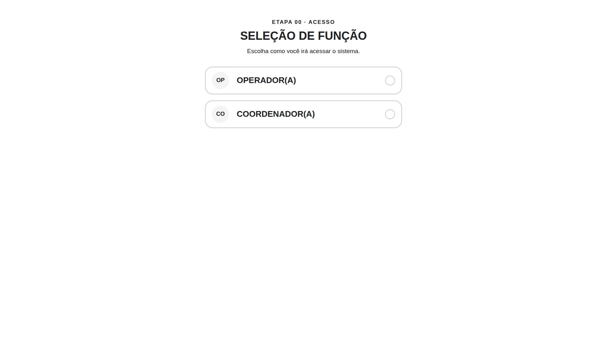<br>
  <sup>Fonte: Elaborado pelos autores (2026)</sup>
</div>
 
A tela inicial do sistema solicita que o usuário escolha com qual função irá acessar: **Operador(a)** ou **Coordenador(a)**. Cada opção é apresentada como um card selecionável com rádio button. Esta etapa define o nível de acesso e o fluxo seguinte.
 
---
 
#### Etapa 01 · Operador(a) — Seleção de Operador(a)

<div align="center">
  <sub><b>Figura 20 - Tela de seleção de operador</b></sub><br>
  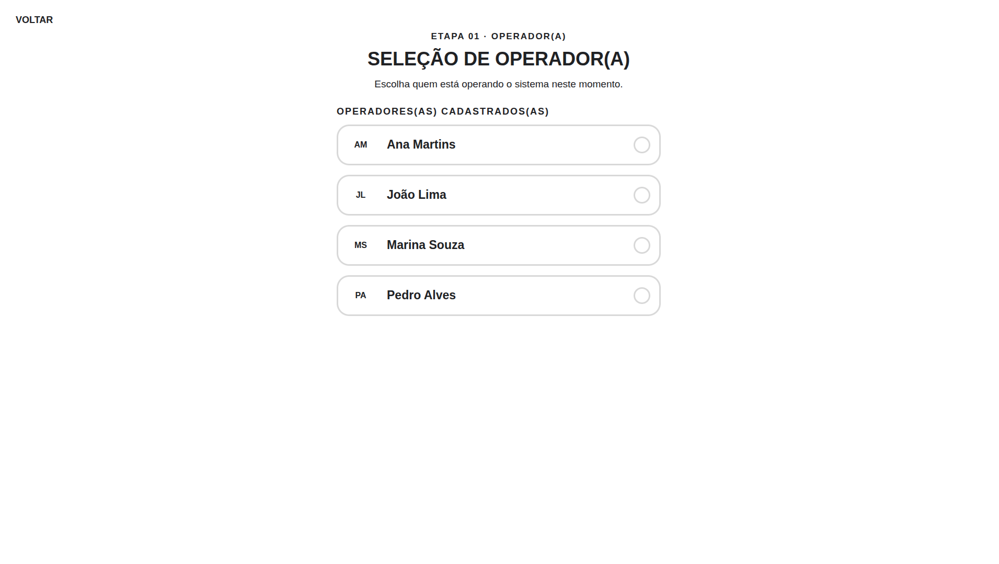<br>
  <sup>Fonte: Elaborado pelos autores (2026)</sup>
</div>
 
Após escolher a função de Operador(a), o usuário seleciona quem está operando o sistema naquele momento. A lista exibe todos os operadores cadastrados (Ana Martins, João Lima, Marina Souza, Pedro Alves). Ao selecionar um nome, um botão de confirmação aparece com a ação contextual, e o nome do operador passa a aparecer no canto superior direito em todas as etapas seguintes.
 
---
 
#### Etapa 01 · Coordenador(a) — Acesso Restrito
 
<div align="center">
  <sub><b>Figura 20 - Tela de atutenticação do coordenador</b></sub><br>
  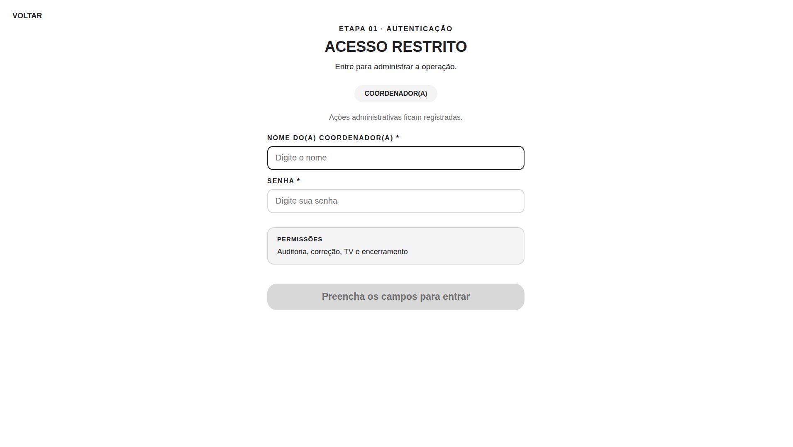<br>
  <sup>Fonte: Elaborado pelos autores (2026)</sup>
</div>

Se a função selecionada na Etapa 00 for **Coordenador(a)**, o sistema redireciona para uma tela de autenticação com nome e senha. O campo de permissões exibe as ações disponíveis para o coordenador: auditoria, correção, TV e encerramento. O botão de acesso só é habilitado após o preenchimento de ambos os campos.
 
---
 
#### Etapa 02 · Equipe — Seleção de Equipe

<div align="center">
  <sub><b>Figura 20 - Tela de seleção de equipe</b></sub><br>
  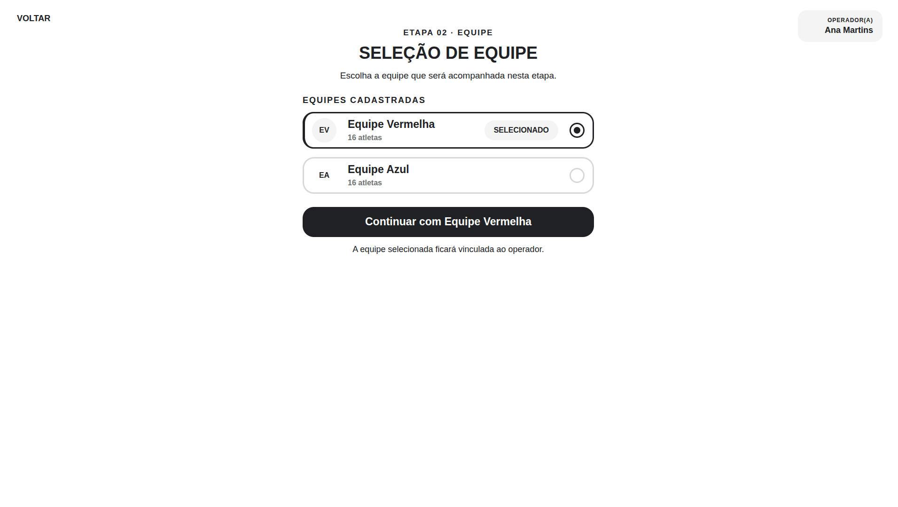<br>
  <sup>Fonte: Elaborado pelos autores (2026)</sup>
</div>
 
O operador escolhe qual equipe será acompanhada na operação da etapa atual. São exibidas as equipes cadastradas — **Equipe Vermelha** e **Equipe Azul** — com a quantidade de atletas em cada uma (16 atletas). Ao selecionar, o botão de confirmação exibe o nome da equipe escolhida, e a tela informa que ela ficará vinculada ao operador.
 
---
 
#### Etapa 03 · Atleta — Seleção de Atleta (lista sem seleção)
 
<div align="center">
  <sub><b>Figura 20 - Tela de seleção de atleta</b></sub><br>
  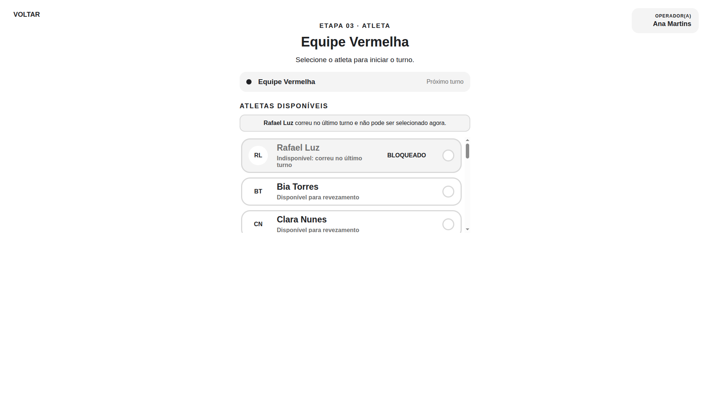<br>
  <sup>Fonte: Elaborado pelos autores (2026)</sup>
</div>

Com a equipe definida, o operador seleciona o atleta que irá correr no próximo turno. A tela exibe os atletas disponíveis para revezamento. Atletas que correram no turno imediatamente anterior aparecem como **bloqueados**, com indicação visual e o rótulo "BLOQUEADO", impedindo seleção indevida. A tela também exibe uma mensagem de aviso contextual sobre o bloqueio.
 
---
 
#### Etapa 03 · Atleta — Seleção de Atleta (com atleta selecionado)
 
<div align="center">
  <sub><b>Figura 20 - Tela de atleta selecionado</b></sub><br>
  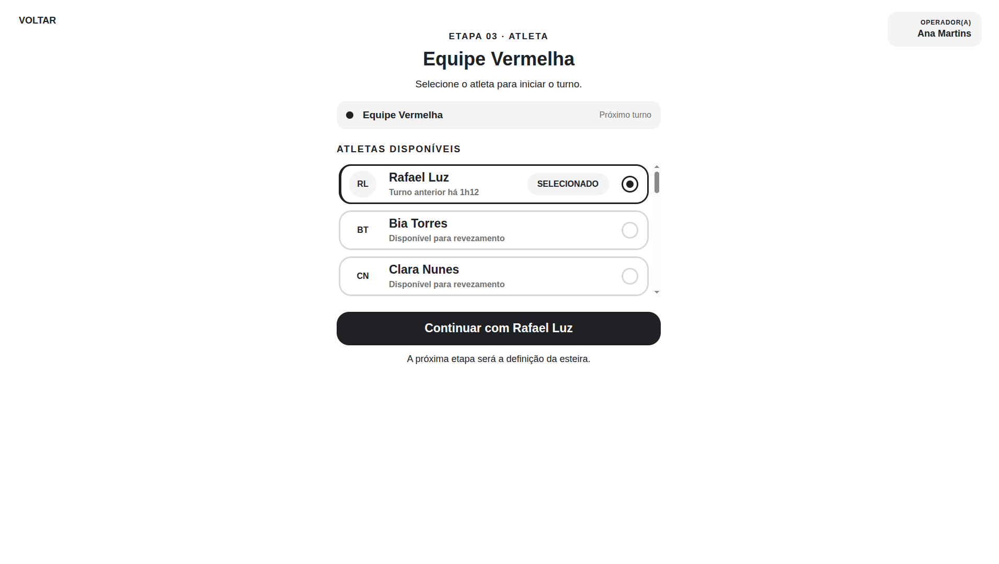<br>
  <sup>Fonte: Elaborado pelos autores (2026)</sup>
</div>

Após o usuário selecionar um atleta disponível (ex.: Rafael Luz), o card do atleta recebe destaque com borda, o rádio button é preenchido e o rótulo "SELECIONADO" aparece. Um botão preto de confirmação é exibido na parte inferior com o nome do atleta escolhido, e uma instrução informa que a próxima etapa será a definição da esteira.
 
---
 
#### Etapa 04 · Turno — Iniciar Turno (sem esteira selecionada)
 
<div align="center">
  <sub><b>Figura 20 - Tela de iniciar turno</b></sub><br>
  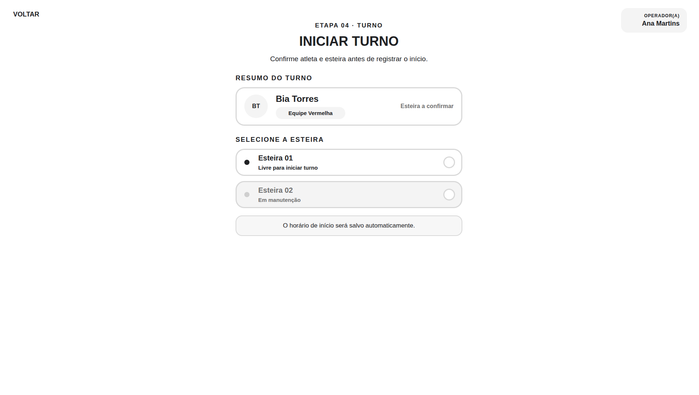<br>
  <sup>Fonte: Elaborado pelos autores (2026)</sup>
</div>

Com atleta e equipe confirmados, o operador deve selecionar a esteira onde o turno ocorrerá. A tela exibe um resumo do turno com o nome e a equipe do atleta. As esteiras disponíveis são listadas com seu status: **Livre para iniciar turno** ou **Em manutenção** (indisponível para seleção). O horário de início é salvo automaticamente pelo sistema.
 
---
 
#### Etapa 04 · Turno — Iniciar Turno (com esteira selecionada)
 
<div align="center">
  <sub><b>Figura 20 - Tela de iniciar com esteira selecionada</b></sub><br>
  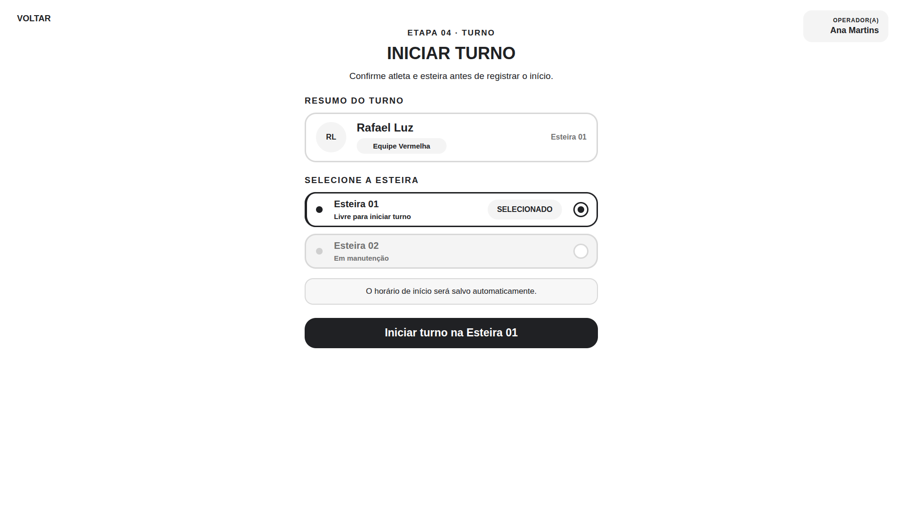<br>
  <sup>Fonte: Elaborado pelos autores (2026)</sup>
</div>

Ao selecionar a Esteira 01 (livre), o card recebe destaque visual, o rótulo "SELECIONADO" aparece e o resumo do turno é atualizado com o nome da esteira. O botão de confirmação é habilitado com a ação "Iniciar turno na Esteira 01".
 
---
 
#### Etapa 05 · Checkpoint — Turno Ativo (aguardando primeiro checkpoint)
 
<div align="center">
  <sub><b>Figura 20 - Tela de turno ativo</b></sub><br>
  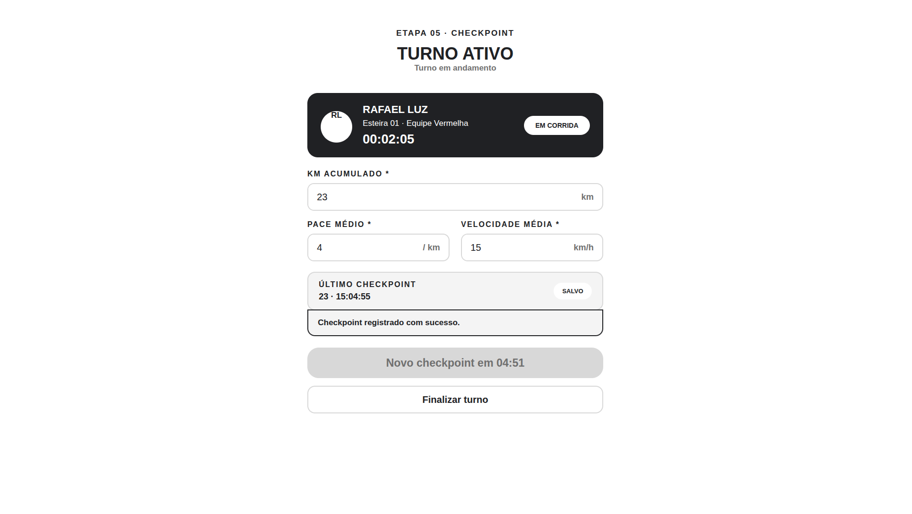<br>
  <sup>Fonte: Elaborado pelos autores (2026)</sup>
</div>

Com o turno em andamento, a tela exibe o card do atleta em corrida com cronômetro em tempo real (ex.: `00:01:41`), status **EM CORRIDA** e os campos para inserção de dados: KM acumulado, pace médio e velocidade média. O último checkpoint indica "Nenhum checkpoint registrado" com status **AGUARDANDO**. O botão **Registrar checkpoint** está ativo, e o botão **Finalizar turno** aparece como opção secundária.
 
---
 
#### Etapa 05 · Checkpoint — Turno Ativo (após checkpoint registrado)
 
<div align="center">
  <sub><b>Figura 20 - Tela de turno ativo com checkpoint registrado</b></sub><br>
  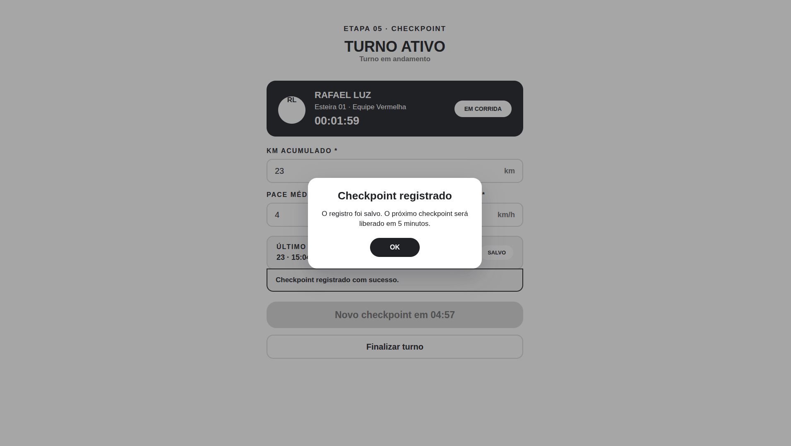<br>
  <sup>Fonte: Elaborado pelos autores (2026)</sup>
</div>

Após o primeiro registro, o sistema exibe um **modal de confirmação** informando que o próximo checkpoint estará disponível em 5 minutos. Ao fechar o modal, a tela atualiza o status do último checkpoint para **SALVO** com o horário e quilometragem registrados, e o botão de novo checkpoint passa a exibir o tempo restante para o próximo registro (ex.: `Novo checkpoint em 04:51`), ficando desabilitado durante a espera.
 
---
 
#### Etapa 06 · Encerramento — Finalizar Turno
 
<div align="center">
  <sub><b>Figura 20 - Tela de finalizar turno</b></sub><br>
  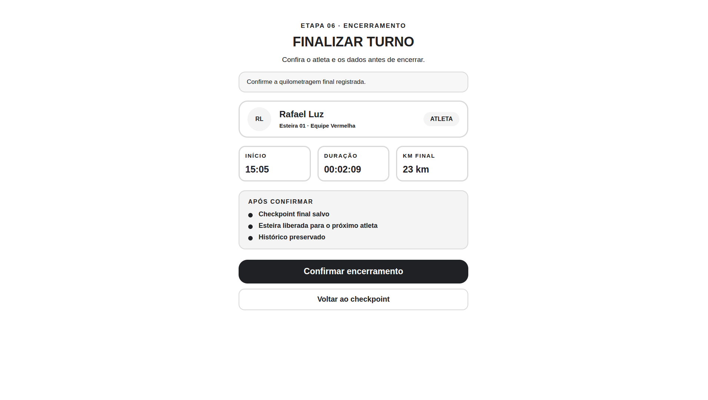<br>
  <sup>Fonte: Elaborado pelos autores (2026)</sup>
</div>

A tela de encerramento apresenta um resumo completo do turno antes da confirmação final: nome do atleta, esteira, equipe, horário de início, duração total e quilometragem final acumulada. Uma caixa informativa lista o que ocorre ao confirmar: checkpoint final salvo, esteira liberada para o próximo atleta e histórico preservado. O operador pode confirmar o encerramento ou retornar à tela de checkpoint.
 
## 4.2. Segunda versão da aplicação web (sprint 4)

*Descreva e ilustre aqui o desenvolvimento da segunda versão do sistema web, com foco no que foi consolidado entre a primeira versão funcional e o sistema operacional integrado. Utilize prints de tela para ilustrar. Indique obrigatoriamente: (a) o que foi implementado, (b) o que não foi concluído, (c) dificuldades técnicas enfrentadas e próximos passos.*

## 4.3. Versão final da aplicação web (sprint 5)

*Descreva e ilustre aqui o desenvolvimento da versão final do sistema web, com foco em refatorações, correções finais e na camada de autenticação/autorização entregue. Utilize prints de tela para ilustrar. Indique obrigatoriamente: (a) o que foi refinado ou adicionado desde a sprint 4, (b) pendências remanescentes, (c) dificuldades técnicas enfrentadas.*

# <a name="c5"></a>5. Testes

## 5.1. Relatório de testes de integração de endpoints automatizados (sprint 4)

*Liste e descreva os testes automatizados dos endpoints criados e planejados para sua solução, implementados com **Jest**. Cubra as duas abordagens:*

- ***White-box*** *— testes unitários de Service que exercitam ramos internos, exceções e regras de negócio (conhecimento da implementação).*
- ***Black-box*** *— testes de integração dos endpoints via Jest + Supertest, verificando apenas o contrato HTTP (status, body, efeito observável), sem depender da implementação interna.*

*Posicione aqui também o relatório de cobertura de testes Jest se houver (através de link ou transcrito para estrutura markdown).*

## 5.2. Testes de usabilidade (sprint 5)

### 5.2.1. Relatório de testes de guerrilha

*Posicione aqui as tabelas com enunciados de tarefas, etapas e resultados de testes de usabilidade. Ou utilize um link para seu relatório de testes (mantenha o link sempre público para visualização).*

### 5.2.2. Relatório de testes SUS (System Usability Scale)

*Posicione aqui o relatório dos testes SUS realizados.*

# <a name="c6"></a>6. Estudo de Mercado e Plano de Marketing (sprint 4)

## 6.1 Resumo Executivo

*Preencher com até 300 palavras, sem necessidade de fonte*

*Apresente de forma clara e objetiva os principais destaques do projeto: oportunidades de mercado, diferenciais competitivos da aplicação web e os objetivos estratégicos pretendidos.*

## 6.2 Análise de Mercado

A aplicação BullPace está inserida no setor de tecnologia aplicada a eventos esportivos, com foco em gestão operacional, registro de desempenho e consolidação de dados em tempo real. Esse segmento combina elementos do mercado de eventos presenciais, da indústria fitness e da chamada sport tech, área que utiliza sistemas digitais, sensores, plataformas de dados e interfaces de acompanhamento para melhorar a organização, a experiência e a confiabilidade de atividades esportivas.

No caso do Red Bull 24 Horas, o problema central não está na criação de um aplicativo fitness para o consumidor final, mas na digitalização de uma operação específica: registrar manualmente informações de atletas, esteiras, turnos e checkpoints ao longo de uma competição de resistência. A solução atua como uma camada de controle operacional, substituindo pranchetas e anotações dispersas por uma base de dados estruturada e auditável.

Do ponto de vista econômico, o setor esportivo tem se mostrado relevante porque eventos, experiências de marca e conteúdos esportivos continuam atraindo investimento. A Ampere Analysis projeta que os gastos globais com direitos esportivos ultrapassem US$ 78 bilhões em 2030, crescimento de 20% em relação a 2025, indicando que o esporte permanece como um ativo estratégico para marcas, mídia e entretenimento. Embora o BullPace não atue diretamente em direitos de transmissão, esse dado demonstra a força econômica do ecossistema esportivo e a valorização de experiências esportivas bem organizadas.

No aspecto tecnológico, há uma tendência de digitalização das experiências esportivas e fitness. O uso de wearables, aplicativos de exercício, plataformas de acompanhamento e dashboards de performance mostra que a coleta e interpretação de dados passaram a fazer parte da experiência esportiva. Segundo estimativa da Grand View Research citada pela Vogue Business, o mercado global de wearables deve atingir US$ 186 bilhões em 2030, com CAGR de 13,6% entre 2025 e 2030. Esse avanço reforça a importância de dados, rastreabilidade e acompanhamento em tempo real no universo esportivo, ainda que o BullPace opte por entrada manual assistida devido à ausência de integração com as esteiras Technogym.

Do ponto de vista regulatório, a aplicação precisa considerar a Lei Geral de Proteção de Dados Pessoais, já que armazena nomes de atletas, operadores e registros associados à participação no evento. A ANPD disponibiliza a LGPD como referência institucional para orientar o tratamento de dados pessoais no Brasil, o que reforça a necessidade de limitar dados coletados, manter rastreabilidade, controlar permissões e evitar exposição indevida de informações.

*b) Tamanho e Crescimento do Mercado (até 250 palavras)*
*Apresente dados quantitativos sobre o tamanho atual e projeções de crescimento do mercado. Utilize fontes confiáveis.*

*c) Tendências de Mercado (até 300 palavras)*
*Identifique e analise tendências relevantes (tecnológicas, comportamentais e mercadológicas) que influenciam o setor. Utilize fontes confiáveis.*

## 6.3 Análise da Concorrência

*a) Principais Concorrentes (até 250 palavras)*
*Liste os concorrentes diretos e indiretos, destacando suas principais características e posicionamento no mercado.*

*b) Vantagens Competitivas da Aplicação Web (até 250 palavras)*
*Descreva os diferenciais da sua aplicação em relação aos concorrentes, sem necessidade de citação de fontes.*


## 6.4 Público-Alvo

*a) Segmentação de Mercado (até 250 palavras)*
Descreva os principais segmentos de mercado a serem atendidos pela aplicação. Utilize bases de dados e fontes confiáveis.*

O público-alvo do sistema reúne dois perfis complementares. O primeiro é o cliente contratante: gestores de marketing esportivo, agências e produtoras que organizam o evento e operam a aplicação. O segundo é o usuário final, aletas amadores que correm em equipe e o público que acompanha o placar, e é sobre ele que existem os dados mais consolidados. 

No geral, é um público adulto jovem, concentrado na faixa dos 25 aos 45 anos [21] e na região Sudeste. Nos últimos anos a corrida ficou mais diversa e democrática, chegando a um equilíbrio entre homens e mulheres [20]. Mais do que um esporte, ela virou estilo de vida, as pessoas correm em busca de saúde, bem-estar mental e superação, e valorizam o sentimento de pertencer a uma comunidade. Boa parte começou a não muito tempo, cerca de 71% começaram a correr depois de 2021[21]. 

Esse corredor também participa cada vez mais de provas oficiais [20] e está mais exigente, querem organização, segurança e cronometragem precisa [22]. É justamente aí que se concentram as necessidades atendidas pela aplicação, um placar e tempo real, apuração transparente e confiavel por equipe e turno, e uma vizualização clara para atletas e plateia. 


## 6.5 Posicionamento

*a) Proposta de Valor Única (até 250 palavras)*
*Defina de maneira clara o que torna a sua aplicação única e valiosa para o mercado.*

*b) Estratégia de Diferenciação (até 250 palavras)*
*Explique como sua aplicação se destacará da concorrência, evidenciando a lógica por trás do posicionamento.*

## 6.6 Estratégia de Marketing 

*a) Produto/Serviço (até 200 palavras)*
*Descreva as funcionalidades, benefícios e diferenciais da aplicação*

*b) Preço (até 200 palavras)*
*Explique o modelo de precificação adotado e justifique com base nas análises anteriores.*

*c) Praça (Distribuição) (até 200 palavras)*
*Apresente os canais digitais utilizados para distribuir e entregar a aplicação ao público.*

*d) Promoção (até 200 palavras)*
*Descreva as estratégias digitais planejadas, como SEO, redes sociais, marketing de conteúdo e campanhas pagas.*

# <a name="c7"></a>7. Conclusões e trabalhos futuros (sprint 5)

*Escreva de que formas a solução da aplicação web atingiu os objetivos descritos na seção 2 deste documento. Indique pontos fortes e pontos a melhorar de maneira geral.*

*Relacione os pontos de melhorias evidenciados nos testes com planos de ações para serem implementadas. O grupo não precisa implementá-las, pode deixar registrado aqui o plano para ações futuras*

*Relacione também quaisquer outras ideias que o grupo tenha para melhorias futuras*

# <a name="c8"></a>8. Referências (sprints 1 a 5)

<a name="ref-1"></a>[1] RED BULL. **TAPI 1AMD2 – Aplicação Web**: RED BULL 24 HORAS. São Paulo: Inteli, 2026.

[2] PORTER, Michael E. Estratégia Competitiva: Técnicas para Análise de Indústrias e da Concorrência. 2. ed. Rio de Janeiro: Elsevier, 2004.

[3] CHIAVENATO, Idalberto. Planejamento Estratégico: Fundamentos e Aplicações. 3. ed. Rio de Janeiro: Elsevier, 2017.

[4] OSTERWALDER, Alexander et al. Value Proposition Design: Como construir propostas de valor inovadoras. São Paulo: HSM Editora, 2015.

[5] PMI - PROJECT MANAGEMENT INSTITUTE. Um Guia do Conhecimento em Gerenciamento de Projetos (Guia PMBOK). 6. ed. Pensilvânia: PMI, 2017.

[6] COOPER, Alan. The inmates are running the asylum: why high tech products drive us crazy and how to restore the sanity. Indianapolis: Sams Publishing, 2004.

[7] NIELSEN, Lene. Personas - User Focused Design. London: Springer Science & Business Media, 2012.

[8] COHN, Mike. User Stories Applied: For Agile Software Development. Boston: Addison-Wesley Professional, 2004.

[9] SOMMERVILLE, Ian. Engenharia de Software. 10. ed. São Paulo: Pearson Education do Brasil, 2019.

[10] PRESSMAN, Roger S.; MAXIM, Bruce R. Engenharia de Software: uma abordagem profissional. 8. ed. Porto Alegre: AMGH, 2016.

[11] ROSS, Ronald G. Business Rule Concepts: Getting to the Point of Knowledge. 4. ed. Houston: Business Rule Solutions, 2013.

[12] COOPER, Alan et al. About Face: The Essentials of Interaction Design. 4. ed. Indianápolis: John Wiley & Sons, 2014.

[13] WIEGERS, Karl; BEATTY, Joy. Software Requirements. 3. ed. Redmond: Microsoft Press, 2013.

[14] BRASIL. Ministério do Planejamento, Desenvolvimento e Gestão. Guia prático de gerenciamento de riscos. Brasília: Ministério do Planejamento, Desenvolvimento e Gestão, 2017.

[15] KOTLER, Philip; KELLER, Kevin Lane. Administração de Marketing. 14. ed. São Paulo: Pearson Education do Brasil, 2012.

[16] COOPER, Alan. The Inmates Are Running the Asylum: Why High Tech Products Drive Us Crazy and How to Restore the Sanity. Indianápolis: Sams Publishing, 1999.

[20] PESQUISA: com impulso de mulheres, jovens e Classe C, corrida de rua alcança 15 milhões de praticantes no Brasil. **Máquina do Esporte**, [s. l.], 31 jan. 2026. Disponível em: https://maquinadoesporte.com.br/running/pesquisa-com-impulso-de-mulheres-jovens-e-classe-c-corrida-de-rua-alcanca-15-milhoes-de-praticantes-no-brasil/.

[21] CORRIDA de rua se torna fenômeno social no Brasil com 13 milhões de praticantes. **Portal Tela**, [s. l.], 2 fev. 2025. Disponível em: https://www.portaltela.com/esportes/geral/2025/02/02/corrida-de-rua-se-torna-fenomeno-social-no-brasil-com-13-milhoes-de-praticantes.

[22] CORRIDAS de rua crescem 85% e viram fenômeno esportivo. **Terra**, [s. l.], 28 jan. 2026. Disponível em: https://www.terra.com.br/vida-e-estilo/saude/corridas-de-rua-crescem-85-e-viram-fenomeno-esportivo.

# <a name="c9"></a>Anexos

<a name="diagrama-de-classes-arquitetural"></a> Diagrama de Classes Arquitetural [Clique aqui para abrir no Google Drive](https://drive.google.com/file/d/1TP7QIwON1gvU5n3oMtH9J_TV2MQFYRuI/view?usp=sharing)
